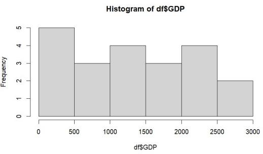
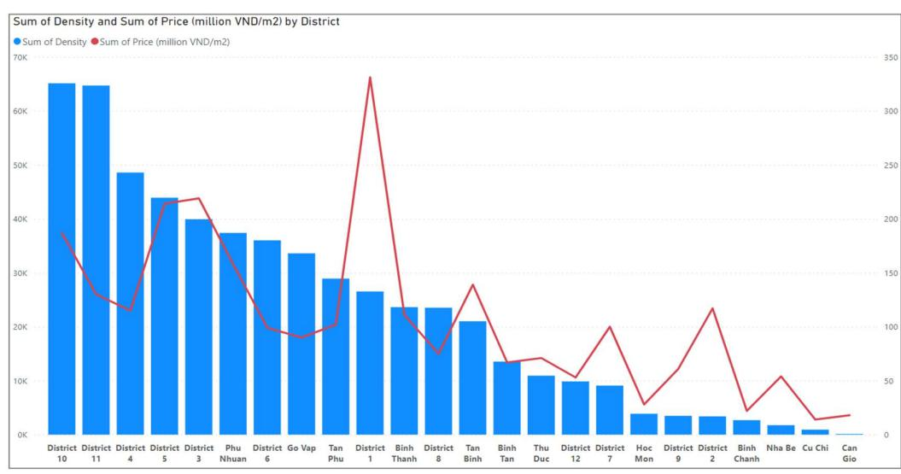
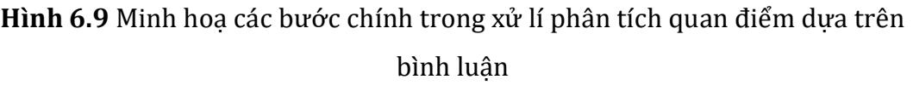

ĐẠI HỌC QUỐC GIA THÀNH PHỐ HỒ CHÍ MINH TRƯỜNG ĐẠI HỌC CÔNG NGHỆ THÔNG TIN

Nguyễn Đình Thuân Nguyễn Minh Nhựt Nguyễn Thị Viết Hương Trịnh Thị Thanh Trúc

GIÁO TRÌNH

# PHÂN TÍCH DỮ LIỆU KINH DOANH

### LỜI NÓI ĐẦU

Sự phát triển của Công nghệ thông tin và trong bối cảnh cách mạng công nghiệp 4.0, dữ liệu được tạo ra hàng ngày đang gia tăng nhanh chóng. Việc tìm kiếm những phương pháp và công cụ tiên tiến nhất để khai thác tối đa giá trị từ dữ liệu, phân tích dữ liệu một cách hiệu quả sẽ giúp các doanh nghiệp đưa ra những quyết định sáng suốt và dự đoán xu hướng tương lai.

Giáo trình Phân tích dữ liệu kinh doanh được biên soạn dưới góc nhìn của những người làm về Công nghệ thông tin, nhằm trang bị cho sinh viên những kiến thức và kỹ năng cần thiết về thống kê, thuật toán, lập trình trong lĩnh vực phân tích dữ liệu kinh doanh.

Giáo trình giới thiệu khái niệm cơ bản về phân tích dữ liệu kinh doanh, các công cụ phân tích dữ liệu phổ biến như ngôn ngữ lập trình R, Python và phương pháp phân tích dữ liệu từ thống kê và máy học.

Nội dung giáo trình bao gồm:

Chương 1. Tổng quan bài toán phân tích dữ liệu và thống kê mô tả

Chương 2. Phân tích diễn giải dữ liệu

Chương 3. Phân tích hồi quy

Chương 4: Mô hình hồi quy Logistics

Chương 5: Dự báo dữ liệu chuỗi thời gian

Chương 6: Máy học và bài toán dự báo

Cuối mỗi chương, sinh viên quét mã QR code để tải tập dữ liệu, hướng dẫn sử dụng ngôn ngữ lập trình R và Python để giải quyết các bài toán về phân tích dữ liệu.

Chúng tôi hi vọng rằng thông qua giáo trình này, mong muốn khơi dậy niềm đam mê và sáng tạo trong việc ứng dụng công cụ lập trình và trí tuệ nhân tạo, giúp các

bạn trở thành những nhà phân tích dữ liệu xuất sắc, góp phần vào sự phát triển bền vững của doanh nghiệp.

Chúng tôi rất mong nhận được các ý kiến đóng góp của đọc giả để giáo trình ngày càng hoàn thiện hơn.

Trân trọng,

Nhóm tác giả

| Chương 1. | TỔNG QUAN BÀI TOÁN PHÂN TÍCH DỮ LIỆU VÀ THỐNG KÊ MÔ |
|-----------|-----------------------------------------------------|
| TẢ        | 1                                                   |
| 1.1.      | Tổng quan bài toán phân tích dữ liệu  1             |
| 1.2.      | Dữ liệu và các phép biến đổi dữ liệu  2             |
| 1.2.1     | Dữ liệu  2                                          |
| 1.2.2     | Các phép biến đổi dữ liệu  3                        |
| 1.3.      | Một số phép phân tích cơ bản và cách đọc dữ liệu  4 |
| 1.3.1     | Phân tích cụm  4                                    |
| 1.3.2     | Phân tích theo nhóm  5                              |
| 1.3.3     | Phân tích hồi quy  5                                |
| 1.3.4     | Mạng nơ-ron nhân tạo  6                             |
| 1.3.5     | Phân tích nhân tố  6                                |
| 1.3.6     | Khai thác dữ liệu  6                                |
| 1.3.7     | Phân tích văn bản  7                                |
| 1.3.8     | Phân tích chuỗi thời gian 7                         |
| 1.3.9     | Cây quyết định  8                                   |
| 1.3.10    | Phân tích thuộc tính  8                             |
| 1.4.      | Đo lường dữ liệu  9                                 |
| 1.4.1     | Đo lường vị trí trung tâm  9                        |
| 1.4.2     | Đo lường sự biến thiên của dữ liệu  12              |
| 1.4.3     | Đo lường về hình dáng của phân phối 13              |
| 1.5.      | Trực quan hóa dữ liệu  16                           |
| 1.5.1     | Biểu đồ hình cột  16                                |

| 1.5.2     |    | Biểu đồ hình hộp  17                                                |
|-----------|----|---------------------------------------------------------------------|
| 1.6.      |    | Giới thiệu R và Python  18                                          |
| 1.7.      |    | Thực hành thống kê mô tả và trực quan trên ngôn ngữ R và Python  19 |
| 1.7.1     |    | Thực hành trên ngôn ngữ R  20                                       |
| 1.7.2     |    | Thực hành trên ngôn ngữ Python  22                                  |
| 1.8.      |    | Bài tập chương  25                                                  |
| Chương 2. |    | PHÂN TÍCH DIỄN GIẢI DỮ LIỆU  27                                     |
| 2.1.      |    | Ước lượng giá trị tổng thể  27                                      |
| 2.1.1     |    | Ước lượng giá trị trung bình tổng thể  28                           |
| 2.1.2     |    | Ước lượng tỷ lệ tổng thể  29                                        |
| 2.1.3     |    | Ví dụ 1  29                                                         |
| 2.2.      |    | Kiểm định tham số trong tổng thể  30                                |
| 2.2.1     |    | Kiểm định trung bình tổng thể với một giá trị trung bình cho trước  |
|           | 31 |                                                                     |
| 2.2.2     |    | Kiểm định hai giá trị trung bình của hai tổng thể  32               |
| 2.2.3     |    | Kiểm định phương sai  33                                            |
| 2.3.      |    | Phân tích phương sai  34                                            |
| 2.3.1     |    | Kiểm định Levene  37                                                |
| 2.3.2     |    | Kiểm định ANOVA 1 yếu tố  37                                        |
| 2.3.3     |    | Hậu kiểm định Tukey  42                                             |
| 2.3.4     |    | Phân tích ANOVA 2 yếu tố  45                                        |
| 2.3.5     |    | Phân tích hiệp phương sai  51                                       |
| 2.4.      |    | Kieቻm định Chi-Square  54                                           |
| 2.5.      |    | Thực hành phân tích diễn giải trong R và Python  55                 |

| 2.5.1     | Thực hành kiểm định ANOVA trên ngôn ngữ R và Python  55            |
|-----------|--------------------------------------------------------------------|
| 2.5.2     | Thực hành kiểm định Chi-Square trên ngôn ngữ R và Python  58       |
| 2.6.      | Bài tập chương  60                                                 |
| Chương 3. | PHÂN TÍCH HỒI QUY  63                                              |
| 3.1.      | Mô hình hồi quy  63                                                |
| 3.2.      | Mô hình hồi quy  63                                                |
| 3.2.1     | Mô hình hồi quy tuyến tính đơn  64                                 |
| 3.2.2     | Mô hình hồi quy tuyến tính bội  66                                 |
| 3.3.      | Mô hình hồi quy phi tuyến  68                                      |
| 3.3.1     | Phương pháp tìm phương trình hồi quy phi tuyến bằng hàm f  68      |
| 3.3.2     | Phương pháp tìm phương trình hồi quy phi tuyến Gauss Newton        |
|           | 70                                                                 |
|           |                                                                    |
| 3.4.      | Đánh giá mô hình dự báo  72                                        |
| 3.4.1     | Các tiêu chí dựa trên sai số tuyệt đối  72                         |
| 3.4.2     | Các tiêu chí dựa vào bình phương sai số  73                        |
| 3.4.3     | Dựa vào R square  74                                               |
| 3.5.      | Sử dụng R và Python Thực hành mô hình hồi quy trong kinh doanh  75 |
| 3.5.1     | Thực hành hồi quy tuyến tính đơn biến trên R  75                   |
| 3.5.2     | Thực hành hồi quy tuyến tính đơn biến trên Python  79              |
| 3.5.3     | Thực hành hồi quy tuyến tính đa biến trên R  80                    |
| 3.5.4     | Thực hành hồi quy tuyến tính đa biến trên Python  84               |
| 3.5.5     | Thực hành hồi quy phi tuyến  86                                    |
| 3.6.      | Ứng dụng của hồi quy tuyến tính trong bài toán giá nhà  87         |

| Chương 4. |       | MÔ HÌNH HỒI QUY LOGISTICS  91                                   |  |
|-----------|-------|-----------------------------------------------------------------|--|
| 4.1.      |       | Mô hình hồi quy Logistics  91                                   |  |
| 4.2.      |       | Xây dựng mô hình hồi quy logistics  92                          |  |
|           | 4.2.1 | Hàm Logistic Response  92                                       |  |
|           | 4.2.2 | Hàm Logit  92                                                   |  |
|           | 4.2.3 | Likelihood và Maximum Likelihood  94                            |  |
|           | 4.2.4 | Các bước xây dựng mô hình hồi quy Logistics  98                 |  |
| 4.3.      |       | Đánh giá mô hình hồi quy Logistics  99                          |  |
| 4.4.      |       | Sử dụng R và Python Thực hành mô hình hồi quy Logistics  100    |  |
|           | 4.4.1 | Thực hành hồi quy logistics trên ngôn ngữ R  101                |  |
|           | 4.4.2 | Thực hành hồi quy logistics trên ngôn ngữ lập trình Python  107 |  |
| 4.5.      |       | Bài tập chương  108                                             |  |
| Chương 5. |       | DỰ BÁO DỮ LIỆU CHUỖI THỜI GIAN  110                             |  |
| 5.1.      |       | Tổng quan về dữ liệu chuỗi thời gian  110                       |  |
|           | 5.1.1 | Chuỗi thời gian đơn biến  111                                   |  |
|           | 5.1.2 | Chuỗi thời gian đa biến  112                                    |  |
| 5.2.      |       | Mô hình Autoregressive Integrated Moving Average – ARIMA  112   |  |
|           | 5.2.1 | Mô hình tự hồi quy (Autoregressive – AR)  112                   |  |
|           | 5.2.2 | Mô hình trung bình trượt (Moving average – MA)  113             |  |
|           | 5.2.3 | Tích hợp (Integrated – I)  113                                  |  |
|           | 5.2.4 | Mô hình ARIMA 114                                               |  |
| 5.3.      |       | Mô hình Autoregressive Integrated Moving Average with Exogenous |  |
|           |       | Variables – ARIMAX  115                                         |  |

| 5.4.      | Mô hình Seasonal Autoregressive Integrated Moving Average –   |  |
|-----------|---------------------------------------------------------------|--|
|           | SARIMA  117                                                   |  |
| 5.5.      | Mô hình Long short term memory – LSTM  117                    |  |
| 5.6.      | Thực hành trên ngôn ngữ Python dự báo chuỗi thời gian  118    |  |
| 5.7.      | Bài tập chương  122                                           |  |
| Chương 6. | MÁY HỌC VÀ BÀI TOÁN DỰ BÁO  126                               |  |
| 6.1.      | Máy học trong phân tích và dự báo  126                        |  |
| 6.1.1     | Mô hình Support Vector Machine 126                            |  |
| 6.1.2     | Mô hình học sâu RNN  130                                      |  |
| 6.1.3     | Lý thuyết về dự báo Anomoly Detection  134                    |  |
| 6.2.      | Các ứng dụng máy học trong phân tích dữ liệu kinh doanh.  137 |  |
| 6.2.1     | Phân tích quan điểm trong dự báo chứng khoán  137             |  |
| 6.2.2     | Xử lý bộ dữ liệu về giá  140                                  |  |
| 6.3.      | Thực hành chuỗi thời gian trên ngôn ngữ Python  142           |  |
| 6.3.1     | Thực hành dự báo giá trị  142                                 |  |
| 6.3.2     | Thực hành dự báo bất thường  146                              |  |
| 6.4.      | Bài tập chương  148                                           |  |
|           | CHƯƠNG PHỤ LỤC. HƯỚNG DẪN SỬ DỤNG SÁCH  151                   |  |
|           | TÀI LIỆU THAM KHẢO  153                                       |  |

#### DANH MỤC HÌNH

| Hình 1.1 Minh hoạ các tứ phân vị  11                                             |  |
|----------------------------------------------------------------------------------|--|
| Hình 1.2 Minh hoạ khoảng tứ phân vị  12                                          |  |
| Hình 1.3 Minh hoạ trực quan độ lệch lên đồ thị  15                               |  |
| Hình 1.4 Biểu đồ hình cột về tiền lương hàng tháng  17                           |  |
| Hình 1.5 Biểu đồ hình hộp diễn tả 5 vị trí phân bố của dữ liệu  17               |  |
| Hình 1.6 Driver Dataset cho Thống kê mô tả  19                                   |  |
| Hình 1.7 Cửa sổ giao diện ngôn ngữ R  20                                         |  |
| Hình 1.8 Cài đặt package bằng R Studio  21                                       |  |
| Hình 1.9 Biểu đồ Histogram GDP trên R  22                                        |  |
| Hình 1.10 Biểu đồ Boxplot GDP trên R  22                                         |  |
| Hình 1.11 Đường dẫn file csv  23                                                 |  |
| Hình 1.12 Biểu đồ Boxplot GDP trên R  25                                         |  |
| Hình 1.13 Biểu đồ Histogram GDP trên R 25                                        |  |
| Hình 2.1 Ảnh mô phỏng mô hình ANCOVA theo mô hình tuyến tính tổng quát.          |  |
| Nguồn: people.ucsc.edu  52                                                       |  |
| Hình 2.2. Driver Dataset cho thống kê diễn giải  55                              |  |
| Hình 2.3 Kết quả tính Chi-Square Critical Value  59                              |  |
| Hình 2.4 Một số giá trị phân tích ANOVA đã được tính và phần in đậm cần bổ       |  |
| sung  61                                                                         |  |
| Hình 2.5 Dữ liệu Education_Survey  62                                            |  |
| Hình 3.1 Mã QR Data Chương 3  64                                                 |  |
| Hình 3.2 Biểu đồ Scatter Plot về Income và Credit Score  64                      |  |
| Hình 3.3 Biểu đồ Scatter Plot về thời gian sửa, thời gian chờ và độ hài lòng  67 |  |
| Hình 3.4 Dữ liệu minh họa hồi quy phi tuyến  69                                  |  |
| Hình 3.5 Thêm dữ liệu Z1  69                                                     |  |
| Hình 3.6 Thêm dữ liệu Z2  69                                                     |  |
| Hình 3.7 Kết quả phương trình hồi quy  70                                        |  |

| Hình 3.8 Dataset của _scoring_credit_linear  76                                 |
|---------------------------------------------------------------------------------|
| Hình 3.9 Phương trình hồi quy tuyến tính Income theo Credit_Score  78           |
| Hình 3.10 Kết quả phương trình hồi quy thực nghiệm trên Python  80              |
| Hình 3.11 Dataset satisfaction_level  81                                        |
| Hình 3.12 Biểu diễn 3 biến trên không gian  84                                  |
| Hình 3.13 Kết quả mô hình hồi quy tuyến tính đa biến  86                        |
| Hình 3.14 Thêm cột ln(Repair_Time) cho tập dữ liệu df  86                       |
| Hình 3.15 Độ tương quan giữa giá nhà và dân số tại một số khu vực thành phố     |
| Hồ Chí Minh  87                                                                 |
| Hình 4.1 BIểu đồ hàm Logistic Response 92                                       |
| Hình 4.2 Biểu đồ mối quan hệ giữa xác suất và log-odds  93                      |
| Hình 4.3 Driver Dataset cho phân tích hồi quy Logistics  100                    |
| Hình 4.4 Sample Dataset 410092301_graduate_school_survey  101                   |
| Hình 4.5 Data sau khi xử lý đưa về dạng số  102                                 |
| Hình 6.1 Hình minh hoạ về thuật toán SVM  129                                   |
| Hình 6.2 Minh hoạ một mô hình mạng nơ ron hồi quy, đầu vào là một ma trận       |
| với hai chuỗi đặc trưng đầu vào kích thước 1x3 (xanh dương), lớp ẩn (trắng),    |
| và một đầu ra (xanh lá), với wx,w1 lần lượt là trọng số kết nối các đơn vị tính |
| toán giữa hai lớp với nhau và w  131                                            |
| Hình 6.3 Minh hoạ mô hình mạng thần kinh hồi quy với các giá trị trọng số,      |
| bias và đặc trưng đầu vào được đưa vào mạng  132                                |
| Hình 6.4 Minh hoạ mạng thần kinh hồi quy với hai giá trị ht tính toán được      |
| trong lớp ẩn hồi quy (SimpleRNN)  133                                           |
| Hình 6.5 Minh hoạ mạng thần kinh hồi quy với giá trị được tính toán hoàn        |
| chỉnh  134                                                                      |
| Hình 6.6 Dữ liệu cổ phiếu mẫu  135                                              |
| Hình 6.7 Hình minh họa thuật toán Isolation Forest  136                         |
| Hình 6.8 Các bước để tiền xử lý và làm sạch một tweet  138                      |

| Hình 6.9 Minh hoạ các bước chính trong xử lí phân tích quan điểm dựa trên      |  |
|--------------------------------------------------------------------------------|--|
| bình luận  140                                                                 |  |
| Hình 6.10<br>Trang web dùng để download dữ liệu Bitcoin  141                   |  |
| Hình 6.11<br>Đồ thị về Closing Price theo thời gian của index BTC  141         |  |
| Hình 6.12<br>Driver Dataset cho Chương 6  142                                  |  |
| Hình 6.13<br>Biểu đồ giá dự báo và giá thực tế của mô hình SVR  144            |  |
| Hình 6.14<br>Biểu đồ giá dự báo và giá thực tế của mô hình RNN  146            |  |
| Hình 6.15 Biểu đồ dự báo điểm bất thường bằng phương pháp Isolation Forest 148 |  |

#### DANH MỤC BẢNG

| Bảng 2-1. Bảng chú giải các giá trị tham số tổng thể và mẫu  27                |
|--------------------------------------------------------------------------------|
| Bảng 2-2. Các loại sai lầm trong kiểm định  31                                 |
| Bảng 2-3. Bảng tổng hợp kiểm định trung bình tổng thể với giá trị cho trước 32 |
| Bảng 2-4. Doanh số kẹo dẻo gấu của từng nhãn hàng trên từng địa điểm được      |
| khảo sát. Trong đó, dòng Mean là trung bình doanh số của từng điểm khảo sát    |
| của từng nhóm thương hiệu; Overall mean là trung bình doanh số của tất cả      |
| nhóm thương hiệu trên toàn bộ điểm khảo  38                                    |
| Bảng 2-5. Phân tích phương sai một yếu tố  41                                  |
| Bảng 2-6 Giá trị trung bình của từng nhóm Thương hiệu và Loại kẹo  46          |
| Bảng 2-7. Phân tích phương sai hai yếu tố  47                                  |
| Bảng 2-8. Các giá trị biến thiên được tính toán theo bảng phân tích phương sai |
| hai yếu tố  50                                                                 |
| Bảng 2-9. Dữ liệu khảo sát doanh số và số lượng trẻ em sinh sống chia theo     |
| từng thương hiệu trên từng điểm bán hàng  53                                   |
| Bảng 3.1 Bảng dữ liệu minh họa  70                                             |
| Bảng 4.1 Ví dụ về một tập dữ liệu mẫu cho bài toán hồi quy logistics  91       |

## Chương 1. TỔNG QUAN BÀI TOÁN PHÂN TÍCH DỮ LIỆU VÀ THỐNG KÊ MÔ TẢ

Chương này cung cấp cái nhìn tổng quan về phân tích dữ liệu và thống kê mô tả, từ các bài toán cơ bản đến các phương pháp phân tích nâng cao. Nội dung bao gồm việc hiểu về dữ liệu và các phép biến đổi cần thiết để xử lý chúng, đồng thời giới thiệu các kỹ thuật phân tích như phân tích cụm, hồi quy, và phân tích nhân tố. Ngoài ra, chương còn đề cập đến những phương pháp hiện đại như mạng nơ-ron nhân tạo, phân tích chuỗi thời gian và khai thác dữ liệu, giúp người đọc nắm bắt cách áp dụng các công cụ này vào thực tế. Đặc biệt, phần thực hành với R và Python mang đến cơ hội trải nghiệm trực tiếp về thống kê mô tả và trực quan hóa dữ liệu, giúp người đọc củng cố kiến thức thông qua các bài tập cụ thể.

#### 1.1. Tổng quan bài toán phân tích dữ liệu

John W. Tukey đã đề xuất về các phương pháp phân tích dữ liệu trong bài báo "The Future of Data Analysis" vào năm 1962 và điều này đã góp phần đặt nền móng cho sự ra đời của lĩnh vực khai thác dữ liệu. Ông John W. Tukey đã phát triển phương pháp phân tích qua các công cụ trực quan dữ liệu như biểu đồ hộp và biểu đồ thông kê. Bên cạnh đó nhấn mạnh các khái niệm như trung bình, trung vị và phân vị. Nhưng công cụ và phương pháp này trực quan góp phần khám phá về cấu trúc và điểm điểm dữ liệu.

Từ những phương pháp và khái niệm ban đầu đã phát triển và hình thành các tri thức phức tạp về phân tích dữ liệu. Các nguyên nhân chính dẫn đến sự mở rộng ngày bao gồm tiến bộ về công nghệ, sự phát triển về dữ liệu lớn và phương pháp định lượng. Do đó, phân tích dữ liệu đã trở thành một lĩnh vực nghiên cứu quan trọng góp phần hiểu và khai thác được thông tin.

Phân tích là quá trình có nhiều giai đoạn từ thu thập dữ liệu từ các nguồn khác nhau. Sau đó làm sạch và chuẩn hoá để đảm bảo tính khách quan và thống nhất giữa các thuộc tính. Tiếp theo đó là dùng các mô hình máy học hoặc thống kê để khai phá dữ liệu và cuối cùng thu được các thông tin cần thiết hỗ trợ trong việc đưa ra quyết định và dự đoán trong kinh doanh và thị trường. Với các vai trò kể trên cho thấy rằng phân tích kinh doanh có vai trò quan trọng trong việc phân tích các hành vi, nhu cầu và sở thích của khách hàng từ đó đưa ra các chiến lược tiếp thị và nâng cao trải nghiệm cho khách hàng nhằm thúc đẩy doanh số, phát hiện thị trường tiềm năng, và giúp hiểu về các đối thủ cạnh tranh.

#### 1.2. Dữ liệu và các phép biến đổi dữ liệu

#### 1.2.1 Dữ liệu

Trong phân tích dữ liệu kinh doanh, hai loại dữ liệu chính thường được sử dụng là dữ liệu số và dữ liệu phân loại.

Dữ liệu số bao gồm hai loại chính:

Dữ liệu số liên tục: Các giá trị có thể thay đổi liên tục trong một khoảng nhất định. Ví dụ như doanh thu hàng tháng, giá sản phẩm, hoặc thời gian trung bình mà khách hàng truy cập vào website. Dữ liệu số rời rạc: Đại diện cho số lượng các sự kiện xảy ra, chẳng hạn như số lượng đơn hàng, số khách hàng mới, hay số lần một sản phẩm được tìm kiếm.

Dữ liệu phân loại được chia thành ba dạng:

Dữ liệu danh mục: Gồm các giá trị hữu hạn, thường là các nhóm hoặc loại. Ví dụ bao gồm kênh tiếp thị (SEO, Google Ads, Social Media), phân loại khách hàng (VIP, thường xuyên, mới), hoặc vị trí địa lý (miền Bắc, miền Trung, miền Nam).

Dữ liệu nhị phân: Biểu diễn các giá trị có hai lựa chọn, thường dùng 0 và 1. Ví dụ như khách hàng đã mua hàng hay chưa, hoặc sản phẩm có được khuyến mãi hay không.

Dữ liệu thứ tự: Thể hiện các giá trị có thứ hạng hoặc mức độ, chẳng hạn như mức độ hài lòng của khách hàng (rất hài lòng, hài lòng, trung bình, không hài lòng) hoặc mức độ ưu tiên của dự án (cao, trung bình, thấp).

### 1.2.2 Các phép biến đổi dữ liệu

Biến đổi dữ liệu là quá trình xử lý dữ liệu thô ban đầu để trở thành dữ liệu sạch, phù hợp cho các bước phân tích tiếp theo. Quá trình này bao gồm các bước như loại bỏ dữ liệu nhiễu, xử lý dữ liệu thiếu, và chuẩn hóa dữ liệu. Việc lựa chọn kỹ thuật biến đổi dữ liệu phù hợp cần dựa trên mục tiêu của nghiên cứu để đảm bảo tính hiệu quả.

Các kỹ thuật biến đổi dữ liệu cơ bản bao gồm:

- 1. Loại bỏ dữ liệu trùng lặp: Quá trình này nhằm phát hiện và loại bỏ các bản ghi dữ liệu bị trùng lặp, giúp giảm thiểu sai lệch và đảm bảo tính chính xác trong quá trình phân tích.
- 2. Xử lý giá trị thiếu: Có thể xử lý dữ liệu thiếu bằng các phương pháp sau:

Điền giá trị thiếu: Sử dụng giá trị trung bình, trung vị hoặc các giá trị dự đoán để điền vào các ô trống.

Loại bỏ: Áp dụng khi số lượng dòng dữ liệu thiếu quá lớn, không thể điền giá trị một cách hợp lý.

3. Chuyển đổi kiểu dữ liệu: Đảm bảo sự đồng nhất về kiểu dữ liệu, ví dụ như chuyển dữ liệu văn bản sang dạng số để thực hiện các phép tính toán.

- 4. Tạo biến mới: Kỹ thuật này giúp tạo ra các biến mới bằng cách kết hợp hoặc biến đổi dữ liệu hiện có, nhằm khám phá các mối quan hệ mới hoặc tạo ra các đặc trưng có giá trị cho mô hình phân tích.
- 5. Xử lý ngoại lệ: Các giá trị ngoại lệ là những giá trị nằm ngoài phạm vi quan sát bình thường của dữ liệu. Có hai phương pháp xử lý ngoại lệ phổ biến:

Loại bỏ: Khi ngoại lệ là kết quả của lỗi thu thập hoặc các nguyên nhân không liên quan.

Cắt tỉa: Được sử dụng khi cần giới hạn ngoại lệ trong một phạm vi nhất định.

6. Chuẩn hóa dữ liệu: Đưa các biến về cùng một thang đo để so sánh chúng một cách khách quan và công bằng. Các phương pháp chuẩn hóa phổ biến bao gồm:

Chuẩn hóa Min-max: Đưa giá trị dữ liệu về khoảng từ 0 đến 1.

Chuẩn hóa Z-score: Dựa trên số độ lệch chuẩn của mỗi giá trị so với trung bình.

### 1.3. Một số phép phân tích cơ bản và cách đọc dữ liệu

#### 1.3.1 Phân tích cụm

Phân tích cụm (cluster analysis) đây là kĩ thuật để phân loại dữ liệu thành các nhóm tương đồng giúp khám phá được các cấu trúc ẩn bên trong của dữ liệu. Trong phân tích dữ liệu kinh doanh, phân tích cụm giúp phân khúc được thị trường thông qua việc nhóm các khách hàng hoặc vị trí địa lí theo nhân khẩu học, hành vi mua sắm, …. Ví dụ về một công ti thời trang may mặc đã phân khúc khách hàng thành ba nhóm chính như nhóm trẻ tuổi thích mua sắm online, nhóm trung niên ưu tiên sản phẩm chất lượng cao, và nhóm lớn tuổi quan tâm đến giá cả.

Điều này đã giúp thiết kế được chiến dịch tiếp thị dành riêng cho từng nhóm khách hàng này.

#### 1.3.2 Phân tích theo nhóm

Phân tích theo nhóm (cohort analysis) đây là thuật ngữ chỉ phương pháp sử dụng các dữ liệu lịch sử nhằm phân tách cũng như so sánh các nhóm có hành vi tương đồng nhằm phân khúc khách hàng nhằm đưa ra dự đoán các hành vi trong tương lai. Trong lĩnh vực tiếp thị thì điều này giúp tăng hiệu quả cho các chiến dịch thông qua phân nhóm khách hàng theo thời điểm tương tác hoặc hành động. Điều này cho phép đo lường tác động của từng chiến dịch một cách chi tiết hơn. Ví dụ về một ứng dụng học trực tuyến đã chia người dùng theo các thời điểm đăng kí và đã phát hiện người dùng đăng ký trong quý 1 có tỷ lệ hoàn thành khóa hơn các người dùng khác. Do đó công ty đã điều chỉnh chiến lược tiếp thị để nhấn mạnh các lợi ích lâu dài cho các nhóm người dùng.

#### 1.3.3 Phân tích hồi quy

Phân tích hồi quy (regression analysis) là một phương pháp mô hình hoá các mối quan hệ giữa một biến phụ thuộc và một hoạc nhiều các biến độc lập. Mục tiêu là hiểu và dự đoán được cách mà các biến số ảnh hưởng lẫn nhau. Phân tích hồi quy này giúp khám phá các xu hướng và dự báo kết quả ở lương lai dựa trên dữ liệu lịch sử nhằm hỗ trợ ra quyết định trong kinh doanh, đầu tư và nghiên cứu. Ví dụ về một công ti sản xuất nước có gas đã sử dụng phân tích hồi quy để dự đoán doanh số sản phẩm mới dựa trên các dữ liệu về giá bán, chi phí quảng cáo, .... từ đó có thể hiểu rõ được mối quán hệ giữa các thuộc tính này.

#### 1.3.4 Mạng nơ-ron nhân tạo

Mạng nơ-ron nhân tạo (neural Networks) là nền tảng của các thuật toán máy học hiện nay, nó được phỏng theo cấu trúc và hoạt động của mạng nơ-ron thần kinh. Nó có thể có khả năng tự học và thích nghi với dữ liệu và các mô hình phức tạp để giải quyết các vấn đề. Mạng nơron có khả năng tự học và trích xuất được đặc trưng từ dữ liệu lớn nhằm thực hiện các nhiệm vụ như phân lớp, hồi quy, nhận dạng hoặc xử lí hình ảnh, ... Ví dụ trong phân tích dữ liệu kinh doanh, có thể sử dụng mạng nơ-ron nhân tạo trong việc dự đoán doanh số dựa trên tập dữ liệu lịch sử và phân tích được quan điểm khách hàng từ mạng xã hội nhằm tối ưu được chiến lược tiếp thị và kinh doanh.

#### 1.3.5 Phân tích nhân tố

Phân tích nhân tố (factor analysis) đây là một kĩ thuật giảm chiều dữ liệu bằng cách tóm gọn các biến tương quan thành một biến số ẩn. Mỗi biến số được xem là nhân tố đại diện cho khái niệm tìm ẩn và giải thích được phần biến thể chung. Phân tích nhân tố có thể giúp đánh giá được các yếu tố ảnh hưởng đến sự hài lòng của khách hàng, tiết kiệm được thời gian và nguồn lực doanh nghiệp trong nghiên cứu thị trường và kinh doanh. Ví dụ như một công ty về ô tô điện đã dùng phân tích nhân tố để xác định ra ba yếu tố then chốt: thiết kế, giá trị và hiệu năng nhằm dẫn tới quyết định mua xe. Từ đó có thể tập trung cải thiện các yếu tố quan trọng này nhằm thu hút khách hàng.

#### 1.3.6 Khai thác dữ liệu

Khai thác dữ liệu (data mining) là quá trình tìm hiểu sâu rộng nhằm khai phá các mẫu ẩn, các mối quan hệ, và xu hướng của các tập dữ liệu. Quá trình này gồm nhiều giai đoạn như thu thập, tiền xử lí, chuẩn hoá và phân tích dữ liệu cũng như dự đoán dựa trên các thuật

toán học máu và thông kê nhằm thu được các thông tin hữu ích và hỗ trợ ra quyết định. Qua qua trình khái thác dữ liệu có thể phân tích và tìm ra được các quy tắc hoặc luật kết hợp. Ví dụ trong các siêu thị đã dùng khai thác dữ liệu để tìm ra các cặp sản phẩm thường được mua chung với nhau. Từ đó sắp xếp các sản phẩm này gần nhau trên kệ bán hàng nhằm giúp thu hút sức mua và tăng doanh số.

#### 1.3.7 Phân tích văn bản

Phân tích văn bản (text analysis) là kĩ thuật nhằm trích xuất các thông tin từ văn bản. Trải qua các giai đoạn như sau: tiền xử lí văn bản, xây dựng mô hình ngôn ngữ, ứng dụng máy học để phân loại hoặc phân cụm hay trích xuất. Nhờ phân tích văn bản có thể hiểu được ý kiến và hành vi của khách hàng thông qua các đánh giá sản phẩm từ các nguồn trực tuyến hoặc khảo sát. Ví dụ về một công ty sản xuất ô tô đã thu thập và phân tích các đánh giá về sản phẩm mới từ các diễn đàn trực tuyến, phân loại chúng thành các nhóm như thiết kế, hiệu suất và chất lượng. Phân tích cho thấy khách hàng khen ngợi thiết kế nhưng lo ngại về mức tiêu thụ nhiên liệu, từ đó công ty điều chỉnh chiến dịch tiếp thị nhắm đến năng tiết kiệm nhiên liệu của sản phẩm.

#### 1.3.8 Phân tích chuỗi thời gian

Phân tích chuỗi thời gian (Time series analysis) là một kỹ thuật chuyên biệt để nghiên cứu về dữ liệu thu thập theo trình tự thời gian. Phương pháp này giúp khám phá các xu hướng, mùa vụ, chu kỳ, và yếu tố ngẫu nhiên trong dữ liệu, từ đó dự đoán giá trị tương lai và hiểu rõ hơn về các biến động theo thời gian. Mục tiêu chính của phân tích chuỗi thời gian là xác định nguyên nhân gây ra biến động và xây dựng mô hình dự đoán, phát hiện điểm bất thường và đánh giá tác động của các sự kiện trong quá khứ. Ví dụ, một cửa hàng bán lẻ thời trang muốn dự đoán doanh số mùa hè đã phân tích dữ liệu bán hàng mùa hè 5 năm qua, xác

định được xu hướng tăng doanh số vào dịp lễ và sự ưu chuộng màu sắc tươi sáng. Kết quả này giúp cửa hàng quyết định nhập nhiều sản phẩm màu sắc tươi sáng hơn và tổ chức khuyến mãi vào các dịp lễ hội.

#### 1.3.9 Cây quyết định

Cây quyết định (Decision Trees) phản ánh các quyết định và kết quả dưới dạng cấu trúc cây. Mỗi nút đại diện cho thuộc tính hoặc quyết định, trong khi mỗi nhánh biểu thị kết quả khả dĩ. Được ứng dụng trong phân loại, hồi quy và dự đoán, cây quyết định giúp doanh nghiệp đưa ra các quyết định chiến lược như lựa chọn sản phẩm mới và đánh giá rủi ro. Ví dụ, một ngân hàng có thể sử dụng cây quyết định để dự đoán khả năng vỡ nợ của khách hàng dựa trên lịch sử tín dụng và thu nhập, từ đó đưa ra các quyết định tín dụng chính xác hơn và giảm thiểu rủi ro.

#### 1.3.10 Phân tích thuộc tính

Phân tích thuộc tính (Conjoint analysis) là kỹ thuật thống kê dùng trong nghiên cứu thị trường để hiểu sở thích và ưu tiên của người tiêu dùng đối với các sản phẩm hoặc dịch vụ. Phương pháp này xác định mức độ quan trọng của từng thuộc tính sản phẩm trong quyết định mua hàng. Mục tiêu là tìm ra sự kết hợp tối ưu của các thuộc tính để đáp ứng nhu cầu của khách hàng. Ví dụ, một công ty sản xuất điện thoại thông minh khảo sát các phiên bản sản phẩm với thuộc tính như dung lượng bộ nhớ, kích thước màn hình và giá cả, và phát hiện rằng khách hàng sẵn sàng trả nhiều hơn cho dung lượng bộ nhớ lớn và màn hình sắc nét, nhưng không quan tâm nhiều đến tốc độ xử lý. Công ty sử dụng thông tin này để điều chỉnh cấu hình sản phẩm và định giá nhằm tối đa hóa doanh số.

#### 1.4. Đo lường dữ liệu

Các biến số dữ liệu có thể được đo bằng nhiều thống kê mô tả nhằm đánh giá và phân tích ý nghĩa của các giá trị, bao gồm: số lượng (Count), giá trị nhỏ nhất (Min), giá trị lớn nhất (Max), trung bình (Mean), trung vị (Median), mốt (Mode), tứ phân vị (Quantile), khoảng biến thiên (Range), phương sai (Variance), độ lệch chuẩn (Standard Deviation), hệ số biến thiên (Coefficient of Variation), độ lệch (Skewness) và độ nhọn (Kurtosis).

#### 1.4.1 Đo lường vị trí trung tâm

Ước lượng vị trí trung tâm là một bước khởi đầu quan trọng trong phân tích dữ liệu nhằm phản ánh khu vực tập trung chủ yếu của các quan sát. Trung bình (mean) là thước đo vị trí trung tâm phổ biến, tuy nhiên, nó không phải luôn phù hợp với mọi loại dữ liệu. Đặc biệt, khi dữ liệu có các giá trị ngoại lệ hoặc phân bố không đối xứng, trung vị (median), mốt (mode) và các phân vị (quantiles) thường được ưu tiên sử dụng. Việc lựa chọn thước đo vị trí trung tâm phù hợp phụ thuộc vào đặc điểm của tập dữ liệu và mục tiêu phân tích. Trong phần tiếp theo, sẽ đi sâu vào các khái niệm này.

#### 1.4.1.1. Mốt

Mốt (mode) là giá trị xuất hiện tần suất lớn nhất trong tập dữ liệu. Nói cách khác, nó là giá trị được lặp lại nhiều nhất trong mẫu. Mốt thường dùng để đo lường vị trí trung cho dữ liệu định tính hoặc dữ liệu định lượng có phân phối rời rạc. Nếu trong mẫu không có phần tử nào xuất hiện lặp lại thì không có mốt.

#### 1.4.1.2. Trung bình

Trung bình (mean) là tổng của các giá trị trong tập dữ liệu chia cho số lượng các giá trị trong tập dữ liệu đang xét.

Công thức tính trung bình mẫu:

$$\overline{\boldsymbol{x}} = \frac{\sum\_{l=1}^{n} \boldsymbol{x}\_{l}}{n} \tag{1-1}$$

Trong đó: : Trung bình mẫu, <sup>ଵ</sup> , <sup>ଶ</sup> , ..., : Các giá trị trong mẫu, : Số lượng giá trị trong mẫu

Công thức tính trung bình tổng thể:

$$\mu = \frac{\sum\_{l=1}^{N} \mathcal{X}\_l}{N} \tag{1-2}$$

Trong đó: : Trung bình tổng thể, <sup>ଵ</sup> , <sup>ଶ</sup> , ..., : Các giá trị trong tổng thể, : Số lượng giá trị trong tổng thể

Lưu ý rằng nếu đã thu thập toàn bộ dữ liệu của một tổng thể, có thể tính trung bình tổng thể.

#### 1.4.1.3. Trung vị

Trung vị (median hoặc 50th percentile) là một thước đo xu hướng trung tâm, đại diện cho giá trị phân chia một tập dữ liệu đã được sắp xếp thành hai phần bằng nhau về số lượng quan sát. Khi số lượng dữ liệu là lẻ, trung vị chính là giá trị nằm ở vị trí giữa. Còn khi số lượng dữ liệu là chẵn, trung vị là trung bình cộng của hai giá trị ở giữa. Trung vị ít bị ảnh hưởng bởi các giá trị ngoại lệ, do đó thường được sử dụng để mô tả dữ liệu có phân bố không đối xứng.

Công thức chúng để tính giá trị trung vị là:

$$Q\_{50} = \frac{\chi\left(\left[\frac{n}{2}\right]\right) + \chi\left(\left[\frac{n}{2} + 1\right]\right)}{2} \tag{1-3}$$

Với ⌊⌋ là số N lớn nhất nhỏ hơn hoặc bằng p (floor function). ⌈⌉ là số N nhỏ nhất lớn hơn hoặc bằng p (ceiling function)

và () trả về giá trị tại vị trí p trong mẫu x sau khi đã sắp xếp tăng dần.

Ví dụ về trung vị:

Số phần tử là số lẻ: 1, 2, 2, 2, 2, 3, 4, 5, 6, 7, 8, 9, 10, 12, 13

5 là số trung vị

Số phần tử là số chẵn: 2, 2, 4, 6, 6, 6, 8, 9, 9, 9, 10, 11

Số trung vị: (6+8)/2 = 7

#### 1.4.1.4. Tứ phân vị

Tứ phân vị (quantiles) là một chỉ số mô tả cách dữ liệu phân bố và mức độ phân tán của một tập hợp số liệu. Nó được chia thành ba giá trị chính: tứ phân vị thứ nhất (Q1), thứ hai (Q2, đồng thời cũng là trung vị) và thứ ba (Q3). Các phần được chia bằng nhau và sắp xếp theo thứ tự bé đến lớn. Để xác định tứ phân vị, cần sắp xếp dữ liệu theo thứ tự tăng dần và chia tập dữ liệu thành bốn phần có số lượng phần tử như nhau. Các giá trị nằm ở vị trí chia cắt chính là các tứ phân vị và được minh hoạ ở Hình 1.1 dưới đây.


Hình 1.1 Minh hoạ các tứ phân vị

Minh hoạ khoảng tứ phân vị (Interquartile Range hoặc IQR) ở Hình 1.2 dướ i đây:


Hình 1.2 Minh hoạ khoảng tứ phân vị

Nếu (ାଵ) ସ là số nguyên thì:

$$Q\_l = \varkappa \left( \frac{i(n+1)}{4} \right) \tag{1-4}$$

Nếu (ାଵ) ସ không phải là số nguyên thì:

$$Q\_l = \frac{\chi\left(\left|\frac{l(n+1)}{4}\right|\right) + \chi\left(\left|\frac{l(n+1)}{4}\right|\right)}{2} \tag{1-5}$$

#### 1.4.2 Đo lường sự biến thiên của dữ liệu

Các số liệu thống kê như trung bình, trung vị, mốt cung cấp thông tin về xu hướng tập trung của dữ liệu. Song, để đánh giá tính đại diện và độ tin cậy của một mẫu, việc đo lường sự biến thiên của dữ liệu là vô cùng quan trọng. Các tham số như khoảng biến thiên (range), khoảng tứ phân vị (IQR), phương sai (variance), độ lệch chuẩn (standard deviation), sai số chuẩn (standard error) được sử dụng rộng rãi để mô tả mức độ phân tán của dữ liệu xung quanh giá trị trung bình.

#### 1.4.2.1. Phạm vi

Phạm vi (range) là sự chênh lệch giữa giá trị lớn nhất và giá trị nhỏ nhất.

Công thức tính phạm vi như sau:

$$\text{range} = \text{max-min} \tag{1-6}$$

#### 1.4.2.2. Phương sai và độ lệch chuẩn

Phương sai cho biết trung bình mỗi số liệu cách xa giá trị trung bình bao nhiêu. Phương sai là một ước lượng không thiên vị cho phương sai của quần thể và là một hàm trơn (smooth function).

Công thức tính phương sai mẫu:

$$\mathbf{s}^2 = \frac{1}{n-1} \sum\_{l=1}^{n} (\mathbf{x}\_l - \bar{\mathbf{x}})^2 \tag{1-7}$$

Tuy nhiên, phương sai có đơn vị là bình phương đơn vị của biến số. Để có một thước đo phân tán có cùng đơn vị với dữ liệu gốc cần tính độ lệch chuẩn (standard deviation) là căn bậc hai của phương sai, được minh hoạ ở công thức dưới đây.

$$\mathbf{s} = \sqrt{\mathbf{s}^2} = \sqrt{\frac{1}{n-1} \sum\_{l=1}^{n} (\mathbf{x}\_l - \bar{\mathbf{x}})^2} \tag{1-8}$$

#### 1.4.2.3. Tương quan

Tương quan (correlation) phản ánh mức độ phụ thuộc tuyến tính giữa hai biến ngẫu nhiên. Dấu của hệ số tương quan cho biết hướng của mối liên hệ: dương (positive) nếu hai biến cùng tăng hoặc giảm, âm (negative) nếu chúng có xu hướng thay đổi ngược chiều. Hệ số tương quan có thể nhận giá trị từ -1 đến 1. Độ lớn của hệ số tương quan cho biết độ mạnh của mối quan hệ: càng gần 1 (dương hoặc âm) thì mối quan hệ càng mạnh.

#### 1.4.3 Đo lường về hình dáng của phân phối

Mục tiêu của phân tích dữ liệu thống kê chính là tìm hiểu được và mô tả cách mà dữ liệu phân bố. Bằng việc xác định vị trí trung tam và mức độ phân tích của các dữ liệu. Ngoài ra có thể từ hình dạng phân bố

như độ lệch hoặc độ nhọn có thể hiểu được các đặc trung của tập dữ liệu đang xét và sau đó đánh giá lại độ chính xác. Histogram đượ xem như một công cụ trực quan để minh hoạ các đặc trung này.

#### 1.4.3.1. Độ lệch

Độ lệch (skewness) cho thấy được tính chất đối xứng của phân phối xác suất. Phân bố đối xứng này có hàm mật độ đối xứng qua đường thẳng và đi qua giá trị trung bình. Có nhiều cách khác nhau để tính được độ lệch như:

Công thức độ lệch Fisher – Pearson được tính như sau:

$$S\_k = \frac{1}{N} \sum\_{l=1}^{N} \frac{(\chi\_l - \bar{x})^3}{\mathfrak{s}^3} \tag{1-9}$$

Với ̅là trung bình các giá trị. là độ lệch chuẩn của các giá trị. là các số điểm dữ liệu

> Lưu ý khi tính hệ số skewness, s được tính bằng N ở mẫu. Công thức tính độ lệch Galton (độ lệch của Bowley):

$$S\_{Bowley} = \frac{Q\_3 + Q\_1 - 2Q\_2}{Q\_3 - Q\_1} \tag{1-10}$$

Với <sup>ଵ</sup> là tứ phân vị thứ nhất trong tập dữ liệu.<sup>ଷ</sup> là tứ phân vị thứ 3 trong tập dữ liệu.<sup>ଶ</sup> là trung vị của các giá trị trong tập dữ liệi.

Công thức tính độ lệch như sau:

$$\mathcal{S}\_{Pearson\ 1} = \frac{\bar{\mathfrak{x}} - \mathfrak{X}}{\mathfrak{s}} \tag{1-11}$$

$$S\_{person\,2} = \frac{3 \times (\bar{\mathfrak{x}} - \tilde{\mathfrak{x}})}{\mathfrak{s}} \tag{1-12}$$

Với ̅là trung bình các giá trị trong tập dữ liệu. ො là yếu vị và là trung vị của các giá trị. là độ lệch chuẩn của các giá trị trong tập dữ liệu

Minh hoạ trực quan độ lệch lên đồ thị qua Hình 1.3 dưới đây:


Hình 1.3 Minh hoạ trực quan độ lệch lên đồ thị

Dựa vào Hình 1.3 trên minh họa ba trường hợp khác nhau của độ lệch trong phân tích thống kê:

Độ lệch dương (Positive Skewness): Khi hệ số lệch (skewness) lớn hơn 0, đồ thị phân phối có đuôi phải dài hơn đuôi trái, phản ánh số lượng các giá trị ngoại lệ lớn.

Phân phối đối xứng (Symmetrical Distribution): Khi hệ số lệch bằng 0, đồ thị phân phối có hình dạng đối xứng, các giá trị phân bố đều quanh giá trị trung tâm.

Độ lệch âm (Negative Skewness): Khi hệ số lệch nhỏ hơn 0, đồ thị phân phối có đuôi trái dài hơn đuôi phải phản ánh số lượng các giá trị ngoại lệ nhỏ.

Khi kết hợp với biểu đồ, độ lệch giúp hình dung rõ hơn về hình dạng của phân phối. Tuy nhiên, trong thực tế, dữ liệu thường không hoàn toàn đối xứng. Việc xác định độ lệch dương hay âm giúp hiểu rõ hơn về sự chênh lệch của dữ liệu so với phân phối chuẩn, từ đó lựa chọn mô hình phù hợp cho phân tích.

#### 1.4.3.2. Độ nhọn

Việc đo lường hệ số độ nhọn (kurtosis) là một bước quan trọng trong quá trình phân tích dữ liệu, đặc biệt khi cần đánh giá mức độ tin cậy của các kết quả thống kê. Một giá trị kurtosis cao cảnh báo nhà nghiên cứu về sự cần thiết phải xử lý các giá trị ngoại lệ trước khi tiến hành các phân tích sâu hơn, nhằm đảm bảo tính chính xác và khách quan của kết quả nghiên cứu. Dưới đây là công thức tính hệ số kurtosis:

$$kurtosis = \frac{1}{|N|} \sum\_{\boldsymbol{\chi}\_{\bar{l}} \in N} \frac{(\boldsymbol{\chi}\_{l} - \bar{\boldsymbol{x}})^{4}}{\mathbf{s}^{4}} \tag{1-13}$$

Với ̅ là giá trị trung bình của tập dữ liệu đang xét. là độ lệch chuẩn của tập dữ liệu. là các số điểm dữ liệu

Mesokurtic: Kurtosis = 0, phân phối có độ nhọn vừa phải. Platykurtic: Kurtosis < 0 phân phối có độ nhọn so với phân phối chuẩn thấp hơn.

Leptokurtic: Kurtosis > 0, phân phối có độ nhọn cao hơn so với phân phối chuẩn.

#### 1.5. Trực quan hóa dữ liệu

#### 1.5.1 Biểu đồ hình cột

Biểu đồ hình cột (biểu đồ histogram) là một công cụ trực quan trong thống kê, giúp hiểu rõ hơn về sự phân bố của một tập hợp dữ liệu. Bằng cách chia dữ liệu thành các khoảng và biểu diễn bằng các cột, histogram cho biết tần suất xuất hiện của các giá trị trong từng khoảng đó. Biểu đồ histogram thường khả dụng với tập dữ liệu từ 100 giá trị trở lên. Biểu đồ histogram cung cấp một bức tranh toàn cảnh về phân bố dữ liệu, bao gồm các thông số thống kê quan trọng như: vị trí trung tâm, mức độ phân tán, độ lệch, giá trị ngoại lệ và mốt.

Các đặc trưng này giúp xác định phân phối lý thuyết phù hợp nhất để mô hình hóa tập dữ liệu. Đối với biến rời rạc, mỗi giá trị được biểu diễn bằng một cột riêng biệt. Còn đối với biến liên tục, dữ liệu được nhóm vào các khoảng để tạo ra một biểu đồ trực quan hơn. Ngay cả đối với biến rời rạc có nhiều giá trị, việc nhóm dữ liệu cũng có thể được áp dụng.


Hình 1.4 Biểu đồ hình cột về tiền lương hàng tháng

#### 1.5.2 Biểu đồ hình hộp

Biểu đồ hộp (biểu đồ box plot) là một công cụ trực quan được John W. Tukey phát triển để mô tả sự phân bố của dữ liệu. Biểu đồ này cung cấp một cái nhìn tổng quan về năm vị trí quan trọng của tập dữ liệu, bao gồm: giá trị nhỏ nhất, tứ phân vị thứ nhất, trung vị, tứ phân vị thứ ba và giá trị lớn nhất, được minh hoạ trong Hình 1.5 dưới đây.


Hình 1.5 Biểu đồ hình hộp diễn tả 5 vị trí phân bố của dữ liệu

Biểu đồ hộp giúp so sánh các phân phối dữ liệu. Nó cung cấp một cái nhìn tổng quan về các đặc trưng quan trọng của tập dữ liệu, bao gồm giá trị nhỏ nhất, giá trị lớn nhất, các tứ phân vị và khoảng biến thiên tứ phân vị. Mô tả các đại lượng thống kê: Biểu đồ hộp trực quan hóa các đại lượng thống kê mô tả như tứ phân vị thứ nhất (Q1), tứ phân vị thứ hai (Q2 - đồng thời là trung vị), tứ phân vị thứ ba (Q3) và khoảng biến thiên tứ phân vị (IQR). Các đại lượng này cung cấp thông tin chi tiết và giúp đánh giá độ lệch, độ tập trung và tìm thấy các giá trị ngoại lệ.Phân chia tứ phân vị chia tập dữ liệu thành bốn phần bằng nhau về số lượng quan sát, cho phép so sánh các phần tử dữ liệu trong cùng một nhóm và giữa các nhóm khác nhau. Điều này đặc biệt hữu ích khi phân tích các tập dữ liệu lớn và phức tạp.Nhận biết giá trị ngoại lệ: Khoảng biến thiên tứ phân vị (IQR) nằm ngoài khoảng từ Q1 - 1.5IQR đến Q3 + 1.5IQR. Việc nhận biết và xử lý các giá trị ngoại lệ là rất quan trọng để đảm bảo tính chính xác và đáng tin cậy của kết quả phân tích.Nhờ những ưu điểm trên, biểu đồ hộp được dùng trong phân tích dữ liệu kinh doanh.

#### 1.6. Giới thiệu R và Python

R và Python là ngôn ngữ lập trình có những tính năng mạnh mẽ và được sử dụng rộng rãi trong cộng đồng nghiên cứu và phân tích dữ liệu. Mỗi ngôn ngữ mang lại những lợi ích riêng biệt và sự lựa chọn giữa chúng thường phụ thuộc vào mục tiêu của dự án.

### Ngôn ngữ R:

## Ưu Điểm:

R được thiết kế đặc biệt cho phân tích thống kê và đồ họa, vì vậy nó có nhiều thư viện mạnh mẽ và giao diện người dùng thân thiện để thực hiện nhiều phép phân tích về thống kê có độ khó cao.

Cộng đồng người dùng R rất lớn, cung cấp nhiều tài liệu và hướng dẫn hỗ trợ người dùng.

#### Ứng Dụng:

Phân tích thống kê và tạo biểu đồ.

Mô hình hóa thống kê.

Thực hiện các nhiệm vụ phân tích dữ liệu phức tạp.

## Ngôn ngữ Python:

## Ưu Điểm:

Python là ngôn ngữ trong lập trình đa dụng và được dùng phổ biến không chỉ trong phân tích mà còn trong phát triển ứng dụng và web.

Có nhiều thư viện mạnh mẽ cho khoa học dữ liệu, như NumPy, pandas, Matplotlib và SciPy.

Python có một cộng đồng lớn và cung cấp nhiều tài liệu cũng như hỗ trợ từ cộng đồng.

## Ứng Dụng:

Phân tích dữ liệu.

Xử lý và làm việc với dữ liệu lớn.

Phát triển ứng dụng và máy học.

Trong giáo trình này, chủ yếu sử dụng Python phiên bản 3.10 và R phiên bản 3.4.

## 1.7. Thực hành thống kê mô tả và trực quan trên ngôn ngữ R và Python


Hình 1.6 Driver Dataset cho Thống kê mô tả

Sử dụng bộ dữ liệu: GDP Việt Nam đến năm 2023 để thực hành trên ngôn ngữ R và Python.

| Console Terminal > Background Jobs<br>0                                                                                                                                                                                                                                                                                                                          |                                                                                          |                                                                                                            | Environment History Connections Tutorial                                                                                                                                                                                                                                                                                                                                                                                                                                                                                                                     |                                                                                                                   | ==                                                                                      |
|------------------------------------------------------------------------------------------------------------------------------------------------------------------------------------------------------------------------------------------------------------------------------------------------------------------------------------------------------------------|------------------------------------------------------------------------------------------|------------------------------------------------------------------------------------------------------------|--------------------------------------------------------------------------------------------------------------------------------------------------------------------------------------------------------------------------------------------------------------------------------------------------------------------------------------------------------------------------------------------------------------------------------------------------------------------------------------------------------------------------------------------------------------|-------------------------------------------------------------------------------------------------------------------|-----------------------------------------------------------------------------------------|
| R R4.2.1 . - 1 .                                                                                                                                                                                                                                                                                                                                                 | Import Dataset - 3 84 MB - 12                                                            |                                                                                                            |                                                                                                                                                                                                                                                                                                                                                                                                                                                                                                                                                              | 三 List ·   (C) ·                                                                                                  |                                                                                         |
| R version 4.2.1 (2022-06-23 ucrt) -- "Funny-Looking Kid"<br>Copyright (C) 2022 The R Foundation for Statistical Computing<br>Platform: x86_64-w64-minqw32/x64 (64-bit)<br>R is free software and comes with ABSOLUTELY NO WARRANTY.<br>You are welcome to redistribute it under certain conditions.<br>Type 'license()' or 'licence()' for distribution details. | R . Global Environment .<br>Environment is empty                                         |                                                                                                            | ರ                                                                                                                                                                                                                                                                                                                                                                                                                                                                                                                                                            |                                                                                                                   |                                                                                         |
| R is a collaborative project with many contributors.<br>Type 'contributors ()' for more information and<br>'citation()' on how to cite R or R packages in publications.<br>Type 'demo()' for some demos, 'help()' for on-line help, or<br>'help.start()' for an HTML browser interface to help.                                                                  |                                                                                          |                                                                                                            |                                                                                                                                                                                                                                                                                                                                                                                                                                                                                                                                                              |                                                                                                                   |                                                                                         |
| Type 'q()' to quit R.                                                                                                                                                                                                                                                                                                                                            |                                                                                          |                                                                                                            | Files Plots Packages Help Viewer Presentation                                                                                                                                                                                                                                                                                                                                                                                                                                                                                                                |                                                                                                                   | - D                                                                                     |
| 入                                                                                                                                                                                                                                                                                                                                                                |                                                                                          | O Install @ Update<br>Name                                                                                 | Description                                                                                                                                                                                                                                                                                                                                                                                                                                                                                                                                                  | ರ<br>Wesion                                                                                                       | 11 @                                                                                    |
|                                                                                                                                                                                                                                                                                                                                                                  | User Library<br>abind<br>म<br>12<br>0<br>图<br>র ক<br>0<br>国<br>car<br>মে<br>E<br>D<br>di | backports<br>base64enc<br>bitaps<br>brio<br>broom<br>callr<br>carData<br>caTools<br>C colorspace<br>Config | Combine Multidimensional Arrays<br>Reimplementations of Functions Introduced Since R-3.0.0<br>Tools for base64 encoding<br>Bitwise Operations<br>Basic R Input Output<br>Convert Statistical Objects into Tidy Tibbles<br>Call & from R<br>Companion to Applied Regression<br>Companion to Applied Regression Data Sets<br>Tools: Moving Window Statistics, GiF, Base64, ROC AUC, etc.<br>Helpers for Developing Command Line Interfaces<br>A Toolbox for Manipulating and Assessing Colors and Palettes<br>Manage Environment Specific Configuration Values | 14.5<br>1.4.1<br>0.1-3<br>1.0-7<br>1.1.3<br>1.0.1<br>3.7.2<br>3.1-1<br>3.0-5<br>1.18.2<br>3.4.1<br>2.0-3<br>0.3.1 | 0 0<br>0 0<br>0 0<br>6 0<br>1 0<br>0 3<br>0 0<br>3 0<br>0 0<br>0 0<br>0 0<br>0 0<br>0 0 |

1.7.1 Thực hành trên ngôn ngữ R

Hình 1.7 Cửa sổ giao diện ngôn ngữ R

Để import dữ liệu trong R dùng câu lệnh sau đây:

```
df<-read.csv(file.choose())
```
Trong đó df là tên dataframe cần đặt.

read.csv() là hàm đọc file csv từ máy tính

file.choose() là hàm cho phép chọn file bằng giao diện cửa sổ

### Thực hiện tìm các ước tính vị trí

Trung bình: mean(df\$GDP)

Trung vị: median(df\$GDP)

Tứ phân vị: quantile(df\$GDP,p) {p có đơn vị là phần trăm}

## Thực hiện tìm các ước tính biến thiên

Phương sai mẫu: var(df\$GDP)

Độ lệch chuẩn mẫu: sd(df\$GDP)

```
Range: range<-max(df$GDP)-min(df$GDP)
```
IQR:

```
IQR<-quantile(df$GDP,0.75)-quantile(df$GDP,0.25)
```
Để thống kê Skewness và Kurtosis trong R, thêm thư viện e1071

- Cách 1 gõ trên R: install.packages("e1071")
- Cách 2 sử dụng giao diện của Rstudio:

| Import Dataset - 3 301 MiB - 1                             |                                                              |         | List ·    |
|------------------------------------------------------------|--------------------------------------------------------------|---------|-----------|
| R .<br>Global Environment ·                                |                                                              | ಇ       |           |
| Data                                                       |                                                              |         |           |
| 62 df                                                      | 21 obs. of 2 variables                                       |         | 113       |
| Values                                                     |                                                              |         |           |
| IOR<br>range                                               | Named num 1472<br>2377                                       |         |           |
|                                                            |                                                              |         |           |
| Files<br>Plots<br>Packages                                 | Help<br>Viewer<br>Presentation                               |         |           |
| 2 Update<br>O Install                                      |                                                              | Q       |           |
| Thame                                                      | Description                                                  | Version |           |
| User Library                                               |                                                              |         |           |
| abind                                                      | Combine Multidimensional Arrays                              | 1.4-5   | 8<br>用    |
| backports                                                  | Reimplementations of Functions Introduced Since R-3.0.0      | 1.4.1   | සි<br>જી  |
| base64enc                                                  | Tools for base64 encoding                                    | 0.1-3   | க்க<br>8  |
| bitops                                                     | Bitwise Operations                                           | 1.0-7   | கு<br>8   |
| brio                                                       | Basic R Input Output                                         | 1.1.3   | 用<br>8    |
| broom                                                      | Convert Statistical Objects into Tidy Tibbles                | 1.0.1   | e<br>8    |
| callr                                                      | Call R from R.                                               | 3.7.2   | 0<br>8    |
| car                                                        | Companion to Applied Regression                              | 3.1-1   | 新<br>23   |
| carData                                                    | Companion to Applied Regression Data Sets                    | 3.0-5   | 대<br>8    |
| ca oo s                                                    | Tools: Moving Window Statistics, GIF, Base64, ROC AUC, etc   | 1.18.2  | e<br>23   |
| cli<br>Helpers for Developing Command Line Interfaces      |                                                              | 3.4.1   | (1)<br>8  |
| colorspace                                                 | A Toolbox for Manipulating and Assessing Colors and Palettes | 2.0-3   | (11)<br>8 |
| config<br>Manage Environment Specific Configuration Values |                                                              | 0.3.1   | 6<br>8    |
| cpp11                                                      | A C + + 11 Interface for R's C Interface                     |         | 10<br>8   |
|                                                            | Colored Terminal Output                                      |         | 0<br>8    |
| crayon                                                     |                                                              |         |           |
| Deriv                                                      | Symbolic Differentiation                                     | 4.1.3   | 6<br>8    |
| desc                                                       | Manipulate DESCRIPTION Files                                 | 1.4.2   | 10 8      |

Hình 1.8 Cài đặt package bằng R Studio Gọi thư viện: library(e1071)

Skewness: skewness(df\$GDP)

Kurtosis: kurtosis(df\$GDP)

### Vẽ biểu đồ mô tả

Histogram: hist(df\$GDP)



Hình 1.9 Biểu đồ Histogram GDP trên R Boxplot: boxplot(df\$GDP)


Hình 1.10 Biểu đồ Boxplot GDP trên R Hai dạng biểu đồ có thể tùy chỉnh nhiều tham số khác để phục vụ theo từng bài toán cụ thể

#### 1.7.2 Thực hành trên ngôn ngữ Python

Công cụ thực hành: Jupyter notebook hoặc Google Colab

Tham khỏa file thực hành: 120092302\_gdp\_vietnam\_py.ipynb

Copy đường dẫn file csv như hình minh họa


Hình 1.11 Đường dẫn file csv

Thư viện caቹn thieቷt: pandas, statistics, numpy, scipy, matplotlib Đọ c ϐile trong python baኁng câu lệnh như sau: import pandas as pd # Đường dẫn đến file CSV trên Google Drive csv\_url = <URL Path của file csv> # Đọc file CSV df = pd.read\_csv(csv\_url) Kết quả đọc file csv #0. Import thư viện Statistics import statistics as st import numpy as np from scipy.stats import skewness from scipy.stats import kurtosis

#### Thực hiện tìm các ước tính vị trí

```
Trung bı̀nh: st.mean(df['GDP'])
```

```
Trung vị: st.median(df['GDP'])
```

```
Tứ phâ n vị: np.quantile(df['GDP'],p) {p có đơn vị là phaቹn 
trăm}
```
### Thực hiện tìm các ước tính biến thiên

```
Phương sai maችu: st.variance(df['GDP'])
```

```
Độ lệch chuaቻn maችu: st.stdev(df['GDP'])
```

```
Range: range = max(df['GDP']) - min(df['GDP'])
```
IQR:

```
IQR = np.quantile(df['GDP'],0.75) -
```

```
np.quantile(df['GDP'],0.25)
```
Skewness: skew(df['GDP'])

```
Kurtosis: kurtosis(df['GDP'])
```
Skewness và Kurtosisi củ a R và Python lệch nhau mộ t tı́ do thư viện e1071 đang sử dụ ng loạ i 31. Đeቻ chı̉nh lạ i cho keቷt quả đoቹng nhaቷt thı̀ trong R nên sử a lạ i loạ i 2. Vı́ dụ skewness(df\$GDP, type = 2)

### Vẽ biểu đồ mô tả

```
Import thư viện: import matplotlib.pyplot as plt 
Boxplot: plt.boxplot(df['GDP']) 
Show boxplot: plt.show()
```
<sup>1</sup> https://rdrr.io/rforge/e1071/man/skewness.html


Hình 1.12 Bieቻu đoቹ Boxplot GDP trê n R Histogram: plt.hist(df['GDP'])

Show Histogram: plt.show()


Hình 1.13 Bieቻu đoቹ Histogram GDP trên R

### 1.8. Bài tập chương

### Câu hỏi lý thuyết

1. Giải thı́ch sự khác biệt giữ a trung bı̀nh (mean) và trung vị (median).

2. \*\*Tạ i sao trung vị thườ ng đượ c ưu tiên hơn trung bı̀nh trong mộ t soቷ trườ ng hợ p?

3. Phương sai (variance) là mộ t ướ c tı́nh veቹ bieቷn độ ng. Hãy giả i thı́ch cách tı́nh phương sai cho một tập dữliệu.

4. Đeቻ đo độ bieቷn độ ng củ a dữ liệu, sử dụ ng cô ng cụ nà o khá c biệt vớ i phương sai?

5. \*Tạ i sao độ bieቷn độ ng củ a dữ liệu có theቻ quan trọ ng trong phân tı́ch thoቷng kê?

- 6. Histogram là gı̀ và mụ c đı́ch củ a nó trong thoቷng kê là gı̀?
- 7. Tạ i sao boxplot đượ c coi là mộ t cô ng cụ hữ u ı́ch đeቻ phát hiện outliers?
- 8. \*Sự khác biệt giữ a độ bè dương và độ bè âm là gı̀?
- 9. \*\*Là m theቷ nà o đeቻ xác định soቷ lượ ng ngăn (bins) phù hợ p cho mộ t bieቻu đoቹ histogram?

10.Giải thı́ch cách tı́nh giá trị Quartile 1 (Q1), Quartile 3 (Q3), và giá trị ngoạ i tiêu (outliers) trong mộ t boxplot.

## Bài tập vận dụng

- 1. Với tập dữliệu: purchase\_orders.csv. Hã y thự c hiện các yêu cầu sau đây:
	- a) Trı́ch xuaቷt thô ng tin veቹ toቻng giá trị đơn hà ng hà ng tháng.
	- b)Gợ i ý: Thự c hiện trı́ch xuaቷt keቷt quả như 120092301\_gdp\_vietnam2020.csv
	- c) Ướ c tı́nh vị trı́ trung bı̀nh củ a toቻng giá trị đơn hà ng hà ng tháng.
	- d)Ướ c tı́nh bieቷn thiên củ a toቻng giá trị đơn hà ng hàng tháng.
	- e) Vẽ bieቻu đoቹ Boxplot và Histogram cho toቻng giátrịđơn hàng hàng tháng.
	- f) Nhận xét veቹ toቻng giá trị đơn hà ng hà ng tháng.
- 2. Với tập dữ liệu: 624092303\_novo\_data.csv. Hãy thự c hiện các yêu caቹu sau đây vớ i cộ t "Close":
	- a) Tı́nh các giá trị đo lườ ng trung tâm: Mean, Median
	- b) Tı́nh các giá trị đo lườ ng hı̀nh dá ng và phâ n phoቷi: Phương sai, độ lệch chuaቻn, Range, Skewness, Kurtosis, Quantiles
	- c) Thự c hiện câ u a) và b) baኁng ngôn ngữR hoặc Python
	- d) Vẽ bieቻu đoቹ Box-plot và Histogram

## Chương 2. PHÂN TÍCH DIỄN GIẢI DỮ LIỆU

Chương này tập trung vào phân tích diễn giải dữ liệu, bao gồm các phương pháp ước lượng và kiểm định thống kê để đưa ra kết luận từ dữ liệu mẫu. Chương bắt đầu với các phương pháp ước lượng giá trị trung bình và tỷ lệ tổng thể, tiếp theo là các kỹ thuật kiểm định tham số như kiểm định trung bình và phương sai. Phần này cũng giới thiệu sâu về phân tích phương sai (ANOVA), giúp người đọc hiểu rõ cách kiểm định sự khác biệt giữa các nhóm dữ liệu. Ngoài ra, chương cung cấp hướng dẫn thực hành trên ngôn ngữ R và Python, giúp người học áp dụng lý thuyết vào thực tế thông qua các bài kiểm định ANOVA và Chi-Square.

#### 2.1. Ước lượng giá trị tổng thể

Trong thống kê, ước lượng giá trị tổng thể (population) là việc ước lượng một tham số cụ thể về toàn bộ tập dữ liệu từ các tham số đã có trong tập mẫu (sample). Thông số này có thể là giá trị trung bình, phương sai, tỷ lệ, hoặc bất kỳ tham số nào khác liên quan đến tổng thể. Tập mẫu là một tập với số lượng hay các tham số có giá trị xác định, được trích từ tập tổng thể bằng các phương pháp lấy mẫu.

| Tham số    | Tổng thể                         | Mẫu                           |
|------------|----------------------------------|-------------------------------|
| Số lượng   | N                                | n                             |
| Trung bình | ௡<br>∑<br>𝑥௜<br>௜<br>𝜇<br>=<br>𝑛 | ௡<br>∑<br>𝑥௜<br>௜<br>𝑥̅=<br>𝑁 |
| Tỷ lệ      | p                                | f                             |
| Phương sai | ଶ<br>𝜎                           | ଶ<br>𝑆                        |

Bảng 2-1. Bảng chú giải các giá trị tham số tổng thể và mẫu

Trong thực tế, luôn tồn tại nhu cầu tìm hiểu về các đối tượng dữ liệu, tuy nhiên việc quan sát hoặc thu thập tất cả dữ liệu từ các đối tượng này là

không khả thi vì dữ liệu liên tục phát sinh và luôn biến đổi. Ví dụ, một sinh viên sau tốt nghiệp muốn khởi nghiệp một thương hiệu trà sữa, do đó, cần biết mức giá trung bình mà một người có thể chi trả cho một ly trà sữa, từ đó định ra một mức giá phù hợp cho loại đồ uống này tại cửa hàng của mình trong tương lai. Rõ ràng, sinh viên này không thể biết giá của tất cả các ly trà sữa được bán ra tại Việt Nam, cũng không thể biết tổng số người đã mua trà sữa cho đến thời điểm hiện tại.

Vậy để ước tính thông tin về tổng thể, sinh viên chỉ cần thu thập một lượng mẫu nhất định từ người tiêu dùng để khảo sát số tiền họ dùng để mua trà sữa. Dựa trên những thông tin này, sinh viên có thể ước lượng giá trị trung bình của tổng thể, tức là mức giá trung bình mà một người thường chi trả khi mua trà sữa. Việc ước lượng được giá trị tổng thể cho phép người khảo sát hiểu rõ hơn về thị trường và giúp đưa ra quyết định thích hợp.

Việc ước lượng trên tổng thể khác với việc tính toán ra một giá trị cụ thể trong tập mẫu đã xác định. Vì vậy khi ước lượng thường có một giá trị thể hiện cho độ tin cậy của giá trị được ước lượng.

#### 2.1.1 Ước lượng giá trị trung bình tổng thể

Việc ước lượng trung bình tổng thể được chia làm hai trường hợp là cỡ mẫu lớn và cỡ mẫu nhỏ, với = 1 − , ta có:

Cỡ mẫu lớn (n >= 30): nếu chưa biết độ lệch chuẩn của tổng thể σ có thể sử dụng một ước lượng xấp xỉ là độ lệch chuẩn của mẫu s nếu cỡ mẫu là lớn (n>= 30):

Khoảng tin cậy (1-)100% cho mẫu lớn đối với μ là: ̅± ఈ/ଶ ఙ √ Cỡ mẫu nhỏ (n < 30):

Khoảng tin cậy (1-)100% cho mẫu lớn đối với μ là: ̅± ఈ/ଶ ିଵ ௦ √

#### 2.1.2 Ước lượng tỷ lệ tổng thể

Với tỉ lệ mẫu được = ௫ , ta có: ̅± ఈ/ଶ × ට (ଵି) 

Từ /2 và − 1, tra các giá trị z và t tương ứng từ bảng phân phối chuẩn hoặc phân phối student.

#### 2.1.3 Ví dụ 1

Một sinh viên muốn ước lượng trung bình giá ly trà sữa bán ra hàng ngày tại các cửa hàng trong thành phố Hồ Chí Minh để chuẩn bị cho startup trà sữa của mình. Sinh viên lựa chọn ngẫu nhiên một mẫu n=100 cửa hàng và ghi nhận giá cả của các ly trà sữa được bán ra tại từng cửa hàng. Trung bình và độ lệch chuẩn của giá trà sữa bán ra hàng ngày trong mẫu 100 cửa hàng lần lượt là 32000 vnđ và 7000 vnđ.

Tìm khoảng tin cậy cho trị giá trung bình của mỗi ly trà sữa bán ra hằng ngày với độ tin cậy 95%?

#### Hướng dẫn giải:

Ta có:

Trung bình mẫu: ̅ = 32000 vnđ

Kích thước mẫu: n = 100 (>30)

Độ lệch chuẩn mẫu: = 7000 vnđ

Khoảng tin cậy 95%: = 1 − 95% = 0,05

Giá trị z sau khi tra bảng: 1,96

Khoảng tin cậy được tính như sau:

$$
\bar{\mathbf{x}} - \mathbf{z}\_{\frac{\alpha}{2}}^{\alpha} \times \frac{\sigma}{\sqrt{n}} \le \mu \le \bar{\mathbf{x}} + \mathbf{z}\_{\frac{\alpha}{2}}^{\alpha} \times \frac{\sigma}{\sqrt{n}} \tag{2-1}
$$

$$
32000 \ -1,96 \times \frac{7000}{\sqrt{100}} \le \mu \le 32000 + 1,96 \times \frac{7000}{\sqrt{100}}
$$

#### 30625 ≤ ≤ 33375

Vậy trung bình giá ly trà sữa được bán ra hằng ngày tại thành phố Hồ Chí Minh được ước lượng với độ tin cậy là 95% trong khoảng là 30625.2 vnđ ≤ μ ≤ 33374.8 vnđ

#### 2.2. Kiểm định tham số trong tổng thể

Kiểm định tham số của tổng thể là một quá trình trong thống kê được sử dụng để kiểm tra một giả định hoặc phát biểu về một thông số cụ thể của tổng thể, chẳng hạn như giá trị trung bình, phương sai, hoặc tỷ lệ.

Kiểm định giả thuyết (Hypothesis testing): đánh giá 1 giả thuyết về tổng thể là chấp nhận hay từ chối dựa vào mẫu thu được. Ví dụ:

Trung bình của hai tổng thể là bằng nhau

Trung bình của tổng thể là bằng một giá trị cho trước

Phương sai của hai tổng thể là bằng nhau

Các bước của bài toán kiểm định:

Đặt giả thuyết (Null Hypothesis) và Đối thuyết <sup>ଵ</sup> (Alternative Hypothesis)

Giả sử là đúng, tính tiêu chuẩn kiểm định T (giá trị kiểm định)

Với mức ý nghĩa (significiance level) α cho trước tìm được giá trị t (t ở đây là các giá trị theo phân phối như phân phối chuẩn hoặc phân phối student):Kết luận là chấp nhận nếu thuộc miền chấp nhận giả thuyết . Ngược lại sẽ từ chối giả thuyết .

Có hai loại sai lầm tồn tại trong kiểm định:

|              | đúng<br>𝐻଴      | sai<br>𝐻଴       |
|--------------|-----------------|-----------------|
| Chấp nhận 𝐻଴ | Quyết định đúng | Sai lầm loại II |
|              | Xác suất: 1-α   | Xác suất: β     |
| Từ chối 𝐻଴   | Sai lầm loại I  | Quyết định đúng |
|              | Xác suất: α     | Xác suất: 1-    |
|              |                 | β               |

Bảng 2-2. Các loại sai lầm trong kiểm định

# 2.2.1 Kiểm định trung bình tổng thể với một giá trị trung bình cho trước

Trong trường hợp cần kiểm định xem giá trị trung bình của biến trong tổng thể có khác biệt đáng kể so với một giá trị trung bình được cho trước (thường là từ một nghiên cứu trước đó hoặc một giả định lý thuyết). Tiêu chuẩn kiểm định được tính toán như sau:

$$T = \frac{\bar{\mathcal{X}} - \mu\_0}{\mathcal{S}} \sqrt{n} \tag{2-2}$$

Kiểm định trung bình tổng thể với một giá trị trung bình cho trước bao gồm: Kiểm định trung bình một phía (One-Tailed Test) và Kiểm định trung bình hai phía (Two-Tailed Test). Trong kiểm định hai phía, chỉ quan tâm đến sự khác biệt giữa giá trị trung bình của mẫu và giá trị trung bình dự kiến mà không quan tâm rằng sự khác biệt này là lớn hơn hay nhỏ hơn so với giá trị cho trước. Trong khi đó, kiểm định một phía quan tâm đến một hướng cụ thể của sự khác biệt giữa giá trị trung bình của mẫu và giá trị trung bình dự kiến, nghĩa là kiểm định cụ thể sự khác biệt là lớn hơn hay nhỏ hơn so với giá trị trung bình cho trước. Hai loại này được thể hiện qua ba bài toán sau:

| Bài toán 1                            | Bài toán 2                            | Bài toán 3                       |  |  |
|---------------------------------------|---------------------------------------|----------------------------------|--|--|
| 𝐻଴<br>:<br>𝜇<br>=<br>𝜇଴               | 𝐻଴<br>:<br>𝜇<br>≤<br>𝜇଴               | 𝐻଴<br>:<br>𝜇<br>≥<br>𝜇଴          |  |  |
| 𝐻ଵ:<br>𝜇<br>≠<br>𝜇଴                   | 𝐻ଵ:<br>𝜇<br>><br>𝜇଴                   | 𝐻ଵ:<br>𝜇<br><<br>𝜇଴              |  |  |
| Với mẫu lớn:                          | Với mẫu lớn:                          | Với mẫu lớn:                     |  |  |
| Miền chấp nhận giả                    | Miền chấp nhận giả                    | Miền chấp nhận giả               |  |  |
| thuyết 𝐻଴<br>:  𝑇 <br><<br>𝑧ഀ<br>మ    | thuyết 𝐻଴<br>:  𝑇 <br><<br>𝑧ഀ<br>మ    | > −𝑧ഀ<br>thuyết 𝐻଴<br>: 𝑇<br>మ   |  |  |
| Miền<br>từ<br>chối<br>giả             | Miền<br>từ<br>chối<br>giả             | Miền<br>từ<br>chối<br>giả        |  |  |
| thuyết 𝐻଴<br>:  𝑇 <br>≥<br>𝑧ഀ<br>మ    | thuyết 𝐻଴<br>:  𝑇 <br>≥<br>𝑧ഀ<br>మ    | ≤ −𝑧ഀ<br>thuyết 𝐻଴<br>:  𝑇 <br>మ |  |  |
| Với mẫu nhỏ:                          | Với mẫu nhỏ:                          | Với mẫu nhỏ:                     |  |  |
| Miền chấp nhận giả                    | Miền chấp nhận giả                    | Miền chấp nhận giả               |  |  |
| ௡ିଵ<br>thuyết 𝐻଴:  𝑇 <br><<br>𝑡ഀ<br>మ | ௡ିଵ<br>thuyết 𝐻଴:  𝑇 <br><<br>𝑡ഀ<br>మ | thuyết<br>:<br>𝐻଴<br>𝑇<br>>      |  |  |
| Miền<br>từ<br>chối<br>giả             | Miền<br>từ<br>chối<br>giả             | ௡ିଵ<br>−𝑡ഀ<br>మ                  |  |  |
| ௡ିଵ<br>thuyết 𝐻଴:  𝑇 <br>≥<br>𝑡ഀ      | ௡ିଵ<br>thuyết 𝐻଴:  𝑇 <br>≥<br>𝑡ഀ      | Miền<br>từ<br>chối<br>giả        |  |  |
| మ                                     | మ                                     | thuyết<br>𝐻଴<br>:<br>𝑇<br>≤      |  |  |
|                                       |                                       | ௡ିଵ<br>−𝑡ഀ<br>మ                  |  |  |

Bảng 2-3. Bảng tổng hợp kiểm định trung bình tổng thể với giá trị cho trước

#### 2.2.2 Kiểm định hai giá trị trung bình của hai tổng thể

Với giả thuyết:

$$H\_0 \colon \mu\_1 = \mu\_2 \tag{2-3}$$

$$H\_1 \colon \mu\_1 \neq \mu\_2 \tag{2-4}$$

Trong trường hợp biết phương sai tổng thể hoặc không biết phương sai tổng thể nhưng cỡ mẫu lớn, có thể xấp xỉ phương sai tổng thể với phương sai mẫu. Tiêu chuẩn kiểm định được tính toán như sau:

$$T = \frac{\bar{\mathbf{x}}\_1 - \bar{\mathbf{x}}\_2}{\sqrt{\frac{\sigma\_1^2}{n\_1} + \frac{\sigma\_2^2}{n\_2}}} \tag{2-5}$$

$$T = \frac{\bar{\mathbf{x}}\_1 - \bar{\mathbf{x}}\_2}{\sqrt{\frac{\mathbf{s}\_1^2}{n\_1} + \frac{\mathbf{s}\_2^2}{n\_2}}} \tag{2-6}$$

Miền chấp nhận giả thuyết : || < ഀ మ

Miền từ chối giả thuyết : || ≥ ഀ మ

Trong trường hợp không biết phương sai tổng thể và cỡ mẫu nhỏ. Tiêu chuẩn kiểm định được tính toán như sau:

$$T = \frac{\bar{x}\_1 - \bar{x}\_2}{\sqrt{S\_p^2 \left(\frac{1}{n\_1} + \frac{1}{n\_2}\right)}}\tag{2-7}$$

$$V\phi i \colon S\_p^2 = \frac{(n\_1 - 1)S\_1^2 + (n\_1 - 1)S\_2^2}{n\_1 + n\_2 - 2}$$

Miền chấp nhận giả thuyết : || < ഀ మ భାమିଶ

Miền từ chối giả thuyết : || ≥ ഀ మ భାమିଶ

#### 2.2.3 Kiểm định phương sai

Trong trường hợp này, cần kiểm định xem hai nhóm trong hai tổng thể có khác biệt về phương sai hay không (bằng nhau hoặc không bằng nhau). Với giả thuyết:

$$H\_0 \colon \sigma\_1 = \sigma\_2 \tag{2-8}$$

$$H\_1 \colon \sigma\_1 \neq \sigma\_2 \tag{2-9}$$

Trong trường hợp biết phương sai tổng thể hoặc không biết phương sai tổng thể nhưng cỡ mẫu lớn, có thể xấp xỉ phương sai tổng thể với phương sai mẫu. Tiêu chuẩn kiểm định được tính toán như sau:

$$F = \frac{\mathbb{S}\_{n\_1 - 1}^2}{\mathbb{S}\_{n\_\text{s} - 1}^2} \simFisher(n\_1 - 1, n\_\text{s} - 1) \tag{2 - 10}$$

Miền chấp nhận giả thuyết :

$$f\_{1-\frac{a}{2}}(n\_1 - 1, n\_s - 1) < F < f\_{\frac{a}{2}}(n\_1 - 1, n\_s - 1) \tag{2-11}$$

Miền từ chối giả thuyết :

$$F < f\_{1 - \frac{a}{2}}(n\_1 - 1, n\_s - 1) \\ \text{have } F > f\_{\frac{a}{2}}(n\_1 - 1, n\_s - 1) \\ \tag{2 - 12}$$

#### 2.3. Phân tích phương sai

Trong thực tế nhu cầu cần kiểm tra xem liệu có sự khác biệt (trên tiêu chí nào đó) giữa các nhóm đối tượng là rất thường diễn ra. Ví dụ, cần khảo sát số liệu của một số thương hiệu sản phẩm nào đó, liệu có sự khác nhau về mức độ phổ biến của các mặt hàng này trên thị trường tiêu thụ Việt Nam hay không. Mức độ phổ biến có thể được cụ thể hóa như lượng doanh số được bán ra hay phần trăm vị trí sản phẩm được bày lên kệ trên tổng vị trí trưng bày hiện có của cửa hàng. Trong tình huống này, kiểm định t-test vẫn có thể được sử dụng để kiểm tra sự khác nhau giữa hai nhóm như đã trình bày ở các phần trước. Vấn đề đặt ra, nếu như gặp tình huống cần kiểm định giữa nhiều hơn hai nhóm thì sao? Thực ra, vẫn có thể thực hiện t – test cho từng cặp nhóm một. Giả sử, có ba nhóm A, B, C, thực hiện kiểm định t – test cho sự khác nhau lần lượt giữa các cặp A – B, B – C, C – A, nếu không tồn tại bất kỳ sự khác nhau giữa các cặp này thì rõ ràng theo quy tắc bắc cầu sẽ không có sự khác biệt nào giữa các nhóm. Tuy nhiên cách tiếp cận này là khá nguy hiểm vì việc thực hiện nhiều kiểm định giữa từng cặp rồi từ đó mới đưa ra kết luận giữa các nhóm thì tình huống "dương tính giả" càng có nhiều cơ hội để xảy ra hơn, khiến cho kết luận cuối cùng dễ xảy ra sai sót hơn.

Có một cách kiểm định khác có thể thực hiện đồng thời giữa các nhóm là phân tích phương sai ANOVA (Analysis of variance). Ngoài ra, còn trường hợp mở rộng là phân tích thêm yếu tố thứ ba (biến nhiễu (confounding variable) hay hiệp biến (covariate)) có khả năng ảnh hưởng một cách tiềm ẩn

đến kết quả. Phương pháp nêu trên gọi là phân tích hiệp phương sai ANCOVA (Analysis of covariance).

Mục tiêu của phân tích phương sai là phân tích liệu các nhóm, xét trên phương diện yếu tố nào đó, có bất kỳ sự khác nhau (về tổng thể) nào hay không. Giả sử có k nhóm cần kiểm định. Gọi là trung bình tổng thể của nhóm , kiểm định ANOVA đặt ra giả thuyết như sau:

$$H\_0 \colon \mu\_1 = \mu\_2 = \dots = \mu\_k \tag{2-13}$$

<sup>ଵ</sup> : Tồn tại ít nhất 1 sự khác biệt nào đó giữa các nhóm

Nghĩa là, trung bình tổng thể của tất cả các nhóm là bằng nhau. Trung bình tổng thể ở đây là toàn bộ đối tượng thuộc các nhóm trong phạm vi cần tính. Ví dụ, cần khảo sát doanh số thị trường kẹo dẻo gấu tại Việt Nam, vậy trung bình tổng thể là trung bình toàn bộ điểm bán hàng có kinh doanh mặt hàng kẹo dẻo gấu từ siêu thị cho tới tạp hóa, cho đến cả các điểm buôn bán tại gia. Nhưng rõ ràng việc có được số liệu của toàn bộ điểm bán hàng trên thị trường Việt Nam để tính trung bình doanh số, để đưa ra ngay kết luận có sự khác nhau giữa trung bình doanh số của các nhóm nhãn hàng hay không là hoàn toàn không khả thi. Vì thế chỉ có thể thu thập một số điểm bán hàng nhất định – gọi đây là trung bình mẫu – dùng số liệu trung bình của các mẫu thu thập được để phân tích và ước lượng, sau đó đưa ra kết luận chấp nhận hay bác bỏ cho giả thuyết được đặt ra.

ANOVA được lý luận dựa trên ý tưởng về sự biến thiên của dãy đối tượng đang được khảo sát. Cụ thể, với dãy số bao gồm giá trị (<sup>ଵ</sup> ,<sup>ଶ</sup> , <sup>ଷ</sup> , … ), cần một chỉ số để phản ánh sự khác biệt của từng đối tượng trong dãy số trên là độ lệch (Deviate), được định nghĩa như sau (2- 14):

$$D\_l = \ X\_l - \overline{X} \tag{2-14}$$

Trong đó là giá trị của đối tượng được xét, ത là giá trị trung bình của tất cả đối tượng trong dãy số. Tuy nhiên, giá trị của một đối tượng bất kỳ có thể cao hơn trung bình hoặc thấp hơn trung bình, do đó có thể mang giá trị âm hoặc dương. Trong khi đó, điều cần quan tâm là mức độ chênh lệch. Ví dụ,

cho dãy số (<sup>ଵ</sup> = 0,<sup>ଶ</sup> = 5, <sup>ଷ</sup> = 10, … ), có thể thấy <sup>ଵ</sup> = −5 và <sup>ଷ</sup> = 5, mặc dù <sup>ଵ</sup> < <sup>ଷ</sup> nhưng điều này không có nghĩa là mức độ chênh lệch của đối tượng ଵ cũng nhỏ hơn <sup>ଶ</sup> , trên thực tế mức độ chênh lệch của hai đối tượng này là bằng nhau (chênh lệch 5 đơn vị). Vì vậy việc tồn tại giá trị âm/dương trong thang đo mức độ chênh lệch sẽ khiến nhiều tình huống hiểu nhầm xảy ra. Từ đó, bình phương của D được sử dụng như sau (2-15):

$$\left|D\_{l}\right|^{2} = (X\_{l} - \overline{X})^{2} \tag{2-15}$$

Ngoài ra, độ biến thiên của dãy số bằng tổng bình phương (Sum of square) của độ lệch D cũng có thể được tính toán như sau (3):

$$\mathcal{SS} = (X\_1 - \bar{X})^2 + (X\_2 - \bar{X})^2 + \dots + (X\_n - \bar{X})^2 \tag{2-16}$$

$$= \sum\_{l=1}^n (X\_l - \bar{X})^2$$

Về sự biến thiên, có hai loại biến thiên là Biến thiên giữa các nhóm – Between group variation (B) và Biến thiên trong nội bộ nhóm – Within group variation (W). Trong đó, ta sử dụng Between group variation khi cần phân tích liệu có sự khác biệt nào đó giữa các nhóm hay không.

Các bước thực hiện kiểm định ANOVA:

- 1. Tìm mức độ biến thiên giữa các nhóm SSB.
- 2. Tìm mức độ biến thiên trong các nhóm SSW.
- 3. Tìm trung bình mức độ biến thiên trên bậc tự do của SSB và SSW.
- 4. Tìm giá trị ௦௧௧ chính là bằng thương của trung bình độ biến thiên SSB chia cho SSW.
- 5. Tìm giá trị tới hạn của ௧ bằng cách tra bảng phân phối F từ số bậc tự do của SSB và SSW và mức ý nghĩa (Thông thường = 0.05 ).
- 6. So sánh nếu ௦௧௧ < ௧ chấp nhận giả thuyết , ngược lại bác bỏ giả thuyết đi đến kết luận có tồn tại sự khác nhau, theo tiêu chí yếu tố nào đó, giữa các nhóm được khảo sát.

#### 2.3.1 Kiểm định Levene

Để thực hiện ANOVA cần một phép tiền kiểm định để đảm sự bằng nhau của phương sai giữa các mẫu độc lập. Có thể sử dụng Levene để kiểm định giả định trên nếu mức ý nghĩa p-value được tính toán của kiểm định lớn hơn 0.05 có thể kết luận các mẫu có phương sai bằng nhau – đủ điều kiện để kiểm định ANOVA.

#### 2.3.2 Kiểm định ANOVA 1 yếu tố

Khi chỉ có một phương diện yếu tố được chọn ra để xem xét sự khác biệt thì one-way ANOVA được sử dụng.

Giả sử cần khảo sát liệu mức độ tiêu thụ của mặt hàng kẹo dẻo gấu trên thị trường Việt Nam có khác nhau hay không. Cụ thể, yếu tố để khảo sát sự khác nhau là giữa ba thương hiệu kẹo dẻo gấu phổ biến nhất thị trường Việt Nam hiện nay: Bibica đến từ Việt Nam, Haribo đến từ Thổ Nhĩ Kỳ và L'il Critters đến từ Hoa Kỳ. Khảo sát được thực hiện trên các điểm bán tại Việt Nam. Số liệu trong các ví dụ dưới đây chỉ mang tính chất minh họa:

Để thực hiện phân tích, tiến hành khảo sát 7 điểm cửa hàng có kinh doanh sản phẩm kẹo dẻo gấu Bibica, 8 điểm có kinh doanh Haribo và 6 điểm có mặt hàng L'il Critter. Tại mỗi điểm thu thập thông tin doanh số mà sản phẩm kẹo dẻo gấu của các thương hiệu nêu trên được bán trong trong năm trên đơn vị nghìn gói. Số liệu được minh họa ở Bảng 2-4 như sau:

Bảng 2-4. Doanh số kẹo dẻo gấu của từng nhãn hàng trên từng địa điểm được khảo sát. Trong đó, dòng Mean là trung bình doanh số của từng điểm khảo sát của từng nhóm thương hiệu; Overall mean là trung bình doanh số của tất cả nhóm thương hiệu trên toàn bộ điểm khảo

|                    | Bibica | Haribo | L'il Critter |
|--------------------|--------|--------|--------------|
|                    | G1     | G2     | G3           |
|                    | 11     | 14     | 12           |
|                    | 7      | 24     | 7            |
|                    | 6      | 10     | 10           |
|                    | 4      | 7      | 17           |
|                    | 5      | 17     | 22           |
|                    | 8      | 10     | 15           |
|                    | 9      | 23     |              |
|                    |        | 12     |              |
| Trung bình nhóm    | 7.14   | 14.63  | 13.83        |
| (Group Mean)       |        |        |              |
| Trung bình tổng    |        |        | 11.90        |
| thể (Overall Mean) |        |        |              |

Trước hết, như đã trình bày ở phân trên, cần thực hiện một bước tiền kiểm định để đảm bảo phương sai giữa các mẫu độc lập trong dữ liệu sau đây là bằng nhau và đủ điều kiện kiểm định ANOVA. Tiền kiểm định Levene sẽ được thực hiện như sau:

$$H\_0 \colon \sigma\_1^2 = \sigma\_2^2 = \sigma\_3^2 \tag{2-17}$$

<sup>ଵ</sup> : Tồn tại ít nhất một nhóm có phương sai khác biệt

Giá trị kiểm định Levene được thể biện bằng công thức như sau:

$$W = \frac{(N-k)}{(k-1)} \frac{\sum\_{l=1}^{k} N\_l (\overline{Z}\_l - \overline{Z})^2}{\sum\_{l=1}^{k} \sum\_{j=1}^{Nl} \left\{ Z\_{ij} - \overline{Z}\_l \right\}^2} \tag{2-18}$$

Trong đó k làsố lượng các nhóm khác nhau, N<sup>୧</sup> làsố lượng các phần tử trong mỗi nhóm, N là tổng số lượng phần tử của tất cả các nhóm, Yij là giá trị của biến được đo đạc cho trường hợp thứ j từ nhóm thứ i. Yı ෩ là giá trị trung vị của nhóm i, Y<sup>న</sup> ഥ là giá trị trung bình của nhóm

i. Z୧୨là bằng หYij − Yı ෩ ห hoặc |Yij − Y<sup>୧</sup> |, Z<sup>న</sup> ഥ: giá trị trung bình của các Z<sup>୧୨</sup> trong nhóm i, Zത là giá trị trung bình của tất cả các biến Z<sup>୧୨</sup>

Ta có: = 3, : {<sup>ଵ</sup> = 7; <sup>ଶ</sup> = 8; <sup>ଷ</sup> = 6}, N = 21

#### Trung bình từng nhóm <sup>ଙ</sup> ഥ :

$$\begin{aligned} \overline{Y}\_1 &= \{11 + 7 + 6 + 4 + 5 + 8 + 9\} / 7 = 7.14\\ \overline{Y}\_2 &= \{14 + 24 + 10 + 7 + 17 + 10 + 23 + 12\} / 8 = 14.625\\ \overline{Y}\_3 &= \{12 + 7 + 10 + 17 + 22 + 15\} / 6 = 13.833\\ \textbf{T} \text{inh } \mathbf{Z}\_{\text{ij}} \\ Z\_{1j} &: \left[ \begin{array}{c} \lfloor 111 \ - & 7.14 \ \lfloor . \rfloor \end{array} \right. \end{aligned} \} / 8 = \textbf{13.833} \end{aligned} $$

$$Z\_{2j} \colon [|14 - 14.625|, |24 - 14.625|, \dots, |12 - 14.625|]$$

$$Z\_{3j} \colon [|12 - 13.833|, |7 - 13.833|, \dots, |15 - 13.833|]$$

#### Tính trung bình từng nhóm <sup>ଙ</sup> ഥ và ഥ:

$$\overline{\mathbf{Z\_1}} \colon Z\_{1j}/N\_1 = \langle |11 - 6.857| + ... + |9 - 6.857| \rangle / 7 = 1.88$$

$$\overline{\mathbf{Z\_2}} \colon Z\_{2j}/N\_2 = \langle |14 - 14.375| + ... + |12 - 14.375| \rangle / 8 = 5.38$$

$$\overline{\mathbf{Z\_3}} \colon Z\_{3j}/N\_3 = \langle |12 - 13.833| + ... + |15 - 13.833| \rangle / 6 = 4.16$$

$$\overline{\mathbf{Z}} \colon (\overline{Z\_1} + \overline{Z\_2} + \overline{Z\_3}) / k = \langle 1.87757 + 5.375 + 4.16 \rangle / 3 = 3.81$$

$$\mathbf{T} \text{inh } \mathbb{W}$$

$$\begin{aligned} \sum\_{i=1}^{k} \text{N}\_{i}(\overline{\mathbf{Z}}\_{1} - \overline{\mathbf{Z}})^{2} &= \text{N}\_{1}(\overline{\mathbf{Z}}\_{1} - \overline{\mathbf{Z}})^{2} + \text{N}\_{2}(\overline{\mathbf{Z}}\_{2} - \overline{\mathbf{Z}})^{2} + \text{N}\_{3}(\overline{\mathbf{Z}}\_{3} - \overline{\mathbf{Z}})^{2} \\ &= 49.77 \\ \sum\_{i=1}^{k} \sum\_{j=1}^{\text{N}1} (\mathbf{Z}\_{i\text{j}} - \overline{\mathbf{Z}}\_{i\text{}})^{2} &= \sum\_{j=1}^{\text{N}1} (\mathbf{Z}\_{1\text{j}} - \overline{\mathbf{Z}}\_{1})^{2} + \dots + \sum\_{j=1}^{\text{N}3} (\mathbf{Z}\_{3\text{j}} - \overline{\mathbf{Z}}\_{3})^{2} \\ &= 119.18 \\ \mathbf{W} = \frac{(21 - 3)}{(3 - 1)} \frac{38.235}{119.1599} = 2.88 \\ \text{df1} &= \text{só lørong nhóm} \text{ -1} = 3 \cdot 1 = 2 \\ \text{df2} &= \text{tóng só quan sát - só lørong nhóm} = 21 \cdot 3 = 18 \\ \text{Vól alpha} &= 0.05, \text{F}\_{\text{cri}} = 3,55 \end{aligned}$$

Ta có W < Fୡ୰୧

 Keቷt luận: Chaቷp nhận giả thuyeቷt phương sai giữ a cá c nhó m thương hiệu kẹo là đoቹng nhaቷt. Đủ đieቹu kiện đeቻ kieቻm định ANOVA.

Đeቻ tı̀m ra liệu có sự khá c biệt nào giữ a trung bı̀nh doanh thu củ a cá c nhó m thương hiệu này tạ i thị trườ ng Việt Nam hay khô ng thı̀ tiêu chı́ caቹn so sá nh chı́nh là bieቷn thiên veቹ trung bı̀nh doanh thu giữ a từ ng nhó m thương hiệu này. Đeቻ định lượ ng sự bieቷn thiên, , sử dụ ng toቻng bı̀nh phương độ lệch. Vı̀ hệ qui chieቷu đang xét là giữ a cá c nhó m vı̀ theቷ độ lệch cũ ng đượ c xét trên toቻng trung bı̀nh giữ a cá c nhó m. Vậy ta có cô ng thứ c như sau (2-19):

$$SSB = \sum\_{l=1}^{n} N\_{G\_{\mathbb{R}}} \left( \overline{\mathbf{X}}\_{G\_{\mathbb{R}}} - \overline{\mathbf{X}} \right)^{2} \tag{2-19}$$

Trong đó, Xഥீ chính là trung bình tổng doanh thu của nhóm n (Group mean), Xഥ chính là trung bình tổng doanh thu của tất cả đơn vị bán của tất cả các nhóm (Overall mean). Để so sánh với SS được trình bày ở công thức (2-16), có thể thấy (2-19) có tích thêm với ீ – số lượng mẫu được khảo sát của từng nhóm. Vậy độ biến thiên giữa các nhóm thương hiệu kẹo dẻo gấu được tính toán như sau:

 = 7(7.14 − 11.90) <sup>ଶ</sup>+. . . +6(13.83 − 11.90) <sup>ଶ</sup> = 240.24

Tiếp theo, cần định lượng độ biến thiên trong mỗi nhóm (Within group variation). Dựa vào công thức (3) có độ biến thiên của mỗi nhóm như sau:

ீ<sup>భ</sup> <sup>=</sup> (11 − 7.14) <sup>ଶ</sup> + (7 − 7.14) <sup>ଶ</sup> + ⋯ (9 − 7.14) <sup>ଶ</sup> = 34.86 ீ<sup>మ</sup> <sup>=</sup> (14 − 14.63) <sup>ଶ</sup> + (24 − 14.63) <sup>ଶ</sup> + ⋯ (12 − 14.63) <sup>ଶ</sup> = 271.88 ீ<sup>మ</sup> <sup>=</sup> (12 − 13.83) <sup>ଶ</sup> + (7 − 13.83) <sup>ଶ</sup> + ⋯ (15 − 13.83) <sup>ଶ</sup> = 142.83

Từ đây cần có một chỉ số chung để phản ảnh được mức độ biến thiên trong mỗi nhóm để từ đó so sánh với mức độ biến thiên giữa các

nhóm. Tiến hành tính độ biến thiên trong các nhóm bằng cách lấy tổng tất cả độ biến thiên trong mỗi nhóm như sau:

$$\text{SSW} = \text{SSW}\_{G\_1} + \text{SSW}\_{G\_2} + \text{SSW}\_{G\_2} = 34.86 + 271.88 + 142.83$$
 
$$= 449.57$$

Để so sánh với mức độ biến thiên giữa các nhóm, lập bảng phân tích phương sai. Bảng phân tích phương sai cần chỉ ra: Nguồn biến thiên, tức là giữa các nhóm hay là trong các nhóm; Bậc tự do – degrees of freedom (DF), của từng nguồn; Tổng bình phương – sum of squares (SS), của từng nguồn; Bình phương trung bình – mean square (MS), của từng nguồn.

|                | Bậc tự do | Tổng bình   | Bình phương     |  |
|----------------|-----------|-------------|-----------------|--|
| Nguồn          | (DF)      | phương (SS) | trung bình (MS) |  |
| Giữa các nhóm  |           |             |                 |  |
| (Between – B)  | 2         | 240.24      | 120.12          |  |
| Trong các nhóm | 18        | 449.57      | 24.98           |  |
| (Within – W)   |           |             |                 |  |

Bảng 2-5. Phân tích phương sai một yếu tố

Bậc tự do được xác định là số đối tượng có sự tự do về giá trị mà không bị bất kỳ ràng buộc nào. Ví dụ, cần tìm 3 số sao cho tổng giá trị của chúng bằng 3, với ràng buộc trên có thể thấy 2 số đầu có sự tự do về giá trị, bởi với bất kỳ giá trị nào được chọn cũng đều có thể ràng buộc lại con số cuối cùng để cho tổng của chúng được bằng 3, tuy nhiên, con số cuối cùng thì chắc chắn phải luôn bằng hiệu của 3 với hai con số còn lại. Vậy, bậc tự do của từng nhóm thương hiệu sẽ bằng số lượng điểm khảo sát trừ đi 1, tức là bằng 6 cho Bibica, 7 cho Haribo và 5 cho L'il Critter, sau cùng, lấy tổng tất cả để có được bậc tự do trong mỗi nhóm.

Tổng bình phương (SS) của từng nguồn đã được tính trước đó. Cụ thể tổng bình phương giữa các nhóm chính là SSB (240.24), còn tổng

bình phương trong các nhóm chính là SSW (449.57). Bình phương trung bình chính là tổng bình phương chia cho số bậc tự do của nguồn biến thiên đó. Cụ thể MSB sẽ bằng SSB/DFB và MSW bằng SSW/DFW.

Từ đây tính được chỉ số F – test của kiểm định này chính là bằng:

$$F\_{stat} = \frac{MSB}{MSW} = 4.81$$

Sau khi có được − , dùng chỉ số này để so sánh với ௧, hay còn gọi là giá trị tới hạn. Nếu giá trị ௦௧௧ < ௧, chấp nhận giả thuyết , ngược lại bác bỏ giả thiết , tức là có tồn tại một sự khác biệt nào đó trong doanh thu giữa các nhóm thương hiệu kẹo dẻo gấu này. Giá trị của ௧ được tra cứu bằng ba giá trị: bậc tự do giữa các nhóm (DFB), bậc tự do trong các nhóm (DFW) và . Trong đó, bậc tự do được xác định từ các điểm và các nhóm trong khảo sát, còn thường được lấy bằng 0.05. Việc tra cứu được thực hiện trên bảng phân phối F – F distribution. Giá trị ௧ bằng giá trị tại vị trí cột DFB và dòng DFW khi tra bảng.

Với giá trị tra bằng, ௧ bằng 3.55 < 4.81, vậy có nghĩa là ௦௧௧ > ௧. Kết luận bác bỏ giả thuyết , đã tồn tại ít nhất một sự khác biệt về trung bình doanh số giữa các nhóm thương hiệu kẹo dẻo gấu tại thị trường Việt Nam. Nhưng cụ thể, sự khác biệt tồn tại ở thương kẹo Bibica với Haribo hay Haribo với L'ill Critter là chưa thể xác định qua kiểm định vừa rồi.

#### 2.3.3 Hậu kiểm định Tukey

Tukey làmột trong những phương pháp phân tı́ch hậu kieቻm định chı̉ ra những khác biệt thật sự có ý nghı̃a thoቷng kê (Honest Signiϐicant Difference) trong từng cặp nhóm. Giả sử caቹn kieቻm định sự khác biệt nào

xảy ra trong 3 trung bı̀nh toቻng theቻ củ a 3 nhó m. Gọ i <sup>ଵ</sup> , <sup>ଶ</sup> , <sup>ଷ</sup> laቹn lượ t là trung bı̀nh maችu củ a 3 nhó m. Giả thuyeቷt Tukey đượ c trı̀nh bày như sau:

$$\begin{aligned} \text{I: } \{ \mathbf{H}\_0 \colon \mathfrak{\mu}\_1 &= \mathfrak{\mu}\_2 \text{ } ; \mathbf{H}\_\mathbf{a} \colon \mathfrak{\mu}\_1 \neq \mathfrak{\mu}\_2 \} \\\\ \text{II: } \{ \mathbf{H}\_0 \colon \mathfrak{\mu}\_2 &= \mathfrak{\mu}\_3 \text{ } ; \mathbf{H}\_\mathbf{a} \colon \mathfrak{\mu}\_2 \neq \mathfrak{\mu}\_3 \} \\\\ \text{III: } \{ \mathbf{H}\_0 \colon \mathfrak{\mu}\_3 &= \mathfrak{\mu}\_2 \text{ } ; \mathbf{H}\_\mathbf{a} \colon \mathfrak{\mu}\_3 \neq \mathfrak{\mu}\_2 \} \end{aligned}$$

Đeቻ kieቻm định Tukey caቹn tı́nh toán chı̉ soቷ T thoቷng kêtrên tập maችu như sau:

$$T = q\_{a(k, df\_{Error})} \sqrt{\frac{MSW}{n}} \tag{2-20}$$

Trong đó , ఈ(,ௗಶೝೝೝ) là giá trị đượ c tra từ bảng phâ n vị Tukey, vớ i mứ c ý nghı̃a , soቷk nhóm, vàbậc tự do ா. Sai soቷ Error hay cò n đượ c bieቷt đeቷn như là độ bieቷn thiên trong các nhóm SSW, vı̀vậy, bậc tự do ா chı́nh làbậc tự do ௌௌௐ (N – k). MSW là trung bı̀nh bieቷn thiên trong các nhó m và là soቷ đoቷi trong nhó m.

Giá trị ௦௧௧ sau khi tı́nh đượ c sẽ so sá nh vớ i chênh lệch trung bı̀nh maችu giữ a hai nhó m đang xét <sup>=</sup> ห<sup>ప</sup> ഥ − <sup>ఫ</sup> ഥ ห. Neቷu > ௦௧௧ thı̀ bác bỏ giả thuyeቷt keቷt luận toቹn tạ i sự khá c biệt trong trung bı̀nh toቻng theቻ giữa hai cặp nhóm đang xét.

Quay lạ i vı́ dụ veቹ khảo sát thị trườ ng kẹo dẻo gaቷu tạ i Việt Nam. Có theቻ thaቷy soቷ lượ ng maችu củ a từ ng nhó m là khác nhau. Vı̀ vậy caቹn có mộ t cô ng thứ c hà i hò a giữ a soቷ lượ ng maችu – n củ a từ ng nhó m. Tieቷn hành tieቷp cận bài toán baኁng phương pháp Tukey – Kramer như sau:

$$T = q\_{a(k, df\_{Error})} \sqrt{\frac{MSW}{2} \left(\frac{1}{n\_f} + \frac{1}{n\_l}\right)} \tag{2-21}$$

Trong đó , và laቹn lượ t là soቷ maችu củ a nhó m và nhó m . Ơቶ phaቹn trướ c, sau khi thự c hiện kieቻm định ANOVA cho thaቷy toቹn tạ i sự khá c biệt veቹ trung bı̀nh doanh soቷ tiêu thu giữ a ba nhó m thương hiệu, tieቷp tụ c phân tı́ch cụ theቻsự khác biệt làở cặp nhóm nào.

Vớ i mứ c ý nghı̃a = 0.05, k = 3 (nhó m thương hiệu)

Bậc tự do ா =18,

Giá trị tra đượ c trong bả ng phân vị Tukey là = 3.61

Giá trị MSW đượ c tı́nh ở dò ng thứ 3 cộ t thứ 4 tại Bảng 2-5 là 24.98, thự c hiện kieቻm định laቹn lượt các cặp nhóm thương hiệu như sau:

#### Bibica vs Haribo

$$T\_1 = 3.61 \sqrt{\frac{24.98}{2} \left(\frac{1}{7} + \frac{1}{8}\right)} = 6.60$$

$$D\_1 = \left|\overline{X}\_l - \overline{X}\_l\right| = \left|7.14 - 14.63\right| = 7.49$$

$$D\_1 > T\_1 \text{: Bác bó giá thuyét } H\_0 \text{ (I)}$$

Haribo vs L'il Critter

$$T\_2 = 3.61 \sqrt{\frac{24.98}{2} \left(\frac{1}{8} + \frac{1}{6}\right)} = 6.89$$
 
$$D\_2 = |\overline{X}\_l - \overline{X}\_l| = |14.63 - 13.83| = 0.8$$
 
$$D\_2 < T\_2 \text{: Chẳp nhận giá thuyểt } H\_0 \text{ (II)}$$

L'il Critter vs Bibica

$$T\_3 = 3.61 \sqrt{\frac{24.98}{2} \left(\frac{1}{6} + \frac{1}{7}\right)} = 7.10$$
 
$$D\_3 = |\overline{X}\_l - \overline{X}\_l| = |7.14 - 13.83| = 6.69$$
 
$$D\_3 < T\_3 \text{: Chẳp nhẳn giá thuyểt } H\_0 \text{ (III)}$$

Kết luận: Toቹn tạ i sự khá c nhau veቹ trung bı̀nh doanh thu kẹo dẻo Gaቷu tạ i thị trườ ng Việ t Nam. Cụ theቻ sự khá c biệt xảy ra ở nhó m thương hiệu kẹo dẻo gaቷu Bibica và Haribo.

#### 2.3.4 Phân tích ANOVA 2 yếu tố

Trong trường hợp khảo sát sự khác biệt trên hai yếu tố phân tích two-way ANOVA sẽ được sử dụng. Bản chất của phân tích phương sai hai yếu tố là: Thứ nhất, phân tích xem có sự biến động giữa các nhóm trong mỗi yếu tố nghiên cứu hay không; Thứ hai, phân tích xem có sự tương tác giữa hai yếu tố lên sự biến động hay không.

Giả sử cần khảo sát liệu mức độ tiêu thụ – doanh số của mặt hàng kẹo dẻo gấu trên thị trường Việt Nam có khác nhau hay không. Tuy nhiên, với cuộc khảo sát cần phân tích trên hai yếu tố, ngoài yếu tố Thương hiệu như ví dụ trên, cần phân tích thêm yếu tố Loại kẹo. Loại kẹo được chia thành hai loại: Loại có Vitamin nhưng kẹo chỉ có một vị (VitaNonFlavor) và loại không có Vitamin nhưng kẹo có các vị khác (NonVitaFlavor). Dễ dàng hình dung được, với bài toán này không thể tiếp cận như cách một yếu tố, cần một cách tiếp cận có thể biểu diễn được hai chiều số liệu của cả hai yếu tố. Vì thế phương pháp sẽ được trình bày sau đây còn gọi là ANOVA Two way – ANOVA hai chiều.

Cụ thể giả thuyết của bài toán "Liệu có thương hiệu hay loại kẹo ảnh hưởng đến doanh số tiêu thụ mặt hàng kẹo dẻo Gấu tại Việt Nam hay không?" được phát biểu như sau:

I. : Không có sự khác nhau về trung bình doanh số giữa các loại nhãn hiệu

<sup>ଵ</sup> : Tồn tại ít nhất 1 sự khác nhau về trung bình doanh số giữa các loại nhãn hiệu

II. : Không có sự khác nhau về trung bình doanh số giữa các loại kẹo

ଵ: Tồn tại ít nhất 1 sự khác nhau về trung bình doanh số giữa các loại kẹo

III. : Không có sự tác động giữa nhãn hiệu và loại kẹo lên trung bình doanh số sản phẩm

<sup>ଵ</sup> : Có sự tác động giữa các loại thương hiệu và loại kẹo lên trung bình doanh số sản phẩm

Mục tiêu chính để giải quyết bài toán này là tìm được 3 chỉ số F – test để so sánh và đưa ra kết luận cho 3 giả thuyết nêu trên. Ý tưởng chung của chỉ số F – test vẫn là thương của trung bình của bình phương biến thiên giữa các nhóm chia cho trung bình của bình phương biến thiên trong các nhóm.

Với dữ liệu doanh số của từng điểm bán hàng được phân tích thêm trên yếu tố loại kẹo. Trong khi ở ví dụ đầu tiên, dữ liệu chỉ được phân tích đơn giản theo 3 Thương hiệu. Vì vậy cần có một cách tiếp cận khác ở bước tính trung bình mẫu của từng yếu tố. Cụ thể, bảng tính trung bình mẫu của hai yếu tố được lập như sau:

|                     | Bibica( | Haribo(B | L'il        | Mean of Candy |
|---------------------|---------|----------|-------------|---------------|
|                     | B)      | 2)       | Critter(B3) | type(C)       |
| VitaNonFlavor       | 4       | 4        | 13          | 8.66          |
| (C1)                | 5       | 5        | 15          |               |
|                     | 7       | 7        | 18          |               |
| Mean of B<br>C<br>∩ | 5.33    | 5.33     | 15.33       |               |
| NonVitaFlavor       | 5       | 9        | 4           | 8.22          |
| (C2)                | 8       | 14       | 6           |               |
|                     | 7       | 13       | 8           |               |
| Mean of B<br>∩ C    | 6.67    | 12       | 6           |               |
| Mean of Branch      | 6       | 8.67     | 10.67       | 8.44          |
| (B)                 |         |          |             |               |

Bảng 2-6 Giá trị trung bình của từng nhóm Thương hiệu và Loại kẹo

Đeቻ so sá nh độ bieቷn thiên veቹ trung bı̀nh doanh soቷ củ a cá c nhó m, tieቷn hành lập bảng phân tı́ch phương sai như ở phaቹn phân tı́ch ANOVA mộ t chieቹu. Tuy nhiên, bảng phân tı́ch phương sai ANOVA hai chieቹu caቹn chı̉ ra:

- 1. Nguoቹn xét sự bieቷn thiên: sự bieቷn thiên củ a từ ng nhó m (nhó m Thương hiệu hoặc nhóm Loại kẹo); sự bieቷn thiên củ a tương tác giữ a hai nhó m (nhó m Thương hiệu và cả nhó m Loạ i kẹo); sự bieቷn thiên củ a sai soቷ (error) – tương ứ ng vớ i việc tı́nh toán sự bieቷn thiên trong cá c nhó m;
- 2. Bậc tự do degrees of freedom (DF), củ a từ ng nguoቹn.
- 3. Toቻng bı̀nh phương sum of squares (SS), củ a từ ng nguoቹn.
- 4. Bı̀nh phương trung bı̀nh mean square (MS), củ a từ ng nguoቹn. Bảng 2-7. Phân tích phương sai hai yếu tố

| Nguồn        | Bậc tự do | Tổng bình  | Bình phương         | F                         |
|--------------|-----------|------------|---------------------|---------------------------|
|              | (DF)      | phương     | trung bình          |                           |
|              |           | (SS)       | (MS)                |                           |
| Thương hiệu  | 𝑑𝑓஻       | 𝑆𝑆஻        | 𝑆𝑆஻<br>𝑀𝑆஻<br>=     | 𝑀𝑆஻<br>𝐹஻<br>=            |
| (B)          |           |            | 𝑑𝑓஻                 | 𝑀𝑆௘                       |
| Loại kẹo (C) | 𝑑𝑓஼       | 𝑆𝑆஼        | 𝑆𝑆஻<br>𝑀𝑆஼<br>=     | 𝑀𝑆௖<br>𝐹௖<br>=            |
|              |           |            | 𝑑𝑓஻                 | 𝑀𝑆௘                       |
| B × C        | 𝑑𝑓஻×<br>஼ | 𝑆𝑆஻<br>× ஼ | 𝑆𝑆஻<br>𝑀𝑆஻<br>× ஼ = | 𝑀𝑆஻<br>× ஼<br>𝐹஻<br>× ஼ = |
|              |           |            | 𝑑𝑓஻                 | 𝑀𝑆௘                       |
| Sai số (E)   | 𝑑𝑓௘       | 𝑆𝑆௘        | 𝑆𝑆஻<br>𝑀𝑆௘<br>=     |                           |
|              |           |            | 𝑑𝑓஻                 |                           |
| Tổng (T)     | 𝑑𝑓௧       | 𝑆𝑆௧        |                     |                           |

Đaቹu tiên, xác định bậc tự do của từng nguoቹn. laቹn lượ t như sau:

$$\text{df}\_{\text{B}} \colon \text{N}\_{\text{B}} - 1 = \text{3} - \text{1} = \text{2}$$

$$\mathbf{df\_C: N\_C - 1 = 2 - 1 = 1}$$

df× େ: (N – 1) × (Nେ – 1) = 2 × 1 = 2 dfୣ : dfభ∩ େభ+ dfమ∩ େభ+. . . + dfయ∩ େ<sup>మ</sup> = 12 dfୣ : N – 1 = 18 – 1 = 17

Tieቷp theo tı́nh toán cá c giá trị bieቷn thiên củ a từ ng nguoቹn. Vớ i bı̀nh phương độ bieቷn thiên giữ a các nhó m thương hiệu đượ c tı́nh toán như sau:

$$\text{SS}\_{B} = \text{SS}B\_{B} = 6(6 - 8.44)^{2} + \dots + 6(10.67 - 8.44)^{2} = 65.88$$

Bı̀nh phương độ bieቷn thiên giữ a các nhó m loạ i kẹo đượ c tı́nh:

$$\text{SS}\_{\mathcal{C}} = \text{SSB}\_{\mathcal{C}} = 6(8.66 - 8.44)^2 + 6(8.22 - 8.44)^2 = 0.87$$

Vớ i bı̀nh phương độ bieቷn thiên trong các nhó m hay cò n gọ i là sai soቷ đượ c tı́nh baኁng toቻng bı̀nh phương độ bieቷn thiên củ a moችi cặp nhóm thương hiệu và loạ i kẹo:

$$\begin{aligned} SSW\_{B\_1 \cap C\_1} &= (4 - 5.33)^2 + (5 - 5.33)^2 + (7 - 5.33)^2 = 4.67\\ SSW\_{B\_2 \cap C\_1} &= (4 - 5.33)^2 + (5 - 5.33)^2 + (7 - 5.33)^2 = 4.67\\ &\dotsb \\ SS\_e &= SSW = SSW\_{B\_1 \cap C\_1} + \dots + SSW\_{B\_1 \cap C\_2} + SSW\_{B\_2 \cap C\_2} \end{aligned}$$

Toቻng bı̀nh phương độ bieቷn thiên sẽ baኁng toቻng từ ng chênh lệch củ a giá trị doanh soቷ củ a từ ng nhó m thương hiệu và loạ i kẹo khảo sát đượ c trên trung bı̀nh doanh soቷ củ a toàn bộ đieቻm khảo sát, vớ i cô ng thứ c đượ c tı́nh toán như sau:

<sup>+</sup> య∩ <sup>మ</sup> = 48.7

$$\text{SS}\_{\sharp} = (4 - 8.44)^2 + \dots + (8 - 8.44)^2 = 314.44^\circ$$

Đeቻ tı̀m ra đượ c mứ c độ bieቷn thiên trong tương tác giữ a nhó m thương hiệu và loạ i kẹo lên trung bı̀nh doanh soቷ củ a các đieቻm bán hàng,

caቹn làm rõ toቻng bı̀nh phương độ bieቷn thiên <sup>௧</sup> sẽ baኁng toቻng củ a , , × , , vı̀ vậy × sẽ đượ c tı́nh như sau:

$$\text{SS}\_{B \times C} = \text{SS}\_t - (\text{SS}\_B + \text{SS}\_C + \text{SS}\_e) = 199.67$$

Bı̀nh phương trung bı̀nh củ a từ ng nguoቹn bieቷn thiên đượ c tı́nh như sau:

$$\begin{aligned} MS\_B &= \frac{SS\_B}{df\_B} = \frac{65.88}{2} = 32.94 \\ MS\_C &= \frac{SS\_B}{df\_B} = \frac{0.19}{1} = 0.19 \\ MS\_{B \times C} &= \frac{SS\_B}{df\_B} = \frac{199.67}{2} = 99.84 \\ MS\_e &= \frac{48.7}{12} = 4.05 \end{aligned}$$

Sau đó tı́nh toán đượ c giá trị củ a F – test củ a từ ng nguoቹn laቹn lượ t:

$$F\_{B\_{-}stat} = \frac{MS\_{B}}{MS\_{e}} = \frac{32.94}{4.05} = 8.13$$

$$F\_{c\_{-}stat} = \frac{MS\_{c}}{MS\_{e}} = \frac{0.89}{4.05} = 0.22$$

$$F\_{B \times C\_{-}stat} = \frac{MS\_{B \times C}}{MS\_{e}} = \frac{99.84}{4.05} = 24.65$$

Bả ng các giá trị sau khi phâ n tı́ch phương sai như sau:

| Nguồn      | Bậc tự do | Tổng bình | Bình phương | F     |
|------------|-----------|-----------|-------------|-------|
|            | (DF)      | phương    | trung bình  |       |
|            |           | (SS)      | (MS)        |       |
| Thương     | 2         | 65.88     | 32.94       | 8.13  |
| hiệu (B)   |           |           |             |       |
| Loại kẹo   | 1         | 0.87      | 0.87        | 0.22  |
| (C)        |           |           |             |       |
| B × C      | 2         | 199.67    | 99.84       | 24.65 |
| Sai số (E) | 12        | 48.7      | 4.05        |       |
| Tổng (T)   | 17        | 314.44    |             |       |

Bảng 2-8. Các giá trị biến thiên được tính toán theo bảng phân tích phương sai hai yếu tố

Sử dụ ng mứ c ý nghı̃a = 0.05, và bậc tự do của từng nhóm và bậc tự do của sai soቷ, các giá trị tớ i hạ n củ a từ ng F – test đượ c trı̀nh bày như sau:

\_௧ = 3.89 \_௧ = 4.75 × \_௧ = 3.89

Kieቻm tra lạ i các giả thuyeቷt (I) (II) và (III), ta có :

\_௦௧௧ <sup>&</sup>gt; \_௧: Bác bỏ giả thuyeቷt , tứ c là khô ng có sự khá c nhau veቹ trung bı̀nh doanh soቷ giữ a các loạ i thương hiệu.

\_௦௧௧ < \_௧: Chaቷp nhận giảthuyeቷt , tứ c là khô ng có sự khá c nhau veቹ trung bı̀nh doanh soቷ giữ a các loạ i kẹo.

\_௦௧௧ <sup>&</sup>gt; \_௧: Bác bỏ giả thuyeቷt , tứ c là toቹn tạ i sự tác độ ng củ a ı́t nhaቷt mộ t loạ i kẹo thuộ c thương hiệu nào đó trong doanh soቷ tiêu thụ của mặt hàng kẹo dẻo gaቷu tạ i thị trườ ng Việt Nam.

#### 2.3.5 Phân tích hiệp phương sai

Phân tích hiệp phương sai ANCOVA là một kỹ thuật mở rộng từ ANOVA. Giả sử trong quá trình khảo sát với một biến Y, ngoài việc khoanh vùng sự ảnh hưởng đến giá trị của Y từ các nhóm cụ thể, có thể phát hiện một biến X khác có liên quan tuyến tính với Y. Hơn nữa, giá trị của biến X này không thể kiểm soát được, tuy nhiên có thể quan sát nó cùng với Y. Biến X như vậy còn gọi là một hiệp biến. Việc phân tích thêm yếu tố hiệp biến giúp tăng độ chính xác kết quả cuối cùng và hạn chế được hiệp biến X gây ra tình trạng thiên vị (bias) ở một nhóm nào đó. Với ví dụ về phân tích thị trường kẹo gấu tại Việt Nam, có thể thấy cần phân tích sự biến thiên về doanh số kẹo gấu dưới tác động của các nhóm thương hiệu trên từng điểm bán hàng. Giả sử kết luận đưa ra là tồn tại sự khác biệt trong trung bình doanh số giữa các nhóm thương hiệu này, đặc biệt là kẹo Haribo được cho là có doanh số cao nhất, đồng nghĩa với việc được người tiêu dùng Việt Nam ưa chuộng nhất. Tuy nhiên, trong trường hợp tại các điểm khảo sát đã vô tình xảy ra thiên vị do không xét đến yếu tố về khu dân cư xung quanh điểm bán. Cụ thể, hầu hết các điểm bán kẹo Haribo được khảo sát lại gần khu dân cư có nhiều trẻ nhỏ và gần trường tiểu học hơn, trong khi đó các điểm bán kẹo Bibica chỉ được thực hiện khảo sát ở nhưng nơi có ít trẻ em hơn. Vì vậy, một cách chủ quan kẹo Haribo đã được đánh giá có doanh số cao hơn kẹo Bibica, dẫn đến kết luận cuối cùng là rất thiên vị và không công bằng. Qua ví dụ trên, có thể dễ dàng thấy số lượng trẻ em xung quanh điểm bán là một yếu tố đóng vai trò như là hiệp biến mà nếu như không

phân tích thêm yếu tố này trong mẫu quan sát sẽ rất dễ dẫn đến sai lầm cho kết luận của cả một tổng thể.

Dùng mô hình tuyến tính tổng quát, có thể trình bày ý tưởng mô hình ANCOVA như Hình 2.1. Cụ thể, ANOVA mô tả sự biến thiên của các quan sát thông qua các nhóm cụ thể và xác định được (hay còn gọi là các biến phân lớp). Vì thế quan sát Hình 2.1 ở khung chữ nhật xanh dương của ANOVA, Y được giải thích bởi các biến X ở dạng biến giả 0/1 (dummy). Nghĩa là, giá trị của Y không hoặc có bị ảnh hưởng bởi nhóm X bất kỳ, nói cách khác, nhóm X có hoặc không có tác động đến sự biến thiên trong Y. Mặt khác, quan sát ở khung chữ nhật vàng của mô hình Hồi qui tuyến tính (Linear Regression), giá trị Y lúc này bị ảnh hưởng bởi biến X mà giá trị của biến X là giá trị không kiểm soát được (hay còn gọi là biến liên tục). Mà như đã trình bày ở trên, ANCOVA chính là mở rộng của ANOVA và phân tích thêm ảnh hưởng của hiệp biến, vì thế ở khung chữ nhật xanh lá tại Hình 2.1 có thể thấy, ANCOVA chính là sự kết hợp giữa ANOVA và mô hình hồi qui tuyến tính.


Hình 2.1 Ảnh mô phỏng mô hình ANCOVA theo mô hình tuyến tính tổng quát. Nguồn: people.ucsc.edu

Để thực hiện ANCOVA, tương tự như ANOVA, cần một phép tiền kiểm định để đảm bảo sự bằng nhau của phương sai giữa các mẫu độc lập. Ngoài ra, cần đảm bảo rằng hiệp biến và biến độc lập còn lại (biến

nhân tố phân nhóm dữ liệu) phải độc lập nhau. Ý tưởng để kiểm định giả định trên là sử dụng ANOVA cho hiệp biến và biến độc lập trong dữ liệu. Nếu giá trị p-value tính toán được lớn hơn mức ý nghĩa 0.05, có thể kết luận rằng không có bất kỳ sự ảnh hưởng nào của hiệp biến lên biến độc lập của dữ liệu, nói cách khác hai biến này là độc lập với nhau.

Giả sử sau cuộc khảo sát ba thương hiệu nào có ảnh hưởng nhất đến mức độ tiêu thụ của mặt hàng kẹo dẻo gấu trên thị trường Việt Nam thì những kết luận tích cực cuối cùng thuộc về Haribo với trung bình doanh số được ước lượng là khác biệt và cao nhất so với các nhóm thương hiệu còn lại. Tuy nhiên, nhãn hàng Bibica không đồng tình với kết luận trên, họ cho rằng có sự thiên vị trong quá trình khảo sát. Cụ thể các điểm bán hàng của Haribo được khảo sát gần khu vực có nhiều trẻ em hơn nên lẽ đương nhiên doanh số của Haribo trong cuộc khảo sát cũng chiếm ưu thế hơn. Để giải quyết mâu thuẫn trên, tiến hành thực hiện lại cuộc phân tích thông qua phương pháp mới là ANCOVA để có thể phân tích thêm một yếu tố gây ảnh hưởng khác là số lượng trẻ em (đơn vị trăm) sinh sống xung quanh điểm bán trong phạm vi 1Km.

|       | Bibica G1 |       | Haribo G2 |       | L'il Critter G3 |
|-------|-----------|-------|-----------|-------|-----------------|
| Doanh | Số        | Doanh | Số        | Doanh | Số              |
| số    | lượng     | số    | lượng     | số    | lượng           |
|       | trẻ em    |       | trẻ em    |       | trẻ em          |
| 11    | 0.45      | 14    | 0.61      | 12    | 0.57            |
| 7     | 0.52      | 24    | 50        | 7     | 0.3             |
| 6     | 0.42      | 10    | 33        | 10    | 0.5             |
| 4     | 0.35      | 7     | 0.25      | 17    | 0.82            |
| 5     | 0.4       | 17    | 0.83      | 22    | 1.1             |

Bảng 2-9. Dữ liệu khảo sát doanh số và số lượng trẻ em sinh sống chia theo từng thương hiệu trên từng điểm bán hàng

| 8 | 0.48 | 10 | 0.6 | 15 | 0.8 |
|---|------|----|-----|----|-----|
| 9 | 0.6  | 23 | 0.9 |    |     |
|   |      | 12 | 0.6 |    |     |

#### 2.4. Kiểm định Chi-Square

Kiểm định Chi-Square là một phương pháp thống kê được sử dụng để kiểm tra mối liên hệ giữa các biến phân loại (categorical variables) trong bảng tần số (contingency table). Từ đó, đánh giá xem mối quan hệ giữa các biến có ý nghĩa thống kê hay không. Phương pháp này dựa trên so sánh giữa tần suất quan sát thực tế và tần suất dự kiến nếu mối quan hệ không tồn tại. Với giả thuyết sau:

H : Hai biến độc lập nhau

Hଵ: Hai biến có mối liên hệ với nhau

Để kiểm định tính độc lập giữa hai biến, sử dụng phân phối ngẫu nhiên Chi-Square với tham số thống kê Pearson để tiến hành so sánh số lượng các trường hợp quan sát được với số lượng các trường hợp mong đợi bằng công thức sau:

$$\chi^2 = \sum\_{l=1}^r \sum\_{j=1}^c \frac{\left\{o\_{lj} - E\_{lj}\right\}^2}{E\_{lj}} \sim \chi^2(r-1) \* (c-1) \tag{2-22}$$

Với:

$$E\_{lj} \colon \frac{\mathcal{R}\_i \mathcal{C}\_j}{n}$$

: giá trị hàng i cột j

 : tổng quan sát hàng i

 : tổng quan sát cột j

Miền chấp nhận giả thuyết : <sup>ଶ</sup> < <sup>ଶ</sup>( − 1) ∗ ( − 1) Miền từ chối giả thuyết : <sup>ଶ</sup> ≥ ଶ( − 1) ∗ ( − 1)

### 2.5. Thực hành phân tích diễn giải trong R và Python


## Hình 2.2. Driver Dataset cho thống kê diễn giải 2.5.1 Thực hành kiểm định ANOVA trên ngôn ngữ R và Python

Dataset: Thự c hành trên dữ liệu khảo sát mứ c độ hà i lò ng củ a ngườ i tham gia bảo hieቻm dự a trên 2 thô ng tin: mứ c độ hài lò ng (Satisfaction) và trı̀nh độ họ c vaቷn (Education). Mứ c độ hài lò ng đượ c đo lườ ng baኁng các giá trị từ 1 đeቷn 5 và trı̀nh độ họ c vaቷn bao goቹm ba nhó m: College graduate, Graduate degree và Some college. Mụ c tiêu củ a việc phâ n tı́ch dữ liệu này là kieቻm tra xem mứ c độ hài lò ng có sự khá c biệt đáng keቻ giữ a các nhó m trı̀nh độ họ c vaቷn khác nhau hay khô ng ( 225092301\_insurance\_survey.csv).

Code tham khả o: 225092301\_insurance\_survey\_anova.ipynb

### Ngôn ngữ R

Đọ c ϐile dữ liệu 225092301\_insurance\_survey.csv

Đeቻ có theቻ sử dụ ng cá c hàm kieቻm định đượ c hoች trợ trên Rstudio tieቷn hı̀nh cà i thêm thư viện car

Đeቻ thự c hiện tieቹn kieቻm định Levene trướ c khi kieቻm định ANOVA dù ng câu lệnh sau đây:

leveneTest(Satisfaction. , Education, center = mean) Trong đó leveneTest() là hàm dù ng đeቻ kieቻm định Levene

Satisfaction. và Education là hai thuộ c tı́nh củ a dự liệu khi kieቻm định giá trị củ a trườ ng Statisfaction đượ c nhó m trên giá trị Education

center là tham soቷ tù y chọ n cho bieቷt cách đeቻ tı́nh toán trung tâm củ a các nhó m, vớ i center = mean giá trị trung tâ m đượ c tı́nh là giá trị trung bı̀nh, vớ i center = median giá trị đượ c tı́nh là gı́a trị trung vị

Giả thuyeቷt, đoቷi thuyeቷt bà i toá n kieቻm định Levene

H0: Phương sai giữ a các nhó m là baኁng nhau

H1: Phương sai giữ a các nhó m là khác nhau

Neቷu chaቷp nhận H0 (Giảthuyeቷt)thı̀cótheቻ nó i raኁng phương sai các nhó m là baኁng nhau Có theቻ kieቻm định ANOVA

Int keቷt quả kieቻm định Levene

Vı̀ Pr(>F) > 0.05 nên chaቷp nhận H0. Tứ c có nghı̃a là phương sai giữ a các nhó m là baኁng nhau. Nên bướ c tieቷp theo sẽ tieቷn hành kieቻm định ANOVA.

Ngoà i cách kieቻm tra baኁng Pr(>F) cũ ng có theቻ baኁng F Value và F-Critical

Vı̀ F-Value < F-Critical nên chaቷp nhận H0. Tứ c là phương sai giữ a cá c nhó m baኁng nhau. Nên bướ c tieቷp theo sẽ tieቷn hành kieቻm định ANOVA.

Giả thuyeቷt và đoቷi thuyeቷt kieቻm định ANOVA

H0: Trung bı̀nh giữ a các nhó m là baኁng nhau

H1: Có ı́t nhaቷt mộ t nhó m có trung bı̀nh khác.

Neቷu từ choቷi H0 (Giả thuyeቷt) thı̀ có theቻ nó i có ı́t nhaቷt mộ t nhó m có trung bı̀nh khá c nhau. Kieቻm định ANOVA đeቻ xác định nhó m nào là khá c. Kieቻm định ANOVA dù ng lệnh sau đây:

rs = aov(Satisfaction. ~Education, data= df)

Trong đó aov() là hàm dù ng đeቻ kieቻm định ANOVA

Satisfaction. và Education là hai thuộ c tı́nh củ a dữ liệu khi kieቻm định giá trị củ a trườ ng Statisfaction đượ c nhó m trên giá trị Education

data là tham soቷ đeቻ gán dữ liệu đượ c đọ c lên từ máy tı́nh

In ra keቷt quả kieቻm định ANOVA:

summary(rs)

In keቷt quả kieቻm định ANOVA

Vı̀ Pr(>F) < 0.05 nên từ choቷi H0 trung bı̀nh giữ a các nhó m là khá c nhau. Nên kieቻm định ANOVA sâ u vớ i keቷt quả rs

TukeyHSD(rs)

Trong đó TukeyHSD() là hàm dùng để kiểm định Tukey

rs là biến chứa thông tin kiểm định ANOVA vừa được thực hiện ở bước trước

Keቷt quả kieቻm định ANOVA sâ u

H0: Trung bı̀nh củ a nhó m i baኁng trung bı̀nh nhó m j

H1: Trung bı̀nh củ a nhó m i khác trung bı̀nh nhó m j

Dự a và o keቷt quả có theቻ thaቷy: p-adj củ a Some College và Graduate degree là < 0.05. Nên từ choቷi giả thuyeቷt H0. Trung bı̀nh hai nhó m này là khác nhau.

### Ngôn ngữ Python

Import các thư viện sau đây: import các gó i pandas, csv, levene, stats, pairwise\_tukeyhsd

Đọc ϐile dữ liệu 225092301\_insurance\_survey.csv

Groupby Education laቷy Satisfaction đưa dạ ng list

sep = df.groupby(group)[value].apply(list)

Kieቻm định Levene trong Python

stat, p = levene(\*sep,center = 'mean') Keቷt quả kieቻm định Levene trong Python Kieቻm định ANOVA trong Python from scipy.stats import statsfvalue, pvalue = stats.f\_oneway(\*sep) print(fvalue,pvalue) In keቷt quả kieቻm định ANOVA trong Python Kieቻm định ANOVA sâu baኁng Python from statsmodels.stats.multicomp import pairwise\_tukeyhsd tukey = pairwise\_tukeyhsd(endog=value,groups=group,alpha=0.05) print(tukey)

#### 2.5.2 Thực hành kiểm định Chi-Square trên ngôn ngữ R và Python

Dataset: Thực hành trên một khảo sát về thương hiệu nước tăng lực được yêu thích (Brand Preference) giữa hai nhóm giới tính (Gender). Cụ thể, dữ liệu bao gồm 2 thuộc tính chính: Gender – Giới tính của người tham gia, với hai nhóm "Male" (Nam) và "Female" (Nữ); Brand Preference – thương hiệu nước tăng lực yêu thích, có các giá trị như sau: "Brand 1", "Brand 2", và "Brand 3" (225092302\_energy\_drink\_survey.csv).

Code tham khảo: 225092301\_energy\_drink\_survey\_chiquare.ipynb

#### Ngôn ngữ R

Đọc dữ liệu file: 225092302\_energy\_drink\_survey.csv

Để có thể sử dụng các hàm kiểm định Chi-Square được hỗ trợ trên Rstudio tiến hình cài thêm thư viện MASS

Giả thuyết bài toán

H0: Hai biến phân loại là độc lập

H1: Hai biến phân loại là phụ thuộc

Để tạo bảng dữ liệu thống kê số lượng nam và nữ mua các loại nước, dùng lệnh sau:

Tb = table(group1, group2)

Trong đó, table là hàm có chức năng lập bảng phân loại dữ liệu với biến và tần số của biến đó.

Gender là tham số của hai nhóm cần kiểm định và Brand\_Preference là tham số chứa các giá trị để thống kê tần số giữa hai nhóm

Để thực hiện kiếm định Chi-square sử dụng câu lệnh sau đây

chisq.test(tb)

In kết quả kiểm định Chi-square

Vì p-value < 0.05 nên từ chối H0 và chấp nhận H1. Nên hai biến là phụ thuộc nhau.

Ngoài cách tính p-value có thể so sánh bằng X-squared bằng Critical value như sau:

```
qchisq(p = 0.05, df = 2, lower.tail =FALSE)
```
Hình 2.3 Kết quả tính Chi-Square Critical Value

Vì X-squared > Critical Value nên từ chối H0 và chấp nhận H1. Nên hai biến là phụ thuộc nhau.

#### Ngôn ngữ Python

Để có thể sử dụng các hàm kiểm định được hỗ trợ tiến hành import các gói pandas, stats

Đọc dữ liệu file: 225092302\_energy\_drink\_survey.csv

Đưa về crosstab như trên ngôn ngữ R

Để thực hiện kiểm định Chi-square dùng hàm chi2\_contigenvy() như sau:

```
c, p, dof, expected = stats.chi2_contingency(chisqt)
```
print(p)

In kết quả kiểm định Chi-square trong ngôn ngữ Python

Tính Critical Chi-square

f\_critical = stats.chi2\_ppf(1-0.05,2)

## 2.6. Bài tập chương

## Câu hỏi lý thuyết

- 1. Phân biệt giữ a ANOVA one-way và ANOVA two-way.
- 2. Kieቻm định Levene đượ c sử dụ ng đeቻ kieቻm tra đieቹu gı̀ trong phân tı́ch dữ liệu?
- 3. Kieቻm định Tukey đượ c sử dụ ng cho mụ c đı́ch gı̀ trong phân tı́ch dữ liệu?
- 4. Kieቻm định Chi-Square là gı̀ và đượ c sử dụ ng trong loạ i tı̀nh huoቷng nà o? Giải thı́ch cách kieቻm định Chi-Square hoạ t độ ng.
- 5. Làm theቷ nào đeቻ tı́nh độ tự do (degrees of freedom) trong kieቻm định Chi-Square?

### Bài tập vận dụng

1. Nghiên cứu về thu nhập của các hộ gia đình ở ngoại thành, 7 địa bàn dân cư được chia thành các vùng khác nhau. Chọn ngẫu nhiên các hộ gia đình trong từng địa bàn và ghi nhận địa bàn. Địa bàn dân cư thứ 3 có 13 hộ được chọn, các địa bàn còn lại đều chọn 19 hộ. Kết quả ANOVA như sau:

| Source of<br>Variation | ટક        | વીર | MS | F |
|------------------------|-----------|-----|----|---|
| Between Groups         | 187,2649  |     |    |   |
| Within Groups          |           |     |    |   |
| Total                  | 1269,6891 |     |    |   |

Hình 2.4 Một số giá trị phân tích ANOVA đã được tính và phần in đậm cần bổ sung

- a) Đieቹn vào nhữ ng phaቹn tômàu đậm đeቻ hoàn thành bả ng
- b) Ơቶ mứ c ý nghı̃a 1% có theቻ keቷt luận raኁng thu nhập trung bı̀nh của các hộ gia đı̀nh ở cá c địa bàn dân cư khác nhau là như nhau đượ c hay khô ng?

2. Dữ liệu bao gồm 25 mục, trong đó mỗi hàng cung cấp sự kết hợp giữa trình độ học vấn, tình trạng hôn nhân, số năm làm việc và điểm hài lòng của các cá nhân khác nhau.

Dữ liệu bao gồm bốn cột: Trình Độ Học Vấn, Tình Trạng Hôn Nhân, Số Năm Làm Việc, và Điểm Hài Lòng, trong đó mỗi hàng đại diện cho thông tin của một cá nhân. Dưới đây là mô tả của từng cột:

- Trình Độ Học Vấn: Đại diện cho trình độ học vấn cao nhất mà cá nhân đạt được, được phân loại thành "Cao đẳng – Some College", "Tốt nghiệp đại học – College graduate" và "Bằng sau đại học - Graduate degree."
- Tình Trạng Hôn Nhân: Cho biết tình trạng hôn nhân của cá nhân, bao gồm "Ly dị - Divorced", "Đã kết hôn- Married", "Góa phụ-Widowed" và "Độc thân - Single".
- Số Năm Làm Việc: Chỉ ra số năm mà cá nhân đã làm việc, với các giá trị dao động từ 1 đến 26 năm.
- Điểm Hài Lòng: Là điểm số phản ánh mức độ hài lòng trong công việc của cá nhân, theo thang điểm từ 1 đến 5, trong đó 5 là mức độ hài lòng cao nhất.

|    | A                | B              | C              | D            |
|----|------------------|----------------|----------------|--------------|
| 1  | Education        | Marital Status | Years Employed | Satisfaction |
| 2  | Some college     | Divorced       | 4              | 4            |
| 3  | Some college     | Divorced       | 2              | 1            |
| 4  | Graduate degree  | Widowed        | 26             | 3            |
| 5  | Some college     | Married        | 9              | 4            |
| б  | Graduate degree  | Married        | 6              | 4            |
| 7  | Graduate degree  | Married        | 10             | 5            |
| 8  | College graduate | Married        | 4              | 5            |
| 9  | College graduate | Divorced       | 9              | 3            |
| 10 | Graduate degree  | Married        | 6              | 5            |
| 11 | Graduate degree  | Married        | 1              | 5            |
| 12 | College graduate | Married        | 4              | 5            |
| 13 | College graduate | Married        | 2              | 3            |
| 14 | Some college     | Married        | 3              | 2            |
| 15 | Some college     | Married        | 2              | 3            |
| 16 | Graduate degree  | Married        | 4              | 4            |
| 17 | College graduate | Married        | 5              | 3            |
| 18 | College graduate | Married        | 15             | 3            |
| 19 | College graduate | Married        | 12             | 3            |
| 20 | Graduate degree  | Single         | 10             | 5            |
| 21 | Some college     | Married        | 3              | 4            |
| 22 | Some college     | Divorced       | 15             | 4            |
| 23 | Graduate degree  | Married        | 2              | 5            |
| 24 | College graduate | Divorced       | 20             | 4            |
| 25 | College graduate | Married        | 18             | 2            |

Hình 2.5 Dữ liệu Education\_Survey

- a) Nhóm nhân viên có Số Năm Làm Việc từ 10 năm trở xuống được gán nhãn là 'Jr', và những người có 11 năm trở lên được gán nhãn là 'Sr'. Liệu mức độ hài lòng trung bình của hai nhóm này có bằng nhau không, và tại sao?
- b) Xác định xem mức độ hài lòng trung bình giữa các nhóm Trình Độ Học Vấn có bằng nhau hay không. Giải thích quá trình tính toán.
- c) Thực hiện câu a và b trên ngôn ngữ lập trình R và Python

#### Chương 3. PHÂN TÍCH HỒI QUY

Chương này tập trung vào phân tích hồi quy, một công cụ quan trọng trong việc dự đoán và mô hình hóa mối quan hệ giữa các biến số. Nội dung chương bao gồm các mô hình hồi quy tuyến tính đơn và bội, cũng như các phương pháp nâng cao như hồi quy phi tuyến. Người đọc sẽ được hướng dẫn chi tiết về cách xây dựng và đánh giá các mô hình hồi quy dự báo dựa trên các tiêu chí như sai số và hệ số R square. Chương cũng cung cấp các bài thực hành sử dụng R và Python để ứng dụng hồi quy vào các tình huống thực tế, chẳng hạn như phân tích trong kinh doanh và dự đoán giá nhà.

#### 3.1. Mô hình hồi quy

Một trong những câu hỏi kinh điển nhất trong phân tích dữ liệu là:

Biến Y có phụ thuộc vào các biến (ଵ, ଶ, … , )và nếu có thì phương trình biểu diễn chúng như thế nào?

Hệ số tương quan đo sự tương quan giữa biến X và Y. Ví dụ: X tăng Y tăng, X giảm Y giảm, X tăng Y giảm,….

Mô hình hồi quy đưa ra Mối liên hệ giữa một biến phụ thuộc Y và một hay nhiều biến độc lập x1, x2, …, xn.

#### 3.2. Mô hình hồi quy

Hồi quy tuyến tính tổng quát có dạng:

$$Y = \beta\_0 + \beta\_1 X\_1 + \beta\_2 X\_2 + \dots + \beta\_k X\_k \tag{3-1}$$

Trong đó

β : Hệ số chắn chặn (intercept) βଵ : Hệ số dốc (slope) ଵ, ଶ, … , : Các biến độc lập : Biến phụ thuộc

Để minh họa cho bài toán phân tích hồi quy, dưới đây mã QR chứa dữ liệu cho toàn bộ Chương 3


Hình 3.1 Mã QR Data Chương 3

#### 3.2.1 Mô hình hồi quy tuyến tính đơn

Tập dữ liệu: 310092301\_scoring\_credit\_li near.csv

Dataset cung cấp dữ liệu với hai biến: Thu nhập (Income) và điểm tín dụng (Credit Score). Mỗi quan sát đại diện cho một hồ sơ về thu nhập của một cá nhân và điểm tín dụng tương ứng của họ. Dataset được cấu trúc theo dạng bảng với các cột như sau:

Thu nhập (Income): Thu nhập hàng năm của cá nhân tính bằng USD. Điểm tín dụng (Credit Score): Điểm tín dụng của các cá nhân.

Biểu đồ scatter của bộ dữ liệu:


Hình 3.2 Biểu đồ Scatter Plot về Income và Credit Score

Phát biểu bài toán: Xác định phương trình hồi quy tuyến tính biểu diễn mối quan hệ giữa biến phụ thuộc và biến độc lập

$$
\hat{Y} = \beta\_0 + \beta\_1 X \tag{3-2}
$$

Xác định hệ số hồi quy β và βଵ sao cho sai số giữa giá trị dự báo và giá trị thực tế là nhỏ nhất.

là giá trị dự đoán hoặc giá trị ước lượng của biến phụ thuộc

Y là giá trị thực hay giá trị quan sát của biến phụ thuộc

Tổng bình phương sai số giữa giá trị dự đoán và giá trị thực, với n là số lượng mẫu quan sát.

$$\text{SSE} = \mathbf{S} = \sum\_{l=1}^{n} \left( Y\_l - \hat{Y}\_l \right)^2 = \sum\_{l=1}^{n} \left( Y\_l - (\mathfrak{B}\_0 + \mathfrak{B}\_1 X\_l) \right)^2 \tag{3-3}$$

Bằng phương pháp bình phương nhỏ nhất xây dựng được phương trình chuẩn tắc xác định các hệ số và

Để SSE là bé nhất thì và <sup>ଵ</sup> là nghiệm của hệ phương trình sau:

$$\begin{cases} \frac{\partial \mathcal{S}}{\partial \beta\_0} = 2 \sum\_{l=1}^n (\beta\_0 + \beta\_1 X\_l - Y\_l) = 0\\ \frac{\partial \mathcal{S}}{\partial \beta\_1} = 2 \sum\_{l=1}^n (\beta\_0 + \beta\_1 X\_l - Y\_l) X\_l = 0 \end{cases}$$

Rút gọn hệ phương trình trên và đưa biến phụ thuộc về vế phải, hệ phương trình trở thành:

$$\begin{cases} \quad n\beta\_0 + \beta\_1 \sum\_{l=1 \atop l \equiv 1 \atop n}^n X\_l = \sum\_{l=1 \atop n}^n Y\_l\\ \beta\_0 \sum\_{l=1}^n X\_l + \beta\_1 \sum\_{l=1 \atop l \equiv 1 \atop l \equiv 1 \end{cases}} \\ X\_l^2 = \sum\_{l=1}^n X\_l Y\_l \end{cases}$$

Đặt a = n, b = ∑ ୀଵ , c = ∑ ୀଵ , d = ∑ ଶ ୀଵ , e = ∑ ୀଵ , f = ∑ ୀଵ

Hệ phương trình trở thành

$$\begin{cases} a\beta\_0 + b\beta\_1 = \text{e} \\ c\beta\_0 + d\beta\_1 = \text{f} \end{cases}$$

$$\text{Båt A} = \begin{pmatrix} a & b \\ c & d \end{pmatrix}, \text{ B} = \begin{pmatrix} e \\ f \end{pmatrix}, \beta = \begin{pmatrix} \beta\_0 \\ \beta\_1 \end{pmatrix}$$
 $\text{A}\beta = \text{B} \Rightarrow \beta = A^{-1}B$ 

Từ đó có thể tìm được ma trận β

Ngoài ra có thể tìm phương trình hồi quy tuyến tính bằng giá trị trung bình:

$$
\mathfrak{B}\_0 = \overline{Y} - \mathfrak{B}\_1 \overline{X} \tag{3-4}
$$

$$\beta\_1 = \frac{\sum\_{l=1}^{n} (X\_l - \overline{X})(Y\_l - \overline{Y})}{\sum\_{l=1}^{n} (X\_l - \overline{X})^2} \tag{3-5}$$

#### 3.2.2 Mô hình hồi quy tuyến tính bội

Phương trình hồi quy tuyến tính bội biểu diễn mối quan hệ giữa một biến phụ thuộc (Y) và nhiều biến độc lập ଵ,ଶ, … ,

Dạng tổng quát của phương trình tuyến tính bội

$$Y = \beta\_0 + \beta\_1 X\_1 + \beta\_2 X\_2 + \dots + \beta\_k X\_k + \epsilon \tag{3-6}$$

Tìm SSE Sau cho = { , <sup>ଵ</sup> , <sup>ଶ</sup> , … , β} là nghiệm của hệ phương trình

$$\frac{\partial \mathcal{S}}{\partial \mathfrak{B}\_0} = 0, \quad \frac{\partial \mathcal{S}}{\partial \mathfrak{B}\_1} = 0, \quad \frac{\partial \mathcal{S}}{\partial \mathfrak{B}\_2} = 0, \dots, \quad \frac{\partial \mathcal{S}}{\partial \mathfrak{B}\_k} = 0 \tag{3-7}$$

Với các ma trận

$$X \;= \begin{pmatrix} 1 & X\_{11} & \dots & X\_{k1} \\ 1 & X\_{12} & \dots & X\_{k2} \\ \vdots & \vdots & \dots & \vdots \\ 1 & X\_{1n} & \dots & X\_{kn} \end{pmatrix}; \boldsymbol{\beta} = \begin{pmatrix} \boldsymbol{\beta}\_{0} \\ \boldsymbol{\beta}\_{1} \\ \vdots \\ \boldsymbol{\beta}\_{k} \end{pmatrix}; \boldsymbol{Y} = \begin{pmatrix} \mathbf{Y}\_{0} \\ \mathbf{Y}\_{1} \\ \vdots \\ \mathbf{Y}\_{k} \end{pmatrix}$$

Hệ phương trình được viết lại dưới dạng ma trận như sau:

$$\begin{aligned} \mathbf{X}^T \mathbf{X} \boldsymbol{\beta} &= \mathbf{X}^T \mathbf{Y} \quad \Rightarrow \\ & \quad \boldsymbol{\beta} = (\mathbf{X}^T \mathbf{X})^{-1} \mathbf{X}^T \mathbf{Y} \end{aligned} \tag{3-8}$$

Minh họa cho bài toán hồi quy tuyến tính bội

Tập dữ liệu: 313092302\_satisfaction\_level.csv

Biểu đồ Scatter Plot của bộ dữ liệu:


Hình 3.3 Biểu đồ Scatter Plot về thời gian sửa, thời gian chờ và độ hài lòng

Phát biểu bài toán: : Xác định phương trình hồi quy tuyến tính biểu diễn mối quan hệ giữa biến phụ thuộc Y (Statisfaction Level) và hai biến độc lập X1(Repair Time), X2 (Waiting Time)

> Y = β + βଵX<sup>ଵ</sup> + βଶX<sup>ଶ</sup> (2)

Để SSE bé nhất nếu = { , <sup>ଵ</sup> , <sup>ଶ</sup> } là nghiệm của hệ phương trình

$$\frac{\partial \mathcal{S}}{\partial \mathfrak{B}\_0} = \mathbf{0}, \quad \frac{\partial \mathcal{S}}{\partial \mathfrak{B}\_1} = \mathbf{0}, \quad \frac{\partial \mathcal{S}}{\partial \mathfrak{B}\_2} = \mathbf{0}$$

Với các ma trận

$$X = \begin{pmatrix} 1 & X\_{11} & X\_{21} \\ 1 & X\_{12} & X\_{22} \\ \vdots & \vdots & \vdots \\ 1 & X\_{1n} & X\_{2n} \end{pmatrix}; \beta = \begin{pmatrix} \beta\_0 \\ \beta\_1 \\ \beta\_2 \end{pmatrix}; Y = \begin{pmatrix} Y\_0 \\ Y\_1 \\ Y\_2 \end{pmatrix}$$

Hệ phương trình được viết lại dưới dạng ma trận như sau:

$$X^TX\beta = X^Y Y \Rightarrow \beta = (X^TX)^{-1}X^TY$$

#### 3.3. Mô hình hồi quy phi tuyến

Mô hình hồi phi tuyến được sử dụng khi mối quan hệ giữa biến phụ thuộc và các biến độc lập không thể được biểu diễn một cách đầy đủ bằng một mô hình tuyến tính. Thay vào đó, mối quan hệ này có thể được biểu diễn bằng các hàm phi tuyến.

Dạng tổng quát

$$Y = f(X, \emptyset) + \epsilon$$

Trong đóΒ làVector hệ số, X là vector biến độc lập (independent variables)

F là hàm phi tuyến, là thành phần sai số

## 3.3.1 Phương pháp tìm phương trình hồi quy phi tuyến bằng hàm f

Ví dụ với tập dữ liệu sau đây:

| X1  | X2 | Y    |
|-----|----|------|
| 2.5 | 30 | 19.3 |
| 3   | 30 | 22.4 |
| 3.5 | 40 | 24.5 |
| বা  | 40 | 26.9 |
| 4.5 | 50 | 29.2 |
| ನ   | 50 | 31.2 |
| ર   | 60 | 28.1 |
| 6.5 | 60 | 27.2 |

#### Hình 3.4 Dữ liệu minh họa hồi quy phi tuyến

Thêm 2 cột mới Z1 = 1/(X1 + X2) và Z2 = X1X<sup>2</sup> 2

|   | MMULT |    |      | v : X √ fx √ =1/(A2+B2)  |   |
|---|-------|----|------|--------------------------|---|
|   | A     | B  | C    | D                        | E |
| 1 | ×1    | X2 | Y    | Z1 = 1/X1+X2 Z2 = X1X2^2 |   |
| 2 | 2.5   | 30 |      | 19.3 =1/(A2+B2)          |   |
| 3 | 3     | 30 | 22.4 |                          |   |
| 4 | 3.5   | 40 | 24.5 |                          |   |
| 5 | 4     | 40 | 26.9 |                          |   |
| 6 | 4.5   | 50 | 29.2 |                          |   |
| 7 | 5     | 50 | 31.2 |                          |   |
| 8 | 6     | 60 | 28.1 |                          |   |
| 9 | 6.5   | 60 | 27.2 |                          |   |

Hình 3.5 Thêm dữ liệu Z1

|   | MMULT |    |      | v : X √ fx v =A2*B2^2    |   |
|---|-------|----|------|--------------------------|---|
|   | A     | B  | C    | D                        | E |
| 1 | X1    | X2 | Y    | Z1 = 1/X1+X2 Z2 = X1X2^2 |   |
| 2 | 2.5   | 30 | 19.3 | 0.030769231 = A2*B2^2    |   |
| 3 | 3     | 30 | 22.4 | 0.0303030303             |   |
| 4 | 3.5   | 40 | 24.5 | 0.022988506              |   |
| 5 | 4     | 40 | 26.9 | 0.022727273              |   |
| 6 | 4.5   | 50 | 29.2 | 0.018348624              |   |
| 7 | 5     | 50 | 31.2 | 0.018181818              |   |
| 8 | 6     | 60 | 28.1 | 0.015151515              |   |
| 9 | 6.5   | 60 | 27.2 | 0.015037594              |   |

Hình 3.6 Thêm dữ liệu Z2

Tìm phương trình hồi quy tuyến tính biến phụ thuộc Y và biến độc lập Z1, Z2

| ANOVA      |              |          |          |          |                |
|------------|--------------|----------|----------|----------|----------------|
|            | df           | SS       | MS       | F        | Significance F |
| Regression | 2            | 88.74281 | 44.3714  | 14.57937 | 0.008197       |
| Residual   | 5            | 15.21719 | 3.043439 |          |                |
| Total      | 7            | 103.96   |          |          |                |
|            |              | Standard |          |          |                |
|            | Coefficients | Error    | t Stat   | P-value  | Lower 95%      |
| Intercept  | 51.78543536  | 7.39621  | 7.001618 | 0.000916 | 32.77287       |
| 1/(X1+X2)  | -992.674153  | 251.5361 | -3.94645 | 0.010889 | -1639.27       |
| 2<br>X1X2  | -0.00038795  | 0.000192 | -2.02139 | 0.099195 | -0.00088       |

Hình 3.7 Kết quả phương trình hồi quy

Vậy phương trình hồi quy phi tuyến là:

 Y = - 992.675(1/(X1 + X2)) – 0.0003 X1X<sup>2</sup> 2

## 3.3.2 Phương pháp tìm phương trình hồi quy phi tuyến Gauss Newton

Dữ liệu minh họa

| Y     | X  |  |  |  |  |
|-------|----|--|--|--|--|
| 147.8 | 0  |  |  |  |  |
| 78.3  | 6  |  |  |  |  |
| 44.7  | 12 |  |  |  |  |
| 29.5  | 18 |  |  |  |  |
| 15.2  | 24 |  |  |  |  |
| 7.8   | 30 |  |  |  |  |

3.2 36

3.9 42

Bảng 3.1 Bảng dữ liệu minh họa

Phát biểu bài toán: Xác định phương trình hồi quy phi tuyến giữa biến độc lập X và biến phụ thuộc Y

Giả sử phương trình hồi quy phi tuyến có dạng

$$\hat{Y} = \mathfrak{f}\_0 e^{-\mathfrak{f}\_1 X} \tag{3-9}$$

$$\text{Hàm } SSE = \sum\_{l=1}^n \left( Y\_l - \mathfrak{f}\_0 e^{-\mathfrak{f}\_1 X\_l} \right)^2.$$

$$\text{Bất } r\_l(\mathfrak{f}) = r\_l(\mathfrak{f}\_0; \mathfrak{f}\_1) = Y\_l - \mathfrak{f}\_0 e^{-\mathfrak{f}\_1 X\_l}$$

$$\text{Hàm } SSE \text{ trở thầnh: } SSE = \sum\_{l=1}^n \{r\_l(\mathfrak{f})\}^2$$

Xác định hệ số hồi quy và ଵ sao cho phương trình hồi quy phi tuyến bằng phương pháp bình phương bé nhất:

$$\frac{\partial SSE}{\partial \beta\_j} = 2 \sum\_{l=1}^{n} r\_l(\emptyset) \frac{\partial r\_l \emptyset}{\partial \beta} \tag{3-10}$$

Ma trận Jacobian

$$J = \begin{bmatrix} \frac{\partial r\_1(\beta)}{\partial \beta\_0} & \frac{\partial r\_1(\beta)}{\partial \beta\_1} \end{bmatrix}$$

Nên công thức trở thành: = பௌௌா பஒೕ = ் .

Đạo hàm cấp hai <sup>ப</sup> <sup>మ</sup>ௌௌா பஒೕ பஒೖ ≈ ∑ ப பஒೕ ୀଵ ப பஒೖ = ் .

Công thức Gauss Newton

$$
\begin{pmatrix} \beta\_{0\_{new}} \\ \beta\_{1\_{new}} \end{pmatrix} = \begin{pmatrix} \beta\_{0\_{old}} \\ \beta\_{1\_{old}} \end{pmatrix} - H^{-1} \cdot G \begin{pmatrix} \beta\_{0\_{old}} \\ \beta\_{1\_{old}} \end{pmatrix} \tag{3-11}
$$

$$
\begin{pmatrix} \beta\_{0\_{new}} \\ \beta\_{1\_{new}} \end{pmatrix} = \begin{pmatrix} \beta\_{0\_{old}} \\ \beta\_{1\_{old}} \end{pmatrix} - \begin{pmatrix} J^{\top} . J \end{pmatrix}^{-1} \cdot I^{\top} \cdot \begin{pmatrix} \beta\_{0\_{old}} \\ \beta\_{1\_{old}} \end{pmatrix} \tag{3-12}
$$

Áp dụng vào bài toán

$$\frac{\partial r\_{l}(\boldsymbol{\beta})}{\partial \boldsymbol{\beta}\_{0}} = -e^{-\boldsymbol{\beta}\_{1}X\_{l}} \frac{\partial r\_{l}(\boldsymbol{\beta})}{\partial \boldsymbol{\beta}\_{1}} = \boldsymbol{\beta}\_{0}X\_{l}e^{-\boldsymbol{\beta}\_{1}X\_{l}} \tag{3-13}$$

Ma trận Jocobian

$$J = \begin{bmatrix} \frac{\partial r\_1(\beta)}{\partial \beta\_0} & \frac{\partial r\_1(\beta)}{\partial \beta\_1} \\ \frac{\partial r\_2(\beta)}{\partial \beta\_0} & \frac{\partial r\_2(\beta)}{\partial \beta\_1} \\ \cdots & \cdots \end{bmatrix}$$

Khởi tạo β = 0.03 và β<sup>ଵ</sup> = 150

Với X1 = Expenses 1 = 300

$$\frac{\partial r\_{\boldsymbol{i}}(\boldsymbol{\beta})}{\partial \beta\_0} = -e^{-150.0} = -1, \frac{\partial r\_{\boldsymbol{i}}(\boldsymbol{\beta})}{\partial \beta\_1} = \beta\_0 X\_{\boldsymbol{i}} e^{-\beta\_1 X\_{\boldsymbol{i}}} = 1$$

0.03 ×300 ିଵହ.ଷ = 0

$$J = \begin{bmatrix} -1 & 0\\ \frac{\partial r\_2(\beta)}{\partial \beta\_0} & \frac{\partial r\_2(\beta)}{\partial \beta\_1} \\ \cdots & \cdots \end{bmatrix}$$

Tính các dòng còn lại trong tập dữ liệu

$$r\_i(\beta) = \begin{bmatrix} 147.8 - 0.03 \ast e^{-150 \ast 0} \\ 78.3 - 0.03 \ast e^{-150 \ast 20} \\ \cdots \end{bmatrix}$$

Áp dụng công thức Gauss Newton

$$
\begin{pmatrix} \beta\_{0\_{new}} \\ \beta\_{1\_{new}} \end{pmatrix} = \begin{pmatrix} \beta\_{0\_{old}} \\ \beta\_{1\_{old}} \end{pmatrix} - (\boldsymbol{J}^T \cdot \boldsymbol{J})^{-1} \cdot \boldsymbol{J}^T \cdot \boldsymbol{r} \begin{pmatrix} \beta\_{0\_{old}} \\ \beta\_{1\_{old}} \end{pmatrix},
$$

Lặp lại cho đến khi đạt số lần lặp chỉ định, hoặc khoảng cách

$$\text{giűra hai vector} \begin{pmatrix} \beta\_{0\_{new}}\\ \beta\_{1\_{new}} \end{pmatrix} \text{và} \begin{pmatrix} \beta\_{0\_{old}}\\ \beta\_{1\_{old}} \end{pmatrix} \text{bằng ngrọ́ng mong muốn } \frac{1}{2}$$

#### 3.4. Đánh giá mô hình dự báo

#### 3.4.1 Các tiêu chí dựa trên sai số tuyệt đối

Dựa trên trị tuyệt đối sai số dựa giá trị thực tế và giá trị dự báo

Trung bình sai số tuyệt đối (Mean Absolute Error - MAE)

$$\text{MAE} = \frac{1}{n} \sum\_{l=1}^{n} |\mathcal{y}\_l - \mathcal{Y}\_l| \tag{3-14}$$

Trung vị sai số tuyết đối (Median Absolute Error – MedAE)

$$\text{MedAE} = \text{median}(|y\_i - \hat{y}\_i|) \tag{3-15}$$

Tổng sai số tuyệt đối (Sum of Absolute Errors – SAE)

$$\text{SAE} = \sum\_{l=1}^{n} |\mathbf{y}\_l - \widehat{\mathbf{y}}\_l| \tag{3-16}$$

Trung bình phần trăm sai số tuyệt đối (MAPE)

$$\frac{100\%}{n} \sum\_{l=1}^{n} \left| \frac{\mathcal{Y}\_{l} - \mathcal{Y}\_{l}}{\mathcal{Y}\_{l}} \right| \tag{3-17}$$

Các tiêu chí càng gần 0 càng tốt, càng lớn càng thì sai số càng lớn. Ba tiêu chí đầu đều đo lường sai biệt giữa thực tế và dự đoán của mô hình, giá trị tuyệt đối được dung để tránh sai lầm trong trường hợp mô hình đồng thời có nguy cơ đánh giá cao và quá thấp, dẫn đến việc sai số >0 và <0 triệt lẫn nhau. Tiêu chí sai số tuyệt đối đo lường sự sai số theo tỉ lệ %, dung cho những trường hợp mà biến kết quả có đơn vị quá thấp hoặc quá cao.

#### 3.4.2 Các tiêu chí dựa vào bình phương sai số

Trung bình bình phương sai số (Mean Squared Error – MSE)

$$\text{MSE} = \frac{1}{n} \sum\_{l=1}^{n} (\mathbf{y}\_l - \mathbf{\hat{y}}\_l)^2 \tag{3-18}$$

Trung vị bình phương sai số (Median Squared Error – MedSE)

$$\text{MedSE} = \text{median}((\mathbf{y}\_l - \mathbf{\hat{y}}\_l)^2) \tag{3-19}$$

Tổng bình phương sai số (Sum of Squared Errors - SSE)

$$\text{SSE} = \sum\_{l=1}^{n} (\mathbf{y}\_l - \mathbf{\hat{y}}\_l)^2 \tag{3-20}$$

Căn bậc hai trung bình bình phương sai số (Root Mean Squared Error – RMSE)

$$\text{RMSE} = \sqrt{\frac{1}{n} \sum\_{l=1}^{n} (\wp\_l - \mathfrak{F}\_l)^2} \tag{3-21}$$

Trung bình bình phương sai số logarithmic (MSLE)

$$\text{MSLE} = \frac{1}{n} \sum\_{l=1}^{n} (\log(1 + \chi\_l) - \log(1 + \hat{\chi}\_l))^2 \tag{3-22}$$

Căn bậc 2 của trung bình bình phương sai số logarithmic

(RMSLE)

$$\text{RMSLE} = \sqrt{\frac{1}{n} \sum\_{l=1}^{n} (\log(1 + \chi\_l) - \log(1 + \hat{\chi}\_l))^2} \tag{3-23}$$

#### 3.4.3 Dựa vào R square

Tiêu chí trong nhóm này không đo lường sai biệt của mô hình một cách độc lập và tuyệt đối, nhưng đánh giá tương đối tỉ lệ giữa sai biệt của mô hình và sai biệt nội tại của biến kết quả bên trong tổng thể.

RRSE - Relative Root Squared Error (căn bậc 2 sai số bình phương tương đối)

$$\text{RRSE} = \sqrt{\frac{\sum\_{l=1}^{n} (\chi\_{l} - \widehat{\chi}\_{l})^{2}}{\sum\_{l=1}^{n} (\chi\_{l} - \overline{\chi})^{2}}} \tag{3-24}$$

RAE - Relative Absolute Error (Sai số tuyệt đối tương đối)

$$\text{RAE} = \frac{\sum\_{l=1}^{n} |\mathbf{y}\_{l} - \widehat{\mathbf{y}}\_{l}|}{\sum\_{l=1}^{n} |\mathbf{y}\_{l} - \overline{\mathbf{y}}|} \tag{3-25}$$

#### R Square

Bản thân hệ số này không cung cấp thông tin về độ chính xác của mô hình nhưng cho biết mô hình giải thích được bao nhiêu phần

phương sai của biến kết quả trong mẫu. Thông tin này khá quan trọng cho mô hình diễn dịch.

Hệ số R2 có liên hệ với những thành phần phương sai mà ta đã biết trong ANOVA cổ điển, bao gồm tổng phương sai(SSE), phương sai của mô hình và phương sai tồn lưu. R2 > 0.5 chấp nhận mô hình.

$$R^2 = 1 - \frac{\Sigma\_{l=1}^n (\mathcal{y}\_l - \overline{\mathcal{y}})^2}{\Sigma\_{l=1}^n (\mathcal{y}\_l - \widehat{\mathcal{y}}\_l)^2} \tag{3-26}$$

R Square hiệu chỉnh

Điều chỉnh giá trị R² để phản ánh số lượng biến độc lập trong mô hình và độ phức tạp của mô hình. Adjusted R² giúp ngăn ngừa tình trạng "overfitting" khi thêm nhiều biến độc lập không cần thiết vào mô hình. Có công thức như sau:

$$\text{Adjusted } R^2 = 1 - \left(\frac{(1 - R^2)(n - 1)}{n - k - 1}\right) \tag{3-27}$$

 Adjusted R² sẽ giảm khi thêm biến không liên quan vào mô hình và tăng khi thêm biến liên quan. Adjusted R² cung cấp một cái nhìn chính xác hơn về độ phù hợp của mô hình khi so sánh các mô hình với số lượng biến độc lập khác nhau.

## 3.5. Sử dụng R và Python Thực hành mô hình hồi quy trong kinh doanh

#### 3.5.1 Thực hành hồi quy tuyến tính đơn biến trên R

Tập dữliệu thự c hành: 310092301\_scoring\_credit\_linear.csv

Yêu cầu thư viện: Khô ng có

Giả sử dataframe tên là : df

| >  | df <- read. csv (file. choose ( |      |  |  |  |  |  |  |
|----|---------------------------------|------|--|--|--|--|--|--|
| >  | df                              |      |  |  |  |  |  |  |
|    | Income Credit Score             |      |  |  |  |  |  |  |
| 1  | 50000                           | 700  |  |  |  |  |  |  |
| 2  | 60000                           | 720  |  |  |  |  |  |  |
| 3  | 42000                           | 650  |  |  |  |  |  |  |
| 4  | 80000                           | 750  |  |  |  |  |  |  |
| 5  | 55000                           | 710  |  |  |  |  |  |  |
| 6  | 72000                           | 730  |  |  |  |  |  |  |
| 7  | 65000                           | 710  |  |  |  |  |  |  |
| 8  | 48000                           | 660  |  |  |  |  |  |  |
| g  | 95000                           | 780  |  |  |  |  |  |  |
| 10 | 85000                           | 760  |  |  |  |  |  |  |
| 11 | 67000                           | 725  |  |  |  |  |  |  |
| 12 | 55000                           | હવેર |  |  |  |  |  |  |
| 13 | 89000                           | 770  |  |  |  |  |  |  |
| 14 | 72000                           | 725  |  |  |  |  |  |  |
| 15 | 55000                           | 690  |  |  |  |  |  |  |
| 16 | 60000                           | 720  |  |  |  |  |  |  |
| 17 | 41000                           | 655  |  |  |  |  |  |  |
| 18 | 88000                           | 775  |  |  |  |  |  |  |
| 19 | 76000                           | 740  |  |  |  |  |  |  |
| 20 | 59000                           | 700  |  |  |  |  |  |  |
| A  |                                 |      |  |  |  |  |  |  |
|    |                                 |      |  |  |  |  |  |  |

Hình 3.8 Dataset của \_scoring\_credit\_linear

Trong R, đeቻ thự c hiện đượ c vớ i mộ t mô hı̀nh hoቹi quy tuyeቷn tı́nh, sử dụ ng hà m lm. Đoạ n mã sau đây sẽ phù hợ p vớ i mộ t mô hı̀nh hoቹi quy tuyeቷn tı́nh vớ i dữ liệu veቹscoring\_credit\_linear data:

```
 model<-lm(Credit_Score ~ Income, data = df)
```
Credit\_Score ~ Income

Đưa ra keቷt quả tó m taቿt mô hı̀nh hoቹi quy tuyeቷn tı́nh:

```
summary(model)
```
#### Bảng kết quả Report

```
Call: 
lm(formula = Credit_Score ~ Income, data = df) 
Residuals: 
 Min 1Q Median 3Q Max 
-17.600 -5.787 -2.240 4.207 17.807 
Coefficients: 
 Estimate Std. Error t value Pr(>|t|) 
(Intercept) 5.674e+02 9.675e+00 58.64 < 2e-16 *** 
Income 2.297e-03 1.433e-04 16.03 4.24e-12 *** 
--- 
Signif. codes: 0 '***' 0.001 '**' 0.01 '*' 0.05 '.' 0.1 ' ' 1 
Residual standard error: 9.978 on 18 degrees of freedom 
Multiple R-squared: 0.9345, Adjusted R-squared: 0.9309 
F-statistic: 256.9 on 1 and 18 DF, p-value: 4.235e-12 
Nhận xét keቷt quả Report:
```
Intercept (Hệ số hằng số): Hệ soቷchặn (Intercept) là 567.40. Đây là giá trị củ a đieቻm tı́n dụng (Credit\_Score) khi thu nhập (Income) baኁng 0. Tuy nhiên, trong ngữ cảnh này, giá trịnày cóı́t ýnghı̃a vı̀thu nhập khô ng theቻ baኁng 0.

Income (Hệ số của Income): Hệ soቷcho thu nhập (Income) là 2.297e-03. Đieቹu này có nghı̃a là vớ i moችi đơn vịtăng trong thu nhập, đieቻm tı́n dụ ng dự đoá n tă ng thêm 2.297e-03 đơn vị. Hệ soቷ này có giá trị dương và có ý nghı̃a thoቷng kê cao (p-value raቷt thaቷp), cho thaቷy moቷi quan hệ dương giữa thu nhập vàđieቻm tı́n dụ ng.

Residuals (Sai số): Residuals là các giá trị sai soቷ cò n lạ i sau khi dự đoá n đieቻm tı́n dụng dựa trên thu nhập. Chúng phân boቷ từ -17.600 đeቷn 17.807, vớ i phân boቷ gaቹn giá trị 0 (median là -2.240).

Độ phân tán của sai số (Residual standard error): Độ phân tá n củ a sai soቷ là 9.978, cho bieቷt mứ c độ bieቷn độ ng trong dự đoá n đieቻm tı́n dụ ng dự a trên mô hı̀nh.

R-squared (R^2): Giá trị R-squared là 0.9345, tứ c là mô hı̀nh củ a bạ n giải thı́ch 93.45% sự bieቷn thiên trong đieቻm tı́n dụ ng dự a trên thu nhập. Đieቹu này cho thaቷy mô hı̀nh hoቹi quy tuyeቷn tı́nh đang thự c hiện khá toቷt trong việc mô tả moቷi quan hệ giữ a hai bieቷn này.

F-statistic: Giá trị F-statistic là 256.9 vớ i mộ t p-value raቷt thaቷp (4.235e-12). Đieቹu này cho thaቷy mô hı̀nh hoቹi quy là thoቷng kê có ý nghı̃a và có khả năng dự đoán toቷt.

Kết luận: Moቷi quan hệ giữ a đieቻm tı́n dụng vàthu nhập làdương và có tı́nh chaቷt tuyeቷn tı́nh, và mô hı̀nh có khả năng dự đoán tương đoቷi toቷt.

#### Vậy phương trình hồi quy:

= 567.40 + 2.297e − 03 ∗ Income


#### 3.5.2 Thực hành hồi quy tuyến tính đơn biến trên Python

Tập dữ liệu thực hành: 310092301\_scoring\_credit\_linear.csv

#### Yêu cầu thư viện:

sklearn.linear\_model import LinearRegression

#### File code tham khảo:

#### 3150920231\_scoring\_credit\_linear.ipynb

Giả sử dataframe tên là: df

Phân chia biến độc lập và biến phụ thuộc

```
Income = ['Income']
```
CreditScore = 'Credit\_Score'

X = pd.get\_dummies(df[Income], prefix='', prefix\_sep='',

drop\_first=True)

y = df[CreditScore]

Khai báo hàm LinearRegression và fit biến độc lập, phụ thuộc

# Khởi tạo mô hình hồi quy tuyến tính

```
model = LinearRegression()
```
# Huấn luyện mô hình trên dữ liệu

model.fit(X, y)

Để lấy các thông số của phương trình hồi quy thực hiện gõ từng lệnh như sau:

model.intercept\_: Hệ số tự do

model.coef\_: Hệ số của các biến phụ thuộc

Vẽ hình bằng thư viện matplotlib

# Dự đoán giá trị Y dựa trên mô hình

```
y_pred = model.predict(X) 
     # Trực quan hóa kết quả 
     plt.scatter(X, y, label='Dữ liệu thực tế') 
     plt.plot(X, y_pred, color='red', linewidth=2, label='Mô 
hình hồi quy tuyến tính') 
     plt.xlabel('X')
```
plt.ylabel('Y')

plt.legend()

plt.show()


Hình 3.10 Kết quả phương trình hồi quy thực nghiệm trên Python

Kết quả và nhận xét giống như ngôn ngữ R

#### 3.5.3 Thực hành hồi quy tuyến tính đa biến trên R

Tập dữ liệu thực hành: 313092302\_satisfaction\_level.csv

Yêu cầu thư viện: Không có

Giả sử dataframe tên là: df

| df<br>>  |            | > df <- read. csv (file. choose ( ) ) |                                             |
|----------|------------|---------------------------------------|---------------------------------------------|
|          |            |                                       | Repair_Time Waiting_Time Satisfaction_Level |
| 1        | 2.5        | 1.0                                   | ব                                           |
| 2        | 3.0        | 1.2                                   | 3                                           |
| 3        | 4.2        | 1.5                                   | 2                                           |
| ধ        | 2.8        | 0.8                                   | 4                                           |
| ഗ        | 5.0        | 2.0                                   | 2                                           |
| ട        | 3.5        | 1.2                                   | 3                                           |
| 7        | 4.0        | 1.8                                   | 3                                           |
| 8        | 2.3        | 0.7                                   | 5                                           |
| ி        | 3.7        | 1.4                                   | 2                                           |
| 10       | 4.5        | 2.2                                   | 2                                           |
| 11       | 3.2        | 1.1                                   | 4                                           |
| 12       | 2.7        | 1.3                                   | 4                                           |
| 13       | 3.8        | 1.0                                   | 3                                           |
| 14       | 2.6        | 0.9                                   | 5                                           |
| 15       | 4.1        | 1.7                                   | 2                                           |
| 16       | 3.3        | 1.5                                   | 3                                           |
| 17       | 3.1        | 1.4                                   | 3                                           |
| 18       | 4.3        | 1.9                                   | 2                                           |
| 19       | 2.9        | 1.1                                   | 4                                           |
| 20       | 3.9        | 1.6                                   | 2                                           |
| 21       | 4.4        | 2.0                                   | 2                                           |
| 22       | 3.4        | 1.6                                   | 3                                           |
| 23       | 4.6        | 2.3                                   | 2                                           |
| 24       | 2.4        | 0.6                                   | 5                                           |
| 25       | 3.6        | 1.3                                   | 3                                           |
| 26       | 4.7        | 2.1                                   | 2                                           |
| 27       | 2.2        | 0.5<br>1.7                            | 5<br>3                                      |
| 28       | 3.5        |                                       | 2                                           |
| 29<br>30 | 4.8<br>2.1 | 2.4<br>0.4                            | 5                                           |
| 31       | 3.5        | 1.0                                   | 4                                           |
| 32       | 3.0        | 1.2                                   | 3                                           |
| 33       | 4.2        | 1.5                                   | 2                                           |
| 34       | 2.8        | 0.8                                   | 4                                           |
| 35       | 5.0        | 2.0                                   | 2                                           |
| 36       | 3.5        | 1.2                                   | 3                                           |
| 37       | 4.0        | 1.8                                   | 3                                           |
| 38       | 2.3        | 0.7                                   | 5                                           |
| 39       | 3.7        | 1.4                                   | 2                                           |
| 40       | 4.5        | 2.2                                   | 2                                           |
| 41       | 3.2        | 1.1                                   | 4                                           |
| 42       | 2.7        | 1.3                                   | 4                                           |
| 43       | 3.8        | 1.0                                   | 3                                           |

#### Hình 3.11 Dataset satisfaction\_level

Tương tự như hồi quy tuyến tính đơn biến, hồi quy tuyến tính đa biến cũng sử dụng hàm lm trong ngôn ngữ R. Đoạn mã sau đây sẽ phù hợp với một mô hình hồi quy tuyến tính đa biến với dữ liệu về satisfaction\_level data:

```
model<-lm(Satisfaction_Level ~ Repair_Time + Waiting_Time, 
data=df)
```
Satisfaction\_Level ~ Repair\_Time + Waiting\_Time Đưa ra kết quả tóm tắt mô hình hồi quy tuyến tính: summary(model)

#### Bảng kết quả Report

Call: lm(formula = Satisfaction\_Level ~ Repair\_Time + Waiting\_Time, data = df) Residuals: Min 1Q Median 3Q Max -0.96846 -0.25871 -0.01114 0.32513 0.76429 Coefficients: Estimate Std. Error t value Pr(>|t|) (Intercept) 7.0957 0.3026 23.446 < 2e-16 \*\*\* Repair\_Time -0.9337 0.1674 -5.577 7.01e-07 \*\*\* Waiting\_Time -0.4802 0.2573 -1.866 0.0672 . --- Signif. codes: 0 '\*\*\*' 0.001 '\*\*' 0.01 '\*' 0.05 '.' 0.1 ' ' 1 Residual standard error: 0.4311 on 57 degrees of freedom Multiple R-squared: 0.8507, Adjusted R-squared: 0.8454 F-statistic: 162.4 on 2 and 57 DF, p-value: < 2.2e-16 Nhận xét kết quả Report:

Intercept (Hệ số chặn): Hệ số chặn (Intercept) là 7.0957. Điều này cho biết rằng khi cả hai biến độc lập Repair\_Time và Waiting\_Time đều bằng 0, mức độ hài lòng (Satisfaction\_Level) sẽ là 7.0957. Tuy nhiên, giá trị này có thể không có ý nghĩa trong ngữ cảnh thực tế, vì không có lý do gì mà cả hai biến độc lập sẽ bằng 0.

Repair\_Time (Hệ số của Repair\_Time): Hệ số cho Repair\_Time là -0.9337. Điều này có nghĩa là mỗi đơn vị tăng trong thời gian sửa chữa (Repair\_Time) sẽ làm giảm mức độ hài lòng (Satisfaction\_Level) khoảng 0.9337 đơn vị, giữa ceteris paribus (giữa các biến khác không đổi). Hệ số này có giá trị âm và có ý nghĩa thống kê cao.

Waiting\_Time (Hệ số của Waiting\_Time): Hệ số cho Waiting\_Time là -0.4802. Điều này có nghĩa là mỗi đơn vị tăng trong thời gian chờ (Waiting\_Time) sẽ làm giảm mức độ hài lòng (Satisfaction\_Level) khoảng 0.4802 đơn vị, giữa ceteris paribus. Hệ số này có giá trị âm và có ý nghĩa thống kê ở mức ý nghĩa 0.0672, có vẻ không đủ mạnh để bác bỏ giả thuyết không có ảnh hưởng của Waiting\_Time.

Residual standard error (Độ lỗi tiêu chuẩn của sai số): Độ lỗi tiêu chuẩn của sai số là 0.4311. Nó cho biết mức độ biến động của sai số trong mô hình.

Multiple R-squared (R^2 đa biến): R^2 đa biến là 0.8507, tức là mô hình của bạn giải thích khoảng 85.07% sự biến thiên trong mức độ hài lòng. Điều này cho thấy mô hình có khả năng dự đoán tốt mối quan hệ giữa các biến.

F-statistic: Giá trị F-statistic là 162.4 với mức ý nghĩa rất thấp (< 2.2e-16), cho thấy mô hình là thống kê có ý nghĩa và phù hợp để mô tả mối quan hệ giữa các biến.

#### Kết luận:

Mô hình hồi quy tuyến tính này có thể được sử dụng để dự đoán mức độ hài lòng dựa trên thời gian sửa chữa và thời gian chờ, với thời gian sửa chữa có ảnh hưởng mạnh hơn. Tuy nhiên, việc chờ đợi cũng có

một tác động tiêu cực nhưng không đủ mạnh để có ý nghĩa thống kê ở mức 0.05

#### Vậy phương trình hồi quy:

= 7.096 − 0.934 ∗ \_ − 0.480

∗ \_


Hình 3.12 Biểu diễn 3 biến trên không gian

#### 3.5.4 Thực hành hồi quy tuyến tính đa biến trên Python

Tập dữ liệu thực hành: 313092302\_satisfaction\_level.csv

Yêu cầu thư viện:

sklearn.linear\_model import LinearRegression

#### File code tham khảo:

3150920232\_satisfaction\_level\_linear.ipynb

Giả sử dataframe tên là: df

Phân chia biến độc lập và biến phụ thuộc

Independent\_Variables = ['Repair\_Time', ' Waiting\_Time']

Dependent\_Variable = ' Satisfaction\_Level'

X = pd.get\_dummies(df[Independent\_Variables], prefix='', prefix\_sep='',

drop\_first=True)

y = df[Dependent\_Variable]

Khai báo hàm LinearRegression và fit biến độc lập, phụ thuộc

# Khởi tạo mô hình hồi quy tuyến tính

model = LinearRegression()

# Huấn luyện mô hình trên dữ liệu

model.fit(X, y)

Để lấy các thông số của phương trình hồi quy thực hiện gõ từng lệnh như sau:

model.intercept\_: Hệ số tự do

model.coef\_: Hệ số của các biến phụ thuộc

Kết quả chạy mô hình hồi quy đa biến bằng Python

Hệ số hồi quy: [-0.93374546 -0.48024955]

Hệ số chặn: 7.095668391231699

R-squared: 0.8506773131322112

Kết quả và nhận xét giống như ngôn ngữ R

Hình vẽ kết quả mô hình hồi quy tuyến tính đa biến


Hình 3.13 Kết quả mô hình hồi quy tuyến tính đa biến 3.5.5 Thực hành hồi quy phi tuyến

Để thực hồi quy phi tuyến tính trong ngôn ngữ R và Python thì biến độc lập hoặc biến phụ thuộc phải có 1 hàm phi tuyến.

Ví dụ tập dữ liệu thực hành: 313092302\_satisfaction\_level.csv

Thay vì sử dụng cột ['Repair\_Time', ' Waiting\_Time'] để dự đoán satisfaction\_level thì có thể thay thế một ví dụ hàm phi tuyến như sau:

Chuyển đổi Repair\_Time => ln(Repair\_Time)

Ví dụ biến đổi cột Repair\_Time bằng Python như sau:

| વેન                                                               |     |
|-------------------------------------------------------------------|-----|
| De<br>Repair_Time Waiting_Time Satisfaction_Level In(Repair_Time) | E   |
| 0<br>4<br>25<br>1.0<br>0.916291                                   | 11. |
| 1<br>3<br>3.0<br>1.2<br>1.098612                                  |     |
| 2<br>2<br>42<br>1.5<br>1.435085                                   |     |
| 3<br>2.8<br>0.8<br>4<br>1.029619                                  |     |
| 4<br>2<br>5.0<br>2.0<br>1.609438                                  |     |
| 5<br>3<br>35<br>12<br>1.252763                                    |     |
| 6<br>3<br>4.0<br>18<br>1.386294                                   |     |
| 7<br>23<br>0.7<br>5<br>0.832909                                   |     |
| 8<br>2<br>1.308333<br>3.7<br>1.4                                  |     |
| 9<br>22<br>2<br>45<br>1.504077                                    |     |


Sau khi biến đổi dữ liệu thành ln(Repair\_Time). Bây giờ, xem như ln(Repair\_Time) là một biến độc lập.

Cách thực hiện và đánh giá giống như mô hình hồi quy tuyến tính đơn biến hoặc đa biến

#### 3.6. Ứng dụng của hồi quy tuyến tính trong bài toán giá nhà

Trong bối cảnh dân số thế giới bùng nổ, nhiều vấn đề nghiêm trọng như thiếu đất có thể xảy ra, làm tăng nhu cầu về nhà ở hàng năm. Việt Nam cũng không ngoại lệ, khi nhiều thành phố, đặc biệt là TP.HCM, trở nên đông đúc do dân di cư từ nông thôn hoặc các nước khác. Do đó, dự đoán giá nhà trở nên rất quan trọng đối với những người có ý định định cư ở các khu đô thị và muốn tránh rủi ro. Sử dụng công nghệ thu thập dữ liệu để lấy các đặc điểm ảnh hưởng đến giá cả và đánh giá mức độ khu vực xung quanh ngôi nhà bằng cách xử lý hình ảnh từ Google Maps. Ví dụ dưới đây đưa ra quy trình dự đoán giá nhà được thực hiện bằng mô hình Hồi quy tuyến tính.



Hình 3.15 Độ tương quan giữa giá nhà và dân số tại một số khu vực thành phố Hồ Chí Minh

 Biểu đồ trong Hình 1 cho thấy quận càng đông dân thì giá nhà càng cao. Theo thống kê về giá đất của từng quận tại TP.HCM vào tháng 9 năm

2021, Quận 1 là khu vực có giá nhà cao nhất, thậm chí lên tới 546 triệu VND/m2, Quận 3 là 399 triệu VND/m2, tiếp theo là Quận 5, Quận 10 với giá lần lượt là 304 triệu VND/m2 và 319 triệu VND/m2. Trong khi đó, các huyện ngoại thành như Nhà Bè, Bình Chánh, và Hóc Môn có giá trung bình thấp nhất, với giá lần lượt là 56 triệu VND/m2, 43 triệu VND/m2, và 47 triệu VND/m2. Điều này cho thấy giá nhà ở TP.HCM đang chịu áp lực rất lớn do hạn chế về nguồn lực bất động sản trong khi dân số ngày càng tăng.

Thu thập dữ liệu từ các sàn giao dịch bất động sản và chuẩn hóa dữ liệu đầu vào gồm các thuộc tính sau đây:

Ngày: ngày đăng bài.

Quận: đặc điểm mô tả vị trí của bất động sản, xác định quận.

Địa chỉ: địa chỉ của bất động sản.

Loại nhà: thông tin loại bất động sản, ví dụ như căn hộ hoặc đất ở, ...

Giấy tờ pháp lý: đặc điểm này cho biết bất động sản có giấy tờ pháp lý hay không.

Diện tích: bao gồm diện tích (tính bằng mét vuông) của đất, tòa nhà, ...

Chiều dài: chiều dài của bất động sản tính bằng mét.

Chiều cao: chiều cao của bất động sản tính bằng mét.

Số tầng: nhóm này cung cấp thông tin về tổng số tầng trong một tòa nhà; nó cho biết nhà nằm ở tầng cao hay thấp, sẽ bằng 0 nếu bất động sản là đất hoặc không phải là nhà.

Số phòng: đặc điểm này mô tả tổng số phòng trong một tòa nhà; sẽ bằng 0 nếu bất động sản là đất hoặc không phải là nhà.

Đoạn đường rộng: đường rộng phía trước bất động sản.

Giá: giá của bất động sản.

Sử dụng mô hình hồi quy tuyến tính để dự đoán giá nhà thông qua các thuộc tính được cung cấp.

#### 3.7. Bài tập chương

#### Câu hỏi lý thuyết

- 1. Hãy giải thích khái niệm "mô hình hồi quy tuyến tính đơn biến".
- 2. Trong mô hình hồi quy tuyến tính đơn biến, có những thành phần chính nào?
- 3. Biểu diễn mô hình hồi quy tuyến tính đơn biến dưới dạng phương trình toán học.
- 4. Giải thích ý nghĩa của hệ số góc (slope) trong mô hình hồi quy tuyến tính đơn biến.
- 5. Hãy trình bày cách đánh giá hiệu suất của mô hình hồi quy tuyến tính đơn biến.
- 6. Giải thích khái niệm "R-squared" (R^2) trong bối cảnh mô hình hồi quy tuyến tính đơn biến.
- 7. \*Trong hồi quy tuyến tính đa biến, làm thế nào để xác định mối quan hệ giữa nhiều biến độc lập và một biến phụ thuộc?
- 8. Giải thích khái niệm "ma trận thiết kế" (design matrix) trong hồi quy tuyến tính đa biến.
- 9. \*Hãy mô tả cách tính hệ số của các biến độc lập trong mô hình hồi quy tuyến tính đa biến.
- 10.\*\*Trong mô hình hồi quy tuyến tính đa biến, làm thế nào để đánh giá sự quan trọng của từng biến độc lập đối với biến phụ thuộc?
- 11. Giải thích ý nghĩa của một mô hình hồi quy tuyến tính đa biến "đánh giá" và "dự đoán".
- 12. Hãy giới thiệu khái niệm "hồi quy phi tuyến" và làm thế nào nó khác biệt so với hồi quy tuyến tính.
- 13. Trong hồi quy phi tuyến, có những hàm số phi tuyến phổ biến nào mà bạn có thể sử dụng?
- 14. Giải thích cách xác định một mô hình hồi quy phi tuyến từ dữ liệu thực tế.
- 15. Làm thế nào để đánh giá hiệu suất của mô hình hồi quy phi tuyến?
- 16.\*\*Trong bối cảnh hồi quy phi tuyến, làm thế nào để xử lý sự nghiệp của các biến độc lập và biến phụ thuộc?

### Bài tập vận dụng

- 1. Với tập dữ liệu: 31609202303\_car\_price\_linear.csv2. Hãy thực hiện các yêu cầu sau đây:
	- a. Xếp hàng các biến độc lập ảnh hưởng đến car\_price.

b. Dùng ngôn ngữ R hoặc Python đưa ra minh hoạ mô hình hồi quy tuyến tính đơn biến với biến phụ thuộc là car\_price

c. Dùng ngôn ngữ R hoặc Python đưa ra minh họa mô hình hồi quy tuyến tính đa biến với biến phụ thuộc là car\_price

d. Dùng ngôn ngữ R hoặc Python đưa ra minh họa mô hình hồi quy phi tuyến đa biến với biến phụ thuộc là car\_price

(Hướng dẫn: Sử dụng các hàm toán học ví dụ numpy.log để biến đổi thành hàm phi tuyến)

2. Với tập dữ liệu: 624092303\_novo\_data.csv. Hãy thực hiện các yêu cầu sau đây:

a. Lập phương trình hồi quy tuyến tính tìm giá đóng cử (Close) dựa vào khối lượng giao dịch (Volume) 7 ngày hôm trước

b. Lập phương trình hồi quy phi tuyến tìm giá đóng cử (Close) dựa vào khối lượng giao dịch (Volume) 30 ngày hôm trước. (Hàm phi tuyến tự đề xuất)

<sup>2</sup> https://www.kaggle.com/code/goyalshalini93/car-price-prediction-linear-regression-rfe

### Chương 4. MÔ HÌNH HỒI QUY LOGISTICS

Chương này giới thiệu về mô hình hồi quy Logistics, một phương pháp phổ biến trong việc phân tích và dự đoán các biến phụ thuộc nhị phân. Nội dung chương tập trung vào cách xây dựng và đánh giá mô hình hồi quy Logistics, từ việc hiểu các hàm Logistic và hàm Logit, đến việc sử dụng các phương pháp như Likelihood và Maximum Likelihood để tối ưu hóa mô hình. Chương này cũng cung cấp các bài thực hành với ngôn ngữ R và Python, giúp người đọc áp dụng lý thuyết vào thực tế thông qua các ví dụ cụ thể, nhằm củng cố kiến thức về hồi quy Logistics trong phân tích dữ liệu.

#### 4.1. Mô hình hồi quy Logistics

Hồi quy Logistics nhị thức (Binary Logistic Regression) là mô hình hồi quy mà biến phụ thuộc chỉ có 2 trạng thái (0/1, Đúng/ Sai, Có/Không,…). Trong trương hợp biến phụ thuộc có nhiều giá trị gọi là hồi quy Logistics đa thức (Multinomial Logistic Regression)

| Mức thu nhập<br>trên tháng (\$) | Số lượng căn<br>nhà sở hữu | Tuổi | Cho vay tín<br>dụng |
|---------------------------------|----------------------------|------|---------------------|
| 15000                           | 2                          | 25   | 1                   |
| 750                             | 0                          | 45   | 0                   |
| 650                             | 8                          | 23   | 1                   |
| 2000                            | 1                          | 50   | 0                   |

Bảng 4.1 Ví dụ về một tập dữ liệu mẫu cho bài toán hồi quy logistics

#### Trong đó

Thuộc tính cho vay tín dụng xem là biến phụ thuộc

Thuộc tính mức thu nhập trên tháng, số lượng căn nhà sở hữu, tuổi được xem là biến độc lập.

#### 4.2. Xây dựng mô hình hồi quy logistics

#### 4.2.1 Hàm Logistic Response

Thay vào đó sử dụng một hàm sau cho p giới hạn lại trong khoảng 0 đến 1. Hàm Logistics Response sẽ giải quyết vấn đề giới hạn khoảng giá trị cho p.

$$p = \frac{1}{1 + e^{-(\beta\_0 + \beta\_1 X\_1 + \beta\_2 X\_2 + \dots + \beta\_n X\_n)}}\tag{4-1}$$

Với cách biến đổi này p bị chặn tại khoảng giá trị từ 0 đến 1.


Hình 4.1 BIểu đồ hàm Logistic Response

#### 4.2.2 Hàm Logit

Để loại bỏ biểu thức mũ trong mẫu số bằng cách xem xét xác suất theo khái niệm "tỷ lệ cược" (odds) thay vì sử dụng xác suất. Trong thuật ngữ xác của xác suất, tỷ lệ cược odds được xác định bằng tỷ lệ của xác suất của một sự kiện trên xác suất sự kiện đối của nó.

Công thức của "tỷ lệ cược" (odds):

$$Odds(Y=1) = \frac{p}{1-p} \tag{4-2}$$

Từ công thức tỷ lệ cược Odds có thể suy ra được công thức tính p dựa trên tỷ lệ cược Odds:

$$p = \frac{0dds}{1 + 0dds} \tag{4-3}$$

Thay p bằng công thức tính của hàm Logistic Response được:

$$\frac{1}{1+e^{-(\beta\_0+\beta\_1X\_1+\beta\_2X\_2+\cdots+\beta\_nX\_n)}} = \frac{Odds}{1+Odds} \tag{4-4}$$

Từ biểu thức đó, có thể được Odds(Y = 1) tính theo X như sau:

$$\text{Odds}(Y=1) = e^{\beta\_0 + \beta\_1 X\_1 + \beta\_2 X\_2 + \dots + \beta\_n X\_n} \tag{4-5}$$

Cuối cùng, lấy logarithm hai phía ta được một biểu thức liên quan đến một hàm tuyến tính của các biến dự báo:

$$\log\{\text{Odds}(Y=1)\} = \beta\_0 + \beta\_1 X\_1 + \beta\_2 X\_2 + \dots + \beta\_n X\_n \tag{4-6}$$

Hàm log của odds còn có tên khác là hàm logit, ánh xạ sang xác suất p từ 0 đến 1.

Phương pháp tìm vector đặc trưng ( , <sup>ଵ</sup> , <sup>ଶ</sup> , … , ) cũng giống như tìm vector đặc trưng tại mô hình hồi quy tuyến tính đơn biến.


Hình 4.2 Biểu đồ mối quan hệ giữa xác suất và log-odds

#### 4.2.3 Likelihood và Maximum Likelihood

Hàm hợp lý (Likelihood Function) có ký hiệu là ℒ dùng để đo lường mức độ "phù hợp" với tập dữ liệu quan sát được.

$$P(X|\theta) = P\{\left(\chi\_1, \chi\_2, \dots, \chi\_n\right)|\theta\} = P\{\chi\_1|\theta\} \cdot P\{\chi\_2|\theta\} \cdot \dots \cdot P\{\chi\_n|\theta\}$$

$$= \prod\_{l=1}^n P(\chi\_l|\theta)$$

Trong đó

(|): Xác suất của tập dữ liệu cho trước các tham số mô hình .

∏ ( |) ୀଵ : Trong công thức likelihood, có nghĩa là nhân xác suất của từng điểm dữ liệu trong tập với nhau.

( |): Xác suất của điểm dữ liệu cho trước các tham số mô hình .

Ví dụ về Likelihood: Giả sử có một đồng xu và muốn biết xác suất của việc tung được mặt ngửa là bao nhiêu. Tung đồng xu 10 lần và thu được kết quả là 7 lần ngửa và 3 lần sấp. Có thể sử dụng likelihood để đánh giá độ hợp lý của các giá trị khác nhau của xác suất tung được mặt ngửa (). Cho ví dụ

Cho = 10, = 7(số lần ngửa), và − = 3(số lần sấp), hàm likelihood được viết lại:

$$L(\theta|X) = \theta^k (1-\theta)^{n-k} \tag{4-7}$$

Nếu = 0.5 (đồng xu công bằng), likelihood sẽ là (0.5|) = (0.5) . (0.5) <sup>ଷ</sup> = 0.0078

Nếu = 0.7, likelihood sẽ là (0.7|) = (0.7) . (0.3) <sup>ଷ</sup> = 0.0282.

Trong trường hợp này, giá trị = 0.7 có likelihood cao hơn, cho thấy nó phù hợp hơn với dữ liệu quan sát được.

Ước tính hàm hợp lý cực đại - Maximum Likelihood Estimation: Ước lượng hợp lý tối đa (MLE) là một phương pháp để ước lượng các tham số của một mô hình thống kê. Mục tiêu của MLE là tìm các giá trị của tham số θ sao cho khả năng L(θ∣X) đạt giá trị lớn nhất. Nói cách khác, MLE tìm các giá trị tham số làm cho dữ liệu quan sát được trở nên "phù hợp nhất" với mô hình có công thức như sau:

$$\hat{\theta}\_{\text{MLE}} = \operatorname\*{argmax}\_{\theta} L(\theta | X) \tag{4-8}$$

Trong đó

: Đây là ký hiệu của ước lượng maximum likelihood, tức là các giá trị của tham số làm cho likelihood là lớn nhất.

: Đây là ký hiệu của toán tử argmax, có nghĩa là tìm các giá trị của làm cho hàm likelihood (|) đạt giá trị lớn nhất.

(|) là hàm likelihood của tham số cho trước dữ liệu . Hàm likelihood

$$L = \prod\_{l=1}^{n} p\_l^{\;k} \cdot (1 - p\_l)^{1 - k} \tag{4-9}$$

Hàm log-likelihood thay vì likelihood: Tìm ước tính hợp lý cực đại của tích rất khó vì các nguyên nhân sau đây:

Tính phi tuyến: Hàm hợp lý cực đại thường không tuyến tính, làm cho quá trình tìm cực đại trở nên phức tạp và yêu cầu các phương pháp tối ưu hóa tiên tiến.

Kích thước dữ liệu lớn: Với tập dữ liệu lớn, hàm khả năng có thể trở nên rất phức tạp và tốn nhiều tài nguyên tính toán để xử lý.

Độ phức tạp của mô hình: Mô hình càng phức tạp với nhiều tham số thì việc tối ưu hóa để tìm cực đại hợp lý càng khó khăn.

Lấy logarit tự nhiên hai về log-likehood có công thức Hàm loglikelihood như sau:

$$LL = \sum\_{i=1}^{n} k \ln p\_i + (1 - k) \ln(1 - p\_i) \tag{4-10}$$

Việc tính ước cực đại của log-likehood dễ dàng có độ phức tạp thấp hơn khi tính likelihood

#### Ví dụ tính MLE

Giả sử chúng ta thực hiện lần tung đồng xu và nhận được kết quả quan sát là = {ଵ,ଶ, … , } trong đó mỗi có thể là 1 (ngửa) hoặc 0 (sấp).

Hàm likelihood cho tham số (xác suất tung được mặt ngửa) được viết là:

$$L(\theta|X) = P(X|\theta) = \prod\_{l=1}^{n} P(\chi\_l|\theta) \tag{4-11}$$

Do mỗi lần tung đồng xu là một biến ngẫu nhiên Bernoulli, xác suất của mỗi lần tung là:

$$P(\boldsymbol{\chi}\_{l}|\boldsymbol{\theta}) = \boldsymbol{\theta}^{\boldsymbol{\chi}\_{l}}(1-\boldsymbol{\theta})^{1-\boldsymbol{\chi}\_{l}}\tag{4-12}$$

Vậy, hàm likelihood là:

$$L(\theta|X) = \prod\_{l=1}^{n} \theta^{\chi\_l} (1-\theta)^{1-\chi\_l} \tag{4-13}$$

Để đơn giản hóa tính toán, chúng ta chuyển hàm likelihood sang dạng log-likelihood:

$$\ln(\theta|X) = \ln L(\theta|X) = \ln \left( \prod\_{l=1}^{n} \theta^{\chi\_l} (1-\theta)^{1-\chi\_l} \right) \tag{4-14}$$

Do logarit của tích bằng tổng logarit, ta có:

$$l(\theta|X) = \sum\_{l=1}^{n} \ln(\theta^{x\_l}(1-\theta)^{1-x\_l})\tag{4-15}$$

$$l(\theta|X) = \sum\_{l=1}^{n} \left[ \chi\_l \ln(\theta) + (1 - \chi\_l) \ln(1 - \theta) \right]^{\boxed{-1}} \tag{4-16}$$

Tính đạo hàm của Hàm Log-likelihood theo , để tìm ước lượng MLE, ta cần tìm giá trị của làm cho hàm log-likelihood đạt giá trị lớn

nhất. Thực hiện điều này bằng cách tính đạo hàm của hàm loglikelihood theo và đặt nó bằng 0:

$$\frac{d l(\theta|X)}{d \theta} = \sum\_{l=1}^{n} \left( \frac{\chi\_l}{\theta} - \frac{1 - \chi\_l}{1 - \theta} \right) = 0 \tag{4-17}$$

Giải phương trình đạo hàm bằng 0

Giải phương trình đạo hàm bằng 0 để tìm :

$$\sum\_{l=1}^{n} \left( \frac{\varkappa\_l}{\theta} - \frac{1 - \varkappa\_l}{1 - \theta} \right) = 0 \tag{4-18}$$

Chuyển các tổng hạng sang một vế:

$$\sum\_{l=1}^{n} \frac{\varkappa\_l}{\theta} = \sum\_{l=1}^{n} \left( \frac{1 - \varkappa\_l}{1 - \theta} \right) \tag{4-19}$$

Biến đổi để đưa các tổng vào chung:

$$\frac{1}{\theta} \sum\_{l=1}^{n} x\_l = \frac{n - \sum\_{l=1}^{n} x\_l}{1 - \theta} \tag{4-20}$$

Nhân cả hai vế với (1 − ):

$$\sum\_{l=1}^{n} x\_l (1 - \theta) = (n - \sum\_{l=1}^{n} x\_l)\theta$$

$$\sum\_{l=1}^{n} x\_l - \theta \sum\_{l=1}^{n} x\_l = n\theta - \theta \sum\_{l=1}^{n} x\_l$$

$$\sum\_{l=1}^{n} x\_l = n\theta$$

$$\theta = \frac{\sum\_{l=1}^{n} x\_l}{n}$$

Kiểm tra Đạo hàm bậc hai, để chắc chắn rằng = ∑ ௫ సభ là điểm cực đại, ta kiểm tra đạo hàm bậc hai của hàm log-likelihood:

$$\frac{d^2l(\theta|X)}{d\theta^2} = -\sum\_{l=1}^n \left(\frac{\chi\_l}{\theta^2} + \frac{1-\chi\_l}{(1-\theta)^2}\right) \tag{4-21}$$

Do ௗ <sup>మ</sup>(ఏ|) ௗఏమ luôn âm, ta kết luận rằng = ∑ ௫ సభ là điểm cực đại.

Kết luận: Ước lượng maximum likelihood cho xác suất tung được mặt ngửa là tỉ lệ số lần tung được mặt ngửa trên tổng số lần tung:

$$
\hat{\theta}\_{MLE} = \frac{\sum\_{l=1}^{n} \mathcal{x}\_{l}}{n} \tag{4-21}
$$

Ví dụ: Giả sử bạn tung đồng xu 10 lần và thu được kết quả là 7 lần ngửa ( = 1) và 3 lần sấp = 0. Áp dụng công thức trên, ta có:

$$
\hat{\theta}\_{MLE} = \frac{7}{10} = 0.7
$$

Vậy ước lượng maximum likelihood cho xác suất tung được mặt ngửa là 0,7.

#### 4.2.4 Các bước xây dựng mô hình hồi quy Logistics

Định nghĩa likelihood function cho logistics

$$P(\mathbf{y} = \mathbf{1}|\mathbf{x}; \; \beta) = h\_{\beta}(\mathbf{x}) \tag{4-22}$$

$$P(\mathbf{y} = 0 | \mathbf{x}; \; \boldsymbol{\beta}) = 1 - h\_{\boldsymbol{\beta}}(\mathbf{x}) \tag{4-23}$$

Likelihood được định nghĩa bởi công thức sau:

$$P(\mathbf{y}|\mathbf{x};\ \boldsymbol{\beta}) = h\_{\boldsymbol{\beta}}(\mathbf{x})^{\mathcal{Y}} \left(1 - h\_{\boldsymbol{\beta}}(\mathbf{x})\right)^{1-\mathcal{Y}} \tag{4-24}$$

Mục tiêu là ước tính hàm hợp lý cực lý. Mở rộng hàm khả năng cho từng quan sát trong dữ liệu bằng cách nhân từng khả năng với giả định rằng mô hình dự đoán chính xác các giá trị y của từng bản ghi.

$$L(\boldsymbol{\beta}) = \prod\_{l=1}^{m} p(\boldsymbol{\gamma}\_{l}|\boldsymbol{\chi}\_{i};\ \boldsymbol{\beta}) = \prod\_{l=0}^{m} h\_{\boldsymbol{\beta}}(\boldsymbol{\chi}\_{i})^{\boldsymbol{\gamma}\_{l}} \left(1 - h\_{\boldsymbol{\beta}}(\boldsymbol{\chi}\_{i})\right)^{1 - \boldsymbol{\gamma}\_{l}} \tag{4-25}$$

Biến đổi về Log-likelihood

$$l(\boldsymbol{\beta}) = \sum\_{l=1}^{n} \boldsymbol{y}\_{l} \log \left( h\_{\boldsymbol{\beta}}(\boldsymbol{x}\_{l}) \right) + (1 - \boldsymbol{y}\_{l}) \log \left( 1 - h\_{\boldsymbol{\beta}}(\boldsymbol{x}\_{l}) \right) \tag{4-26}$$

Sử dụng phương pháp Newton, có thể xác định β như sau:

$$\beta\_{k+1} = \beta\_k - H\_{l(\beta)}^{-1} \nabla l(\beta) \tag{4-27}$$

Trong đó ∇l(β) là gradient (đạo hàm bậc nhất):

$$\nabla l(\boldsymbol{\beta}) = \begin{bmatrix} \frac{\partial l}{\partial \beta\_1} \\ \frac{\partial l}{\partial l} \\ \frac{\partial l}{\partial \beta\_2} \end{bmatrix} = \begin{bmatrix} \sum\_{l=1}^{n} (\boldsymbol{\gamma}\_l - h\_{\beta}(\boldsymbol{\chi}\_l)) \boldsymbol{\chi}\_l \\ \sum\_{l=1}^{n} (\boldsymbol{\gamma}\_l - h\_{\beta}(\boldsymbol{\chi}\_l)) \end{bmatrix}.$$

Và () là ma trận Hessian (đạo hàm bậc hai)

$$H\_{l(\beta)} = \begin{bmatrix} \frac{\partial^2 l}{\partial \beta\_1^2} & \frac{\partial^2 l}{\partial \beta\_1 \partial \beta\_2} \\ \frac{\partial^2 l}{\partial \beta\_2 \partial \beta\_1} & \frac{\partial^2 l}{\partial \beta\_2^2} \end{bmatrix}$$

$$H\_{l(\beta)} = \begin{bmatrix} \sum\_{i=1}^n h\_{\beta}(\mathbf{x}\_i)(1 - h\_{\beta}(\mathbf{x}\_i))\beta\_1\beta\_1 & \sum\_{i=1}^n h\_{\beta}(\mathbf{x}\_i)(1 - h\_{\beta}(\mathbf{x}\_i))\beta\_1 \\ \sum\_{i=1}^n h\_{\beta}(\mathbf{x}\_i)(1 - h\_{\beta}(\mathbf{x}\_i))\beta\_1 & \sum\_{i=1}^n h\_{\beta}(\mathbf{x}\_i)(1 - h\_{\beta}(\mathbf{x}\_i)) \end{bmatrix}$$

$$\mathbf{T} = \mathbf{T}^{-1}h(\mathbf{x}\_i) = \begin{bmatrix} 1 & \mathbf{x}\_i & 0 & \mathbf{0} \end{bmatrix}$$

Trong đó ℎ<sup>ఉ</sup> () = ଵ ଵା ୣష và <sup>=</sup> ଵ <sup>+</sup> <sup>ଶ</sup>

#### 4.3. Đánh giá mô hình hồi quy Logistics

Mỗi khi xây dựng và đánh giá các mô hình phân loại (classification), một phần của dữ liệu thường được tách ra thành một mẫu kiểm tra (holdout sample) để đánh giá hiệu suất của mô hình. Đôi khi, sau khi đã đánh giá và điều chỉnh nhiều mô hình, và nếu có đủ dữ liệu, có thể sử dụng một mẫu kiểm tra thứ ba, chưa từng được sử dụng trước đó, để ước tính hiệu suất của mô hình đã chọn khi đối mặt với dữ liệu hoàn toàn mới. Các ngành và các nhà thực nghiệm khác nhau cũng có thể sử dụng các thuật ngữ như "validation" và "test" để đề cập đến các mẫu kiểm tra (holdout sample). Tính chất cơ bản của quá trình đánh giá là cố gắng tìm hiểu mô hình nào tạo ra các dự đoán chính xác và hữu ích nhất.

Một số độ đo có thể đánh giá cho mô hình hồi quy logistics:

Độ chính xác tổng thể (Accuracy)

Ma trận nhầm lẫn (Confusion matrix) Độ phủ (Recall) Độ chính xác mẫu (Precision) Đường cong Curve (ROC Curve) Chỉ số AUC, Lift,…

### 4.4. Sử dụng R và Python Thực hành mô hình hồi quy Logistics


Hình 4.3 Driver Dataset cho phân tích hồi quy Logistics Sử dụ ng bộ dữ liệu: 410092301\_graduate\_school\_survey.csv thự c hành trên ngô n ngữ R và Python.

Mô tả dữ liệu - Dữ liệu hiển thị trong hình là một khảo sát về sinh viên liên quan đến kế hoạch tham dự trường cao học của họ gồm các thuộc tính như sau:

Giới tính: Chỉ định giới tính của sinh viên. Các giá trị có thể là 'M' (Nam) và 'F' (Nữ).

Đã kết hôn: Chỉ định liệu sinh viên đã kết hôn hay chưa. Các giá trị có thể là 'Y' (Có) và 'N' (Không).

Đại học: Chỉ định liệu sinh viên hiện đang học đại học hay không. Các giá trị có thể là 'Y' (Có) và 'N' (Không).

GPA: Điểm trung bình của sinh viên, là một giá trị số đại diện cho thành tích học tập của họ.

Kế hoạch tham dự trường cao học: Chỉ định liệu sinh viên có kế hoạch tham dự trường cao học hay không. Các giá trị có thể là 'yes' (có) và 'no' (không).

|    |   |   |     | Gender Married Undergraduate.GPA Plan.to.attend.graduate.school |
|----|---|---|-----|-----------------------------------------------------------------|
| 1  | M | Y | 2.9 | yes                                                             |
| 2  | M | Y | 3.1 | yes                                                             |
| 3  | M | N | 3.0 | no                                                              |
| 4  | M | N | 3.5 | yes                                                             |
| 5  | M | N | 3.2 | yes                                                             |
| 6  | M | Y | 3.7 | yes                                                             |
| 7  | M | N | 2.8 | no                                                              |
| 8  | M | Y | 2.6 | yes                                                             |
| 9  | M | Y | 3.3 | no                                                              |
| 10 | M | N | 3.3 | yes                                                             |
| 11 | M | N | 3.5 | yes                                                             |
| 12 | M | Y | 3.2 | no                                                              |
| 13 | M | N | 2.9 | yes                                                             |
| 14 | M | N | 4.0 | yes                                                             |
| 15 | M | Y | 4.0 | yes                                                             |
| 16 | F | N | 3.6 | yes                                                             |
| 17 | F | N | 3.3 | yes                                                             |
| 18 | F | Y | 2.9 | yes                                                             |
| 19 | F | N | 3.4 | yes                                                             |
| 20 | F | Y | 3.0 | no                                                              |
|    |   |   |     |                                                                 |

Hình 4.4 Sample Dataset 410092301\_graduate\_school\_survey

#### 4.4.1 Thực hành hồi quy logistics trên ngôn ngữ R

Yêu cầu thư viện: Không có

Đọc dữ liệu file 410092301\_graduate\_school\_survey.csv

Giả sử dataframe tên là: df

Chuyển đổi Gender, Married, Plan.to.attend.graduate.school sang dạng số

df\$isAttend <- ifelse(df\$ Plan.to.attend.graduate.school == "yes",1,0)

|    | > df    |        |            |                                                                          |        |
|----|---------|--------|------------|--------------------------------------------------------------------------|--------|
|    |         |        |            | Gender Married Undergraduate.GPA Plan.to.attend.graduate.school isAttend |        |
| 1  | 1       | 1      | 2.9        | yes                                                                      | 1      |
| 2  | 1       | 1      | 3.1        | yes                                                                      | 1      |
| nn | 1       | 0      | 3.0        | no                                                                       | 0      |
| ব  | 1       | 0      | 3.5        | yes                                                                      | 1      |
| ഗ  | 1       | 0      | 3.2        | yes                                                                      | 1      |
| ്  | 1       | 1      | 3.7        | yes                                                                      | 1      |
| 7  | 1       | 0      | 2.8        | no                                                                       | 0      |
| 8  | 1       | 1      | 2.6        | yes                                                                      | 1      |
| の  | 1       | 1      | 3.3        | no                                                                       | 0      |
| 10 | 1       | 0      | 3.3        | yes                                                                      | 1      |
| 11 | 1       | 0      | 3.5        | yes                                                                      | 1      |
| 12 | 1       | 1      | 3.2        | no                                                                       | 0      |
| 13 | 1       | 0      | 2.9        | yes                                                                      | 1      |
| 14 | 1       | 0      | 4.0        | yes                                                                      | 1      |
| 15 | 1       | 1      | 4.0        | yes                                                                      | 1      |
| 16 | 0       | 0      | 3.6        | yes                                                                      | 1      |
| 17 | 0       | 0      | 3.3        | yes                                                                      | 1      |
| 18 | 0       | 1      | 2.9        | yes                                                                      | 1      |
| 19 | 0       | 0      | 3.4        | yes                                                                      | 1      |
| 21 | 20<br>0 | 1      | 3.0        | no                                                                       | 0      |
| 22 | 0<br>0  | 1<br>0 | 3.2<br>4.0 | no                                                                       | 0<br>1 |
| 23 | 0       | 1      | 3.0        | yes                                                                      | 0      |
| 24 | 0       | 1      | 2.5        | no<br>no                                                                 | 0      |
| 25 | 0       | 1      | 4.0        |                                                                          | 1      |
|    | 0<br>26 | 0      | 4.0        | yes                                                                      | 1      |
| 27 | O       | 1      | 2.7        | yes<br>no                                                                | 0      |
| 28 | 0       | 0      | 3.7        | yes                                                                      | 1      |
| 29 | 0       | 1      | 3.2        | no                                                                       | 0      |
| 30 | 0       | 1      | 2.8        | no                                                                       | 0      |
|    |         |        |            |                                                                          |        |

Hình 4.5 Data sau khi xử lý đưa về dạng số

Trường hợp hợp data có nhiều hơn 2 giá trị là chuỗi

df\$<column> <- as.numeric(factor(df\$<column>))

Trong R, để thực hiện được với một mô hình hồi quy logistic, chúng ta sử dụng hàm glm với tham số family được đặt thành binomial. Đoạn mã sau đây sẽ phù hợp với một mô hình hồi quy logistic với dữ liệu về graduate\_school\_survey data:

model <- glm(isAttend ~ Gender + Married + Undergraduate.GPA, data = df, family = "binomial")

isAttend ~ Gender + Married + Undergraduate.GPA

Đưa ra kết quả thống kê summary(model)

Bảng kết quả report Call: glm(formula = isAttend ~ Gender + Married + Undergraduate.GPA, family = "binomial", data = df) Deviance Residuals: Min 1Q Median 3Q Max -1.6888 -0.7146 0.3305 0.5397 1.802 Coefficients: Estimate Std. Error z value Pr(>|z|) (Intercept) -9.3006 5.1458 -1.807 0.0707 . Gender 0.9664 1.0075 0.959 0.3374 Married -1.2743 1.0489 -1.215 0.2244 Undergraduate.GPA 3.1618 1.5280 2.069 0.0385 \* --- Signif. codes: 0 '\*\*\*' 0.001 '\*\*' 0.01 '\*' 0.05 '.' 0.1 ' ' 1 (Dispersion parameter for binomial family taken to be 1) Null deviance: 39.429 on 29 degrees of freedom Residual deviance: 26.170 on 26 degrees of freedom AIC: 34.17 Number of Fisher Scoring iterations: 23

#### Nhận xét kết quả Report

Mô hình logistic regression được xây dựng để dự đoán biến phụ thuộc "isAttend" dựa trên các biến độc lập "Gender" (giới tính), "Married" (tình trạng hôn nhân), và "Undergraduate.GPA" (điểm trung bình của bằng cử nhân).

Giá trị của Intercept (chặn) là -9.3006 và có một độ lệch chuẩn (Std. Error) tương ứng là 5.1458. Giá trị z là -1.807 và p-value là 0.0707. Giá trị p-value này lớn hơn ngưỡng thông thường 0.05, cho thấy Intercept không có ý nghĩa thống kê đáng kể.

Coefficient của "Gender" là 0.9664 với Std. Error là 1.0075, zvalue là 0.959 và p-value là 0.3374. Với p-value lớn hơn 0.05, có vẻ "Gender" không ảnh hưởng đáng kể đến biến phụ thuộc.

Coefficient của "Married" là -1.2743 với Std. Error là 1.0489, zvalue là -1.215 và p-value là 0.2244. Tương tự như "Gender," p-value lớn hơn 0.05, cho thấy "Married" không ảnh hưởng đáng kể đến biến phụ thuộc.

Coefficient của "Undergraduate.GPA" là 3.1618 với Std. Error là 1.5280, z-value là 2.069 và p-value là 0.0385. Với p-value nhỏ hơn 0.05, có thể kết luận rằng "Undergraduate.GPA" có ảnh hưởng đáng kể đến biến phụ thuộc.

Kết quả của mô hình được thể hiện qua các thông số như Deviance Residuals, Null deviance, Residual deviance, và AIC. Mô hình được so sánh với một mô hình null (null deviance) và residual deviance thấp hơn, và AIC càng thấp càng tốt.

Số lần lặp Fisher Scoring là 23.

Kết luận: Trong tổng thể, mô hình hồi quy logistic này cho thấy "Undergraduate.GPA" có ảnh hưởng đáng kể đến khả năng dự đoán "isAttend," trong khi "Gender" và "Married" không có ảnh hưởng đáng kể.

Thử nghiệm lại isAttend và Undergraduate.GPA model <- glm(isAttend ~ Undergraduate.GPA,

```
data = df, family = "binomial")
Bảng kết quả report 
Call: 
glm(formula = isAttend ~ Undergraduate.GPA, family = "binomial", 
data = df) 
Deviance Residuals: 
Min 1Q Median 3Q Max 
-1.5976 -0.8444 0.2483 0.7797 1.8741 
Coefficients: 
Estimate Std. Error z value Pr(>|z|) 
(Intercept) -10.909 4.585 -2.379 0.0174 * 
Undergraduate.GPA 3.593 1.463 2.456 0.0140 *--- 
Signif. codes: 0 '***' 0.001 '**' 0.01 '*' 0.05 '.' 0.1 ' ' 1 
(Dispersion parameter for binomial family taken to be 1) 
Null deviance: 39.429 on 29 degrees of freedom 
Residual deviance: 29.494 on 28 degrees of freedom 
AIC: 33.494 
Number of Fisher Scoring iterations: 23
```
#### Nhận xét

Mô hình logistic regression này chỉ sử dụng biến độc lập "Undergraduate.GPA" để dự đoán biến phụ thuộc "isAttend."

Intercept (chặn) có giá trị -10.909 với độ lệch chuẩn (Std. Error) tương ứng là 4.585. Giá trị z là -2.379 và p-value là 0.0174. Với p-value nhỏ hơn 0.05, Intercept có ảnh hưởng đáng kể đến biến phụ thuộc "isAttend."

Coefficient của "Undergraduate.GPA" là 3.593 với Std. Error là 1.463. Giá trị z là 2.456 và p-value là 0.0140. Tương tự như Intercept, "Undergraduate.GPA" cũng có ảnh hưởng đáng kể đến biến phụ thuộc.

Kết quả mô hình được thể hiện qua các thông số như Deviance Residuals, Null deviance, Residual deviance và AIC. Mô hình đã được cải thiện so với mô hình trước, với residual deviance và AIC thấp hơn.

Số lần lặp Fisher Scoring là 5, thấp hơn so với mô hình trước.

Kết luận Tóm lại, mô hình logistic regression mới chỉ sử dụng biến "Undergraduate.GPA" để dự đoán "isAttend," Mô hình này có thể giúp dự đoán khả năng tham gia một sự kiện (isAttend) dựa trên điểm trung bình của điểm tốt nghiệp (Undergraduate.GPA).

#### Phương trình kết quả

og൫odds(Y = 1)൯ = −10.909 + 3.593. Undergraduate. GPA

Từ phương trình kết quả thay những param có thể dự đoán được odds(Y=1), p

.

Đánh giá thêm

$$\mathbf{a}\_{\mathbf{T}\mathbf{a}\ t\mathbf{\hat{o}}} \left( \frac{p}{\mathbf{1} - p} \right) = \mathbf{e}^{-10.909 + 3.593^\* \text{(undergradient{GPA})}} $$

Ta đặt hệ số p/(1-p) là odd

Đặt Odd0 và undergraduateGPA = 0 thì 10,909 Odd e <sup>0</sup> 

Đặt Odd1 và undergraduateGPA = 1 thì 10,909 3,593 Odd e <sup>1</sup> 

$$\frac{Odd\_1}{\text{Tí s} \text{\\$}} \frac{Odd\_1}{Odd\_0} = \frac{e^{-10,909 + 3.593}}{e^{-10,909}} \approx 36,359$$

Lúc này ta có thể diễn dịch, cứ điểm undergraduateGPA lên 1 đơn vị thì khả năng đi dự tốt nghiệp tăng lên tỉ lệ có kế hoạch tham dự lễ tốt nghiệp tăng lên 36,359 lần.

## 4.4.2 Thực hành hồi quy logistics trên ngôn ngữ lập trình Python

#### Yêu cầu thư viện:

scikit-learn class LogisticRegression from sklearn.linear\_model Đọc dữ liệu file 410092301\_graduate\_school\_survey.csv

File code tham khảo:

#### 41009231\_graduate\_school\_survey\_python.ipynb

Giả sử dataframe tên là: df

Import thư viện:

from sklearn.linear\_model import LogisticRegression

Chuyển đổi Plan.to.attend.graduate.school sang dạng số

df['isAttend'] = df['Plan to attend graduate school'].replace({'yes': 1, 'no': 0})

Phân chia biến độc lập và biến phụ thuộc

```
predictors = ['Undergraduate GPA'] 
isAttend = 'isAttend' 
X = pd.get_dummies(df[predictors], prefix='', prefix_sep='', 
drop_first=True)
```

```
y = df[isAttend]
```
Ánh xạ biến độc và phụ thuộc vào mô hình hồi quy ở đây C = 1e42 nhầm tránh dùng hàm chọn lọc over fitting của sklearn, C càng nhỏ chống càng tốt nhưng ở đây chỉ mang tính chất thực nghiệm với R nên việc này là không cần.

```
logit_reg = LogisticRegression(solver = "liblinear", C = 1e42, 
random_state = 0)
```
logit\_reg.fit(X, y) Để lấy các thông số của phương trình hồi quy Logistics thực hiện gõ từng lệnh như sau:

logit\_reg.intercept\_: Hệ số tự do

logit\_reg.coef\_: Hệ số của các biến phụ thuộc

Kết quả và nhận xét giống như ngôn ngữ R

## 4.5. Bài tập chương

## Câu hỏi lý thuyết

- 1. Mô hình hồi quy logistic là gì và được sử dụng trong trường hợp nào?
- 2. Các biến độc lập trong mô hình hồi quy logistic có thể là gì?
- 3. Làm thế nào để đánh giá hiệu suất của mô hình hồi quy logistic?
- 4. \*Overfitting và underfitting có ảnh hưởng đến mô hình hồi quy logistic như thế nào?
- 5. Làm thế nào để giải thích các hệ số (coefficients) của mô hình hồi quy logistic?
- 6. \*Có những thách thức nào khi làm việc với dữ liệu mất cân bằng trong mô hình hồi quy logistic?
- 7. \*\*Khi sử dụng mô hình hồi quy logistic trong việc dự đoán xác suất, làm thế nào để ánh xạ xác suất thành các nhãn lớp?
- 8. \*\*Mô hình hồi quy logistic có nhược điểm gì?

## Bài tập vận dụng

1. Từ ví dụ: 410092301\_graduate\_school\_survey.csv hãy cho biết odds(Y=1) và p là bao nhiêu khi điểm tốt nghiệp GPA = 2,5. Nhận xét thuộc tính nào có ảnh hưởng đến Odds(Y=1) trong các thuộc tính.

- 2. Với tập dữ liệu: 410092301\_loan\_survey.csv. Hãy thực hiện các yêu cầu sau đây:
- a. Thuộc tính nào có sự hưởng cao nhất với loan\_status. Giải thích.
- b. Chọn hai thuộc tính ảnh hưởng đến loan\_status cao nhất lập phương trình hồi quy logistic bằng ngôn ngữ lập trình R và Python.
- c. Cho một dữ liệu sample để test và dự đoán loan\_status của sample đó.

## Chương 5. DỰ BÁO DỮ LIỆU CHUỖI THỜI GIAN

Chương này giới thiệu về các phương pháp dự báo dữ liệu chuỗi thời gian, với trọng tâm là các mô hình Autoregressive Integrated Moving Average (ARIMA) và các biến thể mở rộng của nó. Mô hình ARIMA giúp dự đoán các chuỗi thời gian thông qua việc kết hợp hồi quy tự hồi quy (AR), trung bình trượt (MA), và tích hợp (I) để xử lý các chuỗi không dừng. Ngoài ra, chương cũng giới thiệu mô hình ARIMAX, một phiên bản nâng cao của ARIMA, cho phép tích hợp thêm các biến ngoại sinh nhằm cải thiện độ chính xác trong dự báo. Bên cạnh đó, chương này còn giới thiệu các mô hình khác như SARIMA và LSTM, cung cấp các công cụ mạnh mẽ để dự báo trong nhiều loại dữ liệu chuỗi thời gian khác nhau. Người học sẽ được thực hành trực tiếp trên ngôn ngữ Python để nắm vững các khái niệm và áp dụng vào các bài toán thực tế.

#### 5.1. Tổng quan về dữ liệu chuỗi thời gian

Phân tích chuỗi thời gian là một lĩnh vực quan trọng trong khoa học dữ liệu và thống kê với tính ứng dụng rộng rãi, đặc biệt là các bài toán dự đoán sự biến đổi của một đối tượng theo thời gian. Chuỗi thời gian thường được sử dụng để nắm bắt và hiểu các mẫu quan sát, nhận biết sự tác động của các yếu tố chu kỳ, mùa vụ, xu hướng, và nhiễu đối với dữ liệu. Các ứng dụng của chuỗi thời gian rất đa dạng, bao gồm dự đoán doanh số bán hàng trong tương lai, theo dõi biến động giá cổ phiếu, quản lý tài nguyên trong sản xuất, và nhiều lĩnh vực khác. Để phân tích chuỗi thời gian, các kỹ thuật thống kê và máy học như mô hình ARIMA, LSTM thường được sử dụng. Tìm hiểu về chuỗi thời gian không chỉ giúp dự đoán tốt hơn mà còn giúp hiểu rõ hơn về sự biến đổi của thế giới thực theo thời gian và có thể hỗ trợ ra quyết định thông minh trong nhiều lĩnh vực khác nhau.

Chuỗi thời gian có các tính chất cơ bản sau:

Stationality (Tính dừng): Một chuỗi thời gian được xác định là dừng nếu trung bình, phương sai và độ tương quan không thay đổi theo thời gian. Một số mô hình thống kê đòi hỏi chuỗi thời gian phải có tính dừng mới có thể áp dụng.

Tính chu kỳ (Cycle): Chuỗi thời gian có thể có những biến động nhưng không theo một chu kỳ cố định, xảy ra trong một khoảng thời gian dài. Ví dụ, chu kỳ kinh tế với các giai đoạn tăng trưởng và suy thoái kéo dài trong nhiều năm.

Tính mùa vụ (Seasonality): Chuỗi thời gian cũng có thể có sự biến động tăng giảm nhưng được lặp lại trong một khoảng thời gian cố định, có thể xác định được. Ví dụ, doanh số bán hàng tăng vào dịp lễ Giáng sinh hoặc giảm vào mùa hè.

Tính xu hướng (Trend): Nếu chuỗi thời gian có một xu hướng tăng hoặc giảm dần theo thời gian, thì nó có tính chất xu hướng.

### 5.1.1 Chuỗi thời gian đơn biến

Chuỗi thời gian đơn biến (univariate) là một dãy các quan sát được ghi nhận theo thời gian liên tục, trong đó mỗi quan sát đại diện cho một giá trị hoặc một sự kiện tại một thời điểm cụ thể. Chuỗi thời gian đơn biến chỉ có một biến số được theo dõi và phân tích theo thời gian.

Ví dụ:

Doanh số bán hàng hàng ngày của một cửa hàng trong một năm

Giá đóng cửa của cổ phiếu hằng ngày

Lưu lượng truy cập trang web hằng giờ

#### 5.1.2 Chuỗi thời gian đa biến

Định nghĩa: Chuỗi thời gian đa biến (multivariate) cũng là một dãy các quan sát được ghi nhận theo thời gian liên tục, nhưng trong trường hợp này, mỗi quan sát không chỉ đại diện cho một biến số mà là một tập hợp các biến số. Chúng đặc biệt phong phú cho phân tích vì thường các biến số được đo lường có mối quan hệ với nhau và thể hiện mối quan hệ về thời gian giữa chúng.

Ví dụ:

1. Dữ liệu cổ phiếu bao gồm giá cổ phiếu, khối lượng giao dịch và tỷ lệ cổ tức được ghi nhận

2. Dữ liệu hành vi khách hàng bao gồm số lượng click chọn vào sản phẩm, số lượng sản phẩm được lưu theo từng doanh mục, số lượng sản phẩm được mua theo từng doanh mục

3. Dữ liệu tồn kho bao gồm số lượng hàng tồn theo từng doanh mục, số lần nhập hàng của từng sản phẩm theo từng doanh mục, tỉ lệ nhập/xuất kho của từng sản phầm theo từng doanh mục

#### 5.2. Mô hình Autoregressive Integrated Moving Average – ARIMA

### 5.2.1 Mô hình tự hồi quy (Autoregressive – AR)

Mô hình tự hồi quy dựa trên quan điểm các giá trị tương lai của một chuỗi thời gian là hàm được phản ánh từ các giá trị của chuỗi trong thời điểm trước đó. Khái quát trên mô hình hồi quy tuyến tính đơn biến trước đó, mô hình tự hồi quy đơn giản được trình bày như sau:

$$
\gamma\_t = b\_0 + b\_1 \times \chi\_{t-1} + e\_t \tag{5-1}
$$

Ta có ௧ିଵ đóng vai trò như một biến giải thích hay biến độc lập của mô hình hồi quy tuyến tính. Giá trị của chuỗi tại thời điểm là một hàm của một hằng số , của giá trị tại thời điểm trước đó của biến quan sát nhân với một hằng số khác <sup>ଵ</sup> × ௧ିଵ, và một thành phần sai số biến

đổi theo thời gian <sup>௧</sup> . Giả định rằng thành phần sai số này có phương sai không đổi và giá trị trung bình bằng 0. Khi mô hình tự hồi qui với chỉ một giá trị liền trước đó, có thể ký hiệu mô hình là AR(1) tương ứng với một giá trị trễ đưa vào mô hình. Tổng quát hoá, mô hình AR() có là tham số thể hiện độ trễ bậc của mô hình:

() = + <sup>ଵ</sup> × ௧ିଵ + <sup>ଶ</sup> × ௧ିଶ + ⋯ + × ௧ି + <sup>௧</sup> (5 − 2)

#### 5.2.2 Mô hình trung bình trượt (Moving average – MA)

Mô hình trung bình trượt (MA) giả định rằng giá trị của chuỗi thời gian tại một thời điểm cụ thể còn phụ thuộc vào sai số ngẫu nhiên mà chuỗi thời gian được dự đoán tại các thời điểm trước đó. Các giá trị sai số này là không phụ thuộc lẫn nhau. Tương tự mô hình AR, có thể khái quát hoá số bước sai số trong quá khứ có ảnh hưởng đến giá trị cần dự đoán trong thời điểm là MA() với là giá trị sai số từ các bước thời gian trước đó được dùng để dự đoán giá trị tại thời điểm :

() = <sup>௧</sup> + <sup>ଵ</sup> × ௧ିଵ + <sup>ଶ</sup> × ௧ିଶ + ⋯ + × ௧ି + (5 − 3)

#### 5.2.3 Tích hợp (Integrated – I)

Tiền đề của ARIMA là chuỗi thời gian phải là chuỗi dừng. Nhưng trên thực tế, dữ liệu thường khó có thể mang tính dừng mà chúng sẽ biến đổi theo thời gian. Vì vậy, cần quá trình tích hợp sao cho các giá trị theo thời gian quy về một chuỗi dừng giúp việc hình thành mô hình dự báo dễ dàng hơn. Biến đổi chuỗi dừng có thể được thực hiện các kỹ thuật sau: Biến đổi sai phân, biển đổi logarit, biến đổi căn bậc hai,…

Qua mỗi lần biến đổi chuỗi thời gian sẽ dần ổn định hơn. Trên thực tế có thể phải thực hiện sai phân nhiều lần để chuỗi có thể dừng. Sai phân được ký hiệu như sau: I(), với là tham số đại diện cho bậc của sai phân tương ứng với số lần biến đổi chuỗi trước khi hoàn toàn dừng:

$$I(d) = \Delta^d(\mathcal{Y}\_t) \tag{5-4}$$

#### 5.2.4 Mô hình ARIMA

Vậy ARIMA là mô hình dự báo thống kê kết hợp việc tự hồi quy – AR() và trung bình trượt MA(). Trong đó, chuỗi thời gian được đảm bảo tính dừng trước quá trình phân tích bằng cách lấy sai phân I(). Trong đó (, , ) là các tham số của mô hình. Một số bộ tham số phổ biến thường thấy như:

- 1. ARIMA(0, 0, 0) là mô hình nhiễu trắng (white noise) mô tả chuỗi thời gian không có sự tương quan giữa các điểm dữ liệu
- 2. ARIMA(0, 1, 0) là mô hình bước đi ngẫu nhiên (random walk) mô tả chuỗi thời gian trong đó giá trị tại một thời điểm là kết quả của việc cộng thêm giá trị tại thời điểm trước đó với một sự biến đổi ngẫu nhiên
- 3. ARIMA(0, 1, 1) là mô hình làm mịn luỹ thừa (exponential smoothing) mô tả chuỗi thời gian trong đó giá trị tại một thời điểm phụ thuộc vào một sai số ngẫu nhiên tại thời điểm đó và một sai số ngẫu nhiên tại thời điểm liền trước

Vậy một mô hình ARIMA(, , ) tổng quát được trình bày như sau:

ARIMA(, , ) = + <sup>ଵ</sup> × ∆ௗ௧ିଵ + <sup>ଶ</sup> × ∆ௗ௧ିଶ+. . . + × ∆௧ି + <sup>ଵ</sup> × ௧ିଵ + <sup>ଶ</sup> × ௧ିଶ+. . . + × ௧ି + <sup>௧</sup> Trong đó: ∆ ௗ<sup>௧</sup> : Phần sai phân của chuỗi tại thời điểm t với sai phân bậc d : Hằng số : Hệ số của các giá trị trước đó trong mô hình AR ଵ: Hệ số của các sai số trước đó trong mô hình MA ௧ : Sai số ngẫu nhiên tại thời điểm t

Sau quá trình chọn ra bộ tham số (, , ) phù hợp có khả năng diễn giải được dữ liệu, các hệ số khác trong mô hình ARIMA sẽ lần lượt được ước lượng để mô hình ARIMA sau cùng có khả năng dự báo được giá trị tại thời điểm t dựa và các giá trị trước đó của chuỗi thời gian trong quá khứ. Toàn bộ quá trình này có thể được thực hiện dựa trên phương pháp luận Box-Jenkins với các bước như sau:

Bước 1: Xác định mức độ sai phân d cần thiết để biến đổi chuỗi thời gian thành một chuỗi dừng. Sử dụng các kiểm định thống kê như Augmented Dickey-Fuller (ADF) để kiểm tra tính dừng của chuỗi và xác định mức độ sai phân d. Nếu chuỗi chưa dừng, thực hiện sai phân một lần nữa cho đến khi đạt được tính dừng.

Bước 2: Xác định các phần AR(p) và MA(q). Sử dụng các biểu đồ như ACF (Autocorrelation Function) và PACF (Partial Autocorrelation Function) để xác định độ trễ cần lần lượt cho phần phần MA (q) và AR (p). Độ trễ được chọn là độ trể lớn nhất có đỉnh nằm ngoài khoảng tin cậy 5% của từng loại đồ thị tương ứng này.

Bước 3: Xây dựng mô hình hồi quy sau khi xác định được bộ tham số (p,d,q) của mô hình ARIMA. Việc xây dựng mô hình hồi quy bao gồm việc ước lượng các hệ số , hay bằng các phương pháp như least squares hay maximum likelihood.

Bước 4: Đánh giá mô hình bằng kết quả dự báo so với kết quả quan sát được trong tập dữ liệu đánh giá.

## 5.3. Mô hình Autoregressive Integrated Moving Average with Exogenous Variables – ARIMAX

ARIMAX là một biến thể mở rộng từ mô hình ARIMA. Trong đó, ngoài phần ARIMA(p,d,q) ARIMAX khai thác thông tin về biến ngoại sinh thể hiện

trong phần (X) của mô hình. Biến ngoại sinh (Exogenous Variables) là các biến độc lập không phụ thuộc hay ảnh hưởng bởi các các biến (yếu tố) khác trong mô hình.

Ví dụ trong bài toán dự đoán doanh số bán hàng của một cửa hàng khởi nghiệp trà sữa. Doanh số bán hàng hằng ngày thu thập được trong suốt quá trình hoạt động là một biến nội sinh (Endogenous), hiểu cách khác chính là một biến mục tiêu đã được đề cập cho đến thời điểm hiện tại. Trong khi đó, các thông tin như thời tiết, ngày lễ, tỉ lệ tiếp cận của chiến dịch quảng cáo chính đóng vai trò như một biến ngoại sinh (Exogenous), những biến này không phải là biến mục tiêu tuy nhiên có thể ảnh hưởng đến biến mục tiêu sau cùng của mô hình.

Việc khai thác thêm thông tin biến ngoại sinh giúp cải thiện khả năng dự đoán của mô hình đối với chuỗi thời gian. Mô hình ARIMAX tổng quát được trình bày như sau:

(, , , ) = + <sup>ଵ</sup> × ∆ௗ௧ିଵ + <sup>ଶ</sup> × ∆ௗ௧ିଶ+. . . + × ∆ௗ௧ି + <sup>ଵ</sup> × ௧ିଵ + <sup>ଶ</sup> × ௧ିଶ+. . . + × ௧ି + <sup>௧</sup> + <sup>௧</sup>

Trong đó:

∆ ௗ<sup>௧</sup> : Phần sai phân của chuỗi tại thời điểm t với sai phân bậc d : Hằng số

 : Hệ số của các giá trị trước đó trong mô hình AR

ଵ : Hệ số của các sai số trước đó trong mô hình MA

௧ : Sai số ngẫu nhiên tại thời điểm t

௧ : Giá trị của biến ngoại sinh tại thời điểm t

: Hệ số tương ứng với biến ngoại sinh X୲

## 5.4. Mô hình Seasonal Autoregressive Integrated Moving Average – SARIMA

Mô hình SARIMA là một dạng của mô hình dự báo chuỗi thời gian trong thống kê và kinh tế lượng. Mô hình này mở rộng từ mô hình ARIMA để xử lý cả yếu tố mùa vụ trong dữ liệu chuỗi thời gian.

Với mô hình SARIMA sẽ có thêm 3 tham số P, Q, D, s. Trong đó, hệ số s dùng để xử lý sự ảnh hưởng của yếu tố mùa vụ trong dữ liệu chuỗi thời gian. Mô hình SARIMA bao gồm một số lớp lặp lại của ARIMA.

Với các tham số cụ thể của SARIMA P, D, Q, s, ta có:

P (Seasonal Autoregressive Order): Số lượng phiên bản trước của biến phụ thuộc trong thành phần AR mùa vụ.

D (Seasonal Difference Order): Số lượng sai phân mùa vụ cần thiết để làm cho dữ liệu mùa vụ ổn định.

Q (Seasonal Moving Average Order): Số lượng phiên bản trước của sai số trong thành phần MA mùa vụ.

s (Seasonal Periodicity): Chu kỳ mùa vụ, tức thời gian giữa các lần lặp lại của yếu tố mùa vụ.

Công thức của mô hình SARIMA

<sup>௧</sup> = + ϕଵ௧ିଵ + ⋯ + ϕ௧ି − θଵ௧ିଵ − ⋯ − θ௧ି + <sup>௧</sup> − ϕଵ௧ି − ⋯ − ϕ௧ି + Θଵ௧ି + ⋯ + Θொ௧ିொ

#### 5.5. Mô hình Long short term memory – LSTM

Kiến trúc bộ nhớ dài ngắn hạn là một mô hình học sâu được phát triển từ RNN như một giải pháp cho vấn đề về gradient khi cập nhật trọng số thông qua quá nhiều và hàng loạt các điểm liền kề trước đó trong chuỗi. Cấu trúc cơ bản của mô hình LSTM bao gồm 2 cổng: cổng đầu vào (input gate), cổng đầu ra (output gate) và cổng quên (forget gate). Các cổng này có nhiệm vụ kiểm soát luồng thông tin cần thiết cho quá trình dự báo trong loạt chuỗi dữ liệu được đưa vào mô hình.


Hình 5.1 Minh hoạ kiến trúc LSTM với cổng quên (forget gate), trạng thái tế bào (cell state), cổng đầu vào (input gate), cổng đầu ra (output gate)

Dựa vào kiến trúc được minh hoạ ở Hı̀nh 5-1 ta có thể thấy, đầu vào của khối LSTM là trạng thái của bước thời gian trước đó ℎ௧ିଵ và đặc trưng <sup>௧</sup> , sau đó tích với trạng thái tế bào ௧ିଵ để quyết định mức độ cần giữ lại hay phải quên cho giá trị ở state này nếu nó không thực sự quan trọng (cổng quên). Ở bước tiếp theo, LSTM sẽ quyết định thông tin mới nào sẽ được lưu vào trạng thái tế bào <sup>௧</sup> bằng giá trị đầu vào đi qua hàm sigmoid và tích với giá trị đầu vào đi qua hàm tanh (cổng đầu vào). Cuối cùng, đầu ra quyết định bằng tích đầu vào đi qua hàm sigmoid với giá trị tanh của trạng thái tế bào hiện tại (cổng đầu ra).

### 5.6. Thực hành trên ngôn ngữ Python dự báo chuỗi thời gian


Hình 5.2 Driver Dataset thực hành chương 5

Dữ liệu: Thự c hành trên giá coቻ phieቷu đượ c thu thập theo từng ngày của Amazon. Chuoችi thờ i gian đượ c phân tı́ch trên hai cộ t chı́nh: Date – chứ a thô ng tin ngày giao dịch và Close – Chứ a thô ng tin giá đó ng cử a củ a coቻ phieቷu Amazon

vào ngày giao dịch tương ứ ng. Mụ c tiêu sử dụ ng dữ liệu giá đó ng cử a trong quá khứ đeቻ dự báo cho tương lai (522092301\_amazon\_stock\_price.csv).

File code tham khả o: 525092301\_amazon\_predict\_closing\_price.ipynb

Thư viện caቹn thieቷt: pandas, numpy, pmdarima, statsmodels.api, matplotlib.pyplot

Trườ ng hợ p pmdarima chưa có trong máy thı̀ tieቷn hà nh cài thư viên trướ c khi thự c hành

Import thư viện caቹn thieቷt

import pandas as pd import numpy as np import statsmodels.api as sm from pmdarima import auto\_arima import matplotlib.pyplot as plt

Thư viện pmdarima là mộ t thư viện Python dù ng đeቻ xây dự ng và tinh chı̉nh mô hı̀nh ARIMA mộ t cách deች dà ng và hiệu quả. Thư viện này là mộ t cô ng cụ hữ u ı́ch cho việc phân tı́ch và dự bá o dữ liệu chuoችi thờ i gian.

Thieቷt lập Input môhı̀nh:

# Chuyển cột 'Date' thành kiểu dữ liệu datetime df['Date'] = pd.to\_datetime(df['Date']) df.set\_index('Date', inplace=True) # Chọn cột 'Close' làm biến dự báo close\_data = df['Close']

Khai báo mô hı̀nh ARIMA vớ i các tham soቷ sau đây:

arima\_model = auto\_arima(close\_data, seasonal=False, stepwise=True , trace=True, suppress\_warnings=True) print(arima\_model.summary())

### Neቷu muoቷn là mô hı̀nh SARIMA set là seasonal = True

### Keቷt quả mô hı̀nh ARIMA:

| Performing stepwise search to minimize aic |  |  |  |  |  |
|--------------------------------------------|--|--|--|--|--|
|--------------------------------------------|--|--|--|--|--|

| ARIMA(0,1,0)(0,0,0)[0] intercept<br>: AIC=5097.669, Time=0.05 sec |  |
|-------------------------------------------------------------------|--|
|                                                                   |  |
| ARIMA(1,1,0)(0,0,0)[0] intercept<br>: AIC=5099.066, Time=0.10 sec |  |
| ARIMA(0,1,1)(0,0,0)[0] intercept<br>: AIC=5099.092, Time=0.19 sec |  |
| ARIMA(0,1,0)(0,0,0)[0]<br>: AIC=5095.842, Time=0.05 sec           |  |
| ARIMA(1,1,1)(0,0,0)[0] intercept<br>: AIC=5098.613, Time=0.59 sec |  |
| Best model: ARIMA(0,1,0)(0,0,0)[0]                                |  |

Total fit time: 5.121 seconds

#### SARIMAX Results

| ==============================================================================      |        |                  |          |        |                   |        |           |        |
|-------------------------------------------------------------------------------------|--------|------------------|----------|--------|-------------------|--------|-----------|--------|
| Dep. Variable:                                                                      |        |                  | y        |        | No. Observations: |        | 1007      |        |
| Model:                                                                              |        | SARIMAX(0, 1, 0) |          |        | Log Likelihood    |        | -2546.921 |        |
| Date:                                                                               |        | Tue, 26 Sep 2023 |          | AIC    |                   |        | 5095.842  |        |
| Time:                                                                               |        |                  | 08:55:30 | BIC    |                   |        | 5100.755  |        |
| Sample:                                                                             |        |                  | 0        | HQIC   |                   |        | 5097.709  |        |
|                                                                                     |        |                  | - 1007   |        |                   |        |           |        |
| Covariance Type:                                                                    |        |                  | opg      |        |                   |        |           |        |
| ==============================================================================      |        |                  |          |        |                   |        |           |        |
|                                                                                     | coef   | std err          |          | z      | P> z              | [0.025 | 0.975]    |        |
| ------------------------------------------------------------------------------      |        |                  |          |        |                   |        |           |        |
| sigma2                                                                              | 9.2589 | 0.229            |          | 40.477 | 0.000             | 8.811  | 9.707     |        |
| =================================================================================== |        |                  |          |        |                   |        |           |        |
| Ljung-Box (L1) (Q):                                                                 |        |                  |          | 0.60   | Jarque-Bera (JB): |        |           | 859.63 |
| Prob(Q):                                                                            |        |                  |          | 0.44   | Prob(JB):         |        |           | 0.00   |
| Heteroskedasticity (H):                                                             |        |                  |          | 1.04   | Skew:             |        |           | -0.12  |
| Prob(H) (two-sided):                                                                |        |                  |          | 0.72   | Kurtosis:         |        |           | 7.52   |
| =================================================================================== |        |                  |          |        |                   |        |           |        |
| Warnings:                                                                           |        |                  |          |        |                   |        |           |        |

[1] Covariance matrix calculated using the outer product of gradients (complex-step).

Nhận xét keቷt quả:

Keቷt quả mô hı̀nh ARIMA mô tả các thô ng soቷ toቷt nhaቷt dự a trên việc tı̀m kieቷm đeቻ giảm thieቻu độ đo AIC (Akaike Information Criterion). Dướ i đây là mô tả chi tieቷt veቹ mô hı̀nh ARIMA toቷt nhaቷt:

Mô hı̀nh ARIMA(0,1,0)(0,0,0)[0]: Đây là mộ t mô hı̀nh ARIMA vớ i các tham soቷ sau:

p (bậc của thành phaቹn AR): 0

d (bậc của thành phaቹn Integration): 1

q (bậc của thành phaቹn MA): 0

P (bậc của thành phaቹn AR trong mô hı̀nh SARIMA): 0

D (bậc của thành phaቹn Integration trong mô hı̀nh SARIMA): 0

Q (bậc của thành phaቹn MA trong mô hı̀nh SARIMA): 0

m (soቷ bướ c thờ i gian trong mộ t chu kỳ mù a vụ , neቷu có ): 0

AIC (Akaike Information Criterion): AIC là mộ t độ đo đượ c sử dụ ng đeቻ so sá nh và lự a chọ n mô hı̀nh thoቷng kê. Trong trườ ng hợ p này, giá trị AIC là 5095.842. Mô hı̀nh vớ i AIC thaቷp hơn đượ c coi là mô hı̀nh toቷt hơn, và mô hı̀nh ARIMA(0,1,0)(0,0,0)[0] có AIC thaቷp nhaቷt trong các mô hı̀nh đượ c thử nghiệm.

Log Likelihood (Log củ a hà m Likelihood): Giá trị log củ a hàm Likelihood cho mô hı̀nh này là -2546.921.

BIC (Bayesian Information Criterion): BIC là mộ t độ đo khác đeቻ so sá nh mô hı̀nh, và giá trị BIC cho mô hı̀nh này là 5100.755.

Covariance Type: Loạ i hiệp phương sai đượ c sử dụ ng cho mô hı̀nh là "opg" (outer product of gradients).

sigma2: Giá trị củ a tham soቷ sigma2 là 9.2589, theቻ hiện phương sai củ a mô hı̀nh.

Ljung-Box (L1) và Prob(Q): Ljung-Box test đượ c sử dụ ng đeቻ kieቻm tra tı́nh tương quan củ a cá c sai soቷ cò n só t lạ i trong mô hı̀nh. Keቷt quả cho thaቷy khô ng có tương quan đáng keቻ vớ i giá trị Q = 0.60 và Prob(Q) = 0.44.

Jarque-Bera (JB) và Prob(JB): Jarque-Bera test đượ c sử dụ ng đeቻ kieቻm tra tı́nh phân phoቷi chuaቻn củ a các sai soቷ. Keቷt quả cho thaቷy sự phân phoቷi khô ng phải là phân phoቷi chuaቻn vớ i JB = 859.63 và Prob(JB) = 0.00.

Heteroskedasticity (H) và Prob(H): Keቷt quả kieቻm tra heteroskedasticity (bieቷn độ ng khô ng đoቹng nhaቷt) cho thaቷy khô ng có sự heteroskedasticity đá ng keቻ vớ i Prob(H) = 0.72.

Skew và Kurtosis: Giá trị skew (độ méo) là -0.12, cho thaቷy phân phoቷi có sự méo veቹ phı́a trái. Giá trị kurtosis (độ nhọ n) là 7.52.

Warnings: Cảnh bá o cho bieቷt ma trận hiệp phương sai được tı́nh baኁng cách sử dụ ng outer product of gradients (complex-step).

Tó m lạ i, mô hı̀nh ARIMA(0,1,0)(0,0,0)[0] đượ c chọ n là mô hı̀nh toቷt nhaቷt dự a trên AIC và là mô hı̀nh có độ phứ c tạ p thaቷp nhaቷt trong cá c mô hı̀nh đã thử nghiệm.

Xây dự ng mô hı̀nh ARIMA vớ i cá c order toቷt nhaቷt do hàm autoarima vừ a tı̀m:

```
p, d, q = arima_model.order 
arima = sm.tsa.ARIMA(close_data, order=(p, d, q)) 
arima_fit = arima.fit()
```
Dự bá o 10 ngày tieቷp theo

arima\_forecast = arima\_fit.forecast(steps=10)

#### 5.7. Bài tập chương

### Câu hỏi lý thuyết

1. ARIMA là viết tắt của gì và nó được sử dụng trong ngữ cảnh nào?

- 2. ARIMA bao gồm những thành phần nào và làm thế nào chúng hoạt động cùng nhau để mô tả dữ liệu chuỗi thời gian?
- 3. ARIMA và mô hình ARMA khác nhau như thế nào?
- 4. ARIMA có bao nhiêu tham số chính và chúng đại diện cho điều gì trong mô hình?
- 5. Sự khác biệt giữa các thành phần AR (AutoRegressive) và MA (Moving Average) trong mô hình ARIMA là gì?
- 6. Tại sao chúng cần tích hợp (integration) trong ARIMA và làm thế nào để kiểm tra tích hợp của một chuỗi thời gian?
- 7. ARIMA(1,1,1) có nghĩa gì và cấu hình này đại diện cho mô hình nào?
- 8. Thành phần "AR" trong mô hình ARIMA liên quan đến gì và làm thế nào để xác định giá trị p (bậc AR) tốt nhất?
- 9. Thành phần "MA" trong mô hình ARIMA liên quan đến gì và làm thế nào để xác định giá trị q (bậc MA) tốt nhất?
- 10.Cách sử dụng hàm tự tương quan (ACF) và hàm tự tương quan bội (PACF) để xác định p và q trong ARIMA.
- 11.ARIMA thường được sử dụng cho loại dữ liệu chuỗi thời gian nào và có nhược điểm gì?
- 12.Mô hình SARIMA là gì và nó được sử dụng để xử lý vấn đề gì trong chuỗi thời gian?
- 13.Sự khác biệt chính giữa ARIMA và SARIMA là gì?
- 14.Mô hình SARIMA có thêm thành phần nào so với ARIMA và chúng có ý nghĩa gì?
- 15.Làm thế nào để xác định giá trị p, d, và q cho mô hình SARIMA?
- 16.Làm thế nào để xác định các tham số m, P, D, và Q cho thành phần mùa vụ (seasonal) trong SARIMA?
- 17.Giải thích khái niệm "làm mịn" (smoothing) trong mô hình SARIMA.
- 18.Mô hình ARIMAX (ARIMA mở rộng với biến giải thích bên ngoài) là gì và tại sao nó hữu ích?
- 19.Làm thế nào để chọn và tích hợp biến giải thích bên ngoài vào mô hình ARIMAX?
- 20.Cách tính sai số (residuals) trong mô hình ARIMA và SARIMA.
- 21.Giải thích khái niệm "tổng quan" (stationarity) trong chuỗi thời gian và tại sao nó quan trọng?
- 22.Làm thế nào để kiểm tra tính tổng quan của một chuỗi thời gian?
- 23.Các phương pháp tránh dư thừa (differencing) và biến đổi (transformations) trong ARIMA.
- 24.Làm thế nào để kiểm tra tốt nghiệp (goodness of fit) của một mô hình ARIMA hoặc SARIMA?
- 25.Tại sao kiểm tra và xử lý nhiễu (noise) quan trọng trong mô hình ARIMA?
- 26.Cách sử dụng mô hình ARIMA để dự đoán giá trị trong tương lai.
- 27.Hiểu cách sử dụng phân tích mô hình ARIMA để phát hiện xu hướng và mùa vụ trong dữ liệu chuỗi thời gian.
- 28.Sử dụng thư viện Python như statsmodels và pmdarima để xây dựng và tinh chỉnh mô hình ARIMA và SARIMA.
- 29.Làm thế nào để đánh giá hiệu suất của mô hình ARIMA và SARIMA?
- 30.Hiểu cách tùy chỉnh và điều chỉnh mô hình ARIMA và SARIMA cho các tình huống cụ thể trong phân tích chuỗi thời gian.

## Bài tập vận dụng

- 1. Sử dụng dữ liệu: 526092302\_energy\_vietnam\_open.csv. Thực hiện các yêu cầu sau đây:
	- a. Chọn 1 indicator code. Thực hiện huấn luyện mô hình ARIMA
	- b. Chọn 1 indicator code. Thực hiện huấn luyện mô hình SARIMA
	- c. Chọn 2 indicator code. Thực hiện huấn luyện mô hình ARIMAX tác động qua lại lẫn nhau.
	- d. Dự báo 10 năm tới của 3 mô hình tại câu a, b, c.
- 2. Sử dụng dữ liệu: 526092302\_energy\_vietnam\_open.csv. Thực hiện các yêu cầu sau đây:
	- a. Thực hiện huấn luyện với mô hình LSTM và so sánh kết quả với các mô hình ARIMA, SARIMA, ARIMAX từ câu 1.
- 3. Sử dụng dữ liệu: 526092303\_social\_protection\_and\_labor\_vnm.csv . Thực hiện các yêu cầu sau đây:
	- a. Chọn 1 indicator code. Thực hiện huấn luyện mô hình ARIMA
	- b. Chọn 1 indicator code. Thực hiện huấn luyện mô hình SARIMA
	- c. Chọn 2 indicator code. Thực hiện huấn luyện mô hình ARIMAX tác động qua lại lẫn nhau.
	- d. Dự báo 10 năm tới của 3 mô hình tại câu a, b, c.
- 4. Sử dụng dữ liệu: 526092303\_social\_protection\_and\_labor\_vnm.csv. Thực hiện các yêu cầu sau đây:
	- a. Thực hiện huấn luyện với mô hình LSTM

b. So sánh kết quả với các mô hình ARIMA, SARIMA, ARIMAX từ câu 3

## Chương 6. MÁY HỌC VÀ BÀI TOÁN DỰ BÁO

Chương này giới thiệu về các phương pháp máy học và bài toán dự báo trong phân tích dữ liệu. Nội dung chương bao gồm việc trình bày các mô hình học máy tiên tiến như Support Vector Machine (SVM) và mạng nơ-ron hồi tiếp (RNN), những công cụ mạnh mẽ trong dự báo và phân tích dữ liệu. Ngoài ra, chương cũng thảo luận về lý thuyết phát hiện bất thường (Anomaly Detection), giúp nhận diện các mẫu dữ liệu bất thường trong các tập dữ liệu lớn. Đặc biệt, chương này cung cấp các ứng dụng của máy học trong phân tích dữ liệu kinh doanh, chẳng hạn như dự báo chứng khoán và xử lý dữ liệu giả. Bên cạnh đó, người học sẽ được thực hành dự báo chuỗi thời gian trên ngôn ngữ Python, với các ví dụ cụ thể về dự báo giá trị và phát hiện bất thường, nhằm củng cố kiến thức và kỹ năng áp dụng trong thực tế.

#### 6.1. Máy học trong phân tích và dự báo

#### 6.1.1 Mô hình Support Vector Machine

Support Vector Machine (SVM) là mô hình dựa trên phương pháp học có giám sát ban đầu được sử dụng cho phân lớp tuyến tính. Với mục tiêu tìm siêu phẳng (hyperplane) để tách hai lớp dữ liệu. Khi cần phân lớp phi tuyến tính và không có siêu phẳng tách rời tốt, SVM sử dụng kernel function. Kernel function này chuyển dữ liệu vào một không gian mới, nơi các lớp dữ liệu có thể được tách bằng siêu phẳng. Điều này giúp SVM thực hiện phân loại một cách hiệu quả. Một số người gọi SVM tuyến tính khi không sử dụng kernel function, nhưng thực tế là SVM tuyến tính thường sử dụng kernel function dạng tuyến tính.

### 6.1.1.1. Ưu điểm của SVM

Cơ sở lý thuyết mạnh mẽ: SVM dựa trên cơ sở lý thuyết hình học không gian vectơ và đối lập, giúp nó trở thành một phương pháp phân loại mạnh mẽ và đáng tin cậy.

Hoạt động với dữ liệu có số chiều cao: SVM hoạt động tốt với các bộ dữ liệu có số chiều rất cao, trong đó có cả dữ liệu với số lượng biến đầu vào lớn. Điều này là do SVM sử dụng các siêu phẳng để phân tách các lớp dữ liệu, và trong không gian có số chiều cao, nó vẫn có hiệu suất tốt.

Phương pháp phân loại phổ biến và mạnh mẽ: SVM là một trong những phương pháp phân loại phổ biến và mạnh mẽ nhất trong lĩnh vực máy học. Điều này có nghĩa là có nhiều tài liệu, thư viện và công cụ hỗ trợ cho SVM, giúp việc triển khai và sử dụng nó dễ dàng hơn.

Phân loại văn bản hiệu quả: SVM tuyến tính thường rất hiệu quả trong việc phân loại văn bản. Với các tập dữ liệu văn bản lớn, SVM có thể tạo ra các mô hình phân loại mạnh mẽ dựa trên các đặc trưng của văn bản như từ vựng và tần suất xuất hiện của các từ.

Tuy nhiên, SVM cũng có nhược điểm và hạn chế của nó, bao gồm khả năng xử lý các tập dữ liệu lớn, đòi hỏi tối ưu hóa siêu tham số cẩn thận và không phù hợp cho các tập dữ liệu có nhiễu lớn. Điều này đòi hỏi người sử dụng phải hiểu rõ cách SVM hoạt động và lựa chọn các tham số phù hợp để đạt được hiệu suất tốt nhất.

#### 6.1.1.2. Cơ sở lý thuyết SVM

Dữ liệu huấn luyện

D = {(x1, y1), (x2, y2), …, (xr, yr)} với cỡ r.

Mỗi xi là một vector trong một không gian n chiều. Mỗi chiều đại diện cho một thuộc tính. Các ký tự đậm biểu thị vectơ. Ví dụ: xi = (xi1, xi2, ..., xin)T.

yi là một nhãn lớp trong {-1; 1}. '1' là lớp possitive, '-1' là lớp negative.

Giả định độ phân tách tuyến tính: tồn tại một siêu phẳng (của dạng tuyến tính) tách biệt hai lớp. (giả thuyết tồn tại một siêu phẳng mà phân tách 2 lớp được).

#### 6.1.1.3. Đặc điểm của SVM tuyến tính

SVM tìm thấy một siêu phẳng có hình dạng:

$$f(\mathbf{x}) = \langle \mathbf{w} \cdot \mathbf{x} \rangle + b \ge 0 \tag{6-1}$$

Trong đó:

w là vector trọng số (weight vector);

b là một số thực (bias).

⟨ ∙ ⟩ và ⟨, ⟩ là tích vô hướng của hai véctơ.

Như vậy cho mỗi xi: = ൜ 1 ế ⟨ ∙ ⟩ + ≥ 0 −1 ế ⟨ ∙ ⟩ + < 0

### 6.1.1.4. Phương pháp tách siêu phẳng

Siêu phẳng (H0) tách lớp positive với lớp negative có dạng:

$$
\langle \mathbf{w} \cdot \mathbf{x} \rangle + \mathbf{b} = \mathbf{0} \tag{6-2}
$$

Nó còn được gọi là ranh giới quyết định / mặt quyết định. SVM tìm siêu phẳng tách sao cho khoảng cách tối thiểu giữa các điểm dữ liệu và siêu phẳng là lớn nhất (max margin) điều này được thể hiện ở Hình 6.1 dưới đây. Thực tế chứng minh là siêu phẳng có biên độ lề tối đa (max-margin hyperplane) thì sẽ có lỗi tối thiểu (minimal errors) trong số tất cả các siêu phẳng.


Hình 6.1 Hình minh hoạ về thuật toán SVM

Giả sử raኁng hai lớ p trong dữ liệu có theቻ đượ c tá ch biệt rõ ràng bở i mộ t siêu phaኃng. Bieቻu thị (x+,1) trong lớ p positive và (x- ,-1) trong lớ p negative, gaቹn nhaቷt vớ i siêu phaኃng phân tá ch H<sup>0</sup> (⟨ ∙ ⟩ + = ). Xác định hai siêu phaኃng cận biên song song như sau:

> H+ đi qua x+ và song song vớ i H0: ⟨ ∙ ା⟩ + = H- đi qua x và song song vớ i H0: ⟨ ∙ ି⟩ + = − Khô ng có đieቻm dữ liệ u nào naኁm giữ a hai siêu phaኃng biên

này và thỏ a mã n:

$$
\langle \mathbf{w} \cdot \boldsymbol{\pi}\_{l} \rangle + b \ge 1, \text{néu } \boldsymbol{\jmath}\_{l} = 1
$$
 
$$
\langle \mathbf{w} \cdot \boldsymbol{\pi}\_{l} \rangle + b \le -1, \text{néu } \boldsymbol{\jmath}\_{l} = -1
$$

#### 6.1.1.5. Mức Lề

Margin (mức lề) được định nghĩa là khoảng cách giữa hai siêu phẳng biên (marginal hyperplane). Trong đó:

d+ là khoảng cách từ H0 đến H+.

d- là khoảng cách từ H0 đến H-.

(d+ + d-) là biên.

Khoảng cách từ một điểm xi đến siêu phẳng H0 (⟨ ∙ ⟩ +

= 0):

$$\frac{|\langle \boldsymbol{w} \cdot \boldsymbol{x}\_l \rangle + b|}{\|\boldsymbol{w}\|}.$$

Trong đó:

$$\|\boldsymbol{\nu}\|\| = \sqrt{\langle \boldsymbol{\nu} \cdot \boldsymbol{\nu} \rangle} = \sqrt{\boldsymbol{\nu}\_1^2 + \boldsymbol{\nu}\_2^2 + \dots + \boldsymbol{\nu}\_n^2}$$

Vậy khoảng cách d+ từ x+ đến H0 là:

$$d\_{+} = \frac{|\langle \boldsymbol{w} \cdot \boldsymbol{x}^{+} \rangle + b|}{\|\boldsymbol{w}\|} = \frac{|1|}{\|\boldsymbol{w}\|} = \frac{1}{\|\boldsymbol{w}\|}.$$

Tương tự, khoảng cách d- từ x- đến H0 là:

$$d\_{-}=\frac{|\langle w\cdot x^{-}\rangle+b|}{||w||}=\frac{|-1|}{||w||}=\frac{1}{||w||} $$

Kết quả lề (margin) là:

$$margin = d\_+ + d\_- = \frac{2}{\|w\|}$$

#### 6.1.2 Mô hình học sâu RNN

#### 6.1.2.1. Mạng RNN

Mạng nơ ron hồi quy – Recurrent Neural Network (RNN) là mô hình mạng nơ ron nhân tạo được cấu trúc để xử lý các loại dữ liệu có tính tuần tự hay dữ liệu chuỗi thời gian. RNN khác so với cấu trúc chuyển tiếp như đã đề cập ở DNN cơ bản hoặc tích chập như CNN là mô hình này có một thành phần đóng vai trò như bộ nhớ giúp lưu giữ các thông tin đầu vào trước đó nhằm bổ sung ngữ nghĩa cho đầu vào hiện tại. Trong khi các cấu trúc mạng nơ ron khác giả định đầu vào và đầu ra là độc lập nhau cho từng mẫu, thì một đầu ra bất

kỳ của mạng nơ ron hồi quy sẽ phụ thuộc vào các mẫu tuần tự trước đó theo thời gian.

Một đặc điểm khác của mạng hồi quy là việc giữa các lớp có sự chia sẻ thông tin qua lại giữa các đơn vị tính toán bên trong (node) thông qua phép tích giữa giá trị đầu ra của node hiện tại với trọng số cho node chia sẻ.

#### 6.1.2.2. Diễn giải RNN

Một mô hình mạng hồi quy cơ bản có thể được mô tả cụ thể như sau:


Hình 6.2 Minh hoạ một mô hình mạng nơ ron hồi quy, đầu vào là một ma trận với hai chuỗi đặc trưng đầu vào kích thước 1x3 (xanh dương), lớp ẩn (trắng), và một đầu ra (xanh lá), với wx,w1 lần lượt là trọng số kết nối các đơn vị tính toán giữa hai lớp với nhau và w

Giả sử ta có mộ t mạ ng thaቹn kinh hoቹi quy vớ i caቷu trú c như Hı̀nh 6.2, trong đó trọ ng soቷ và bias đượ c khở i tạ o ngaችu nhiên và mộ t maችu dữ liệu sau:

| [[0,4 | 0,5]  |  |  |
|-------|-------|--|--|
| [0,1  | 0,2]  |  |  |
| [0,2  | 0,3]] |  |  |

Giả sử ta có mộ t mạ ng thaቹn kinh hoቹi quy vớ i caቷu trú c như Hı̀nh 6.2, trong đó trọ ng soቷ và bias đượ c khở i tạ o ngaችu nhiên và mộ t maችu dữ liệu sau:

Mẫu dữ liệu được đưa vào mô hình như sau:


Hình 6.3 Minh hoạ mô hình mạng thần kinh hồi quy với các giá trị trọng số, bias và đặc trưng đầu vào được đưa vào mạng

Đầu ra của một đơn vị tính toán trong mạng thần kinh hồi quy được tổng quát hoá bằng công thức sau:

$$\text{Output} = \{\text{W}^\* \,\text{X} + \text{b}\} + \{\text{W}\text{o}^\* \text{ht} \text{-1}\}$$

Trong đó, X là ma trận giá trị của đặc trưng cần được trích xuất thông tin, W là trọng số kết nối giữa đơn vị tính toán của lớp hiện tại và lớp kế tiếp, Wo là trọng số cho giá trị h state được sử dụng để hồi quy cũng như chia sẻ thông tin với các đơn vị tính toán khác trong cùng một lớp, b là giá trị bias của từng đơn vị tính toán. Giá trị h state t – 1 đầu tiên được khởi tạo bằng 0, một state của các đơn vị tính toán trong lớp RNN được thực hiện theo các bước sau

> Đơn vị tính toán thứ nhất: Bước 1: h=W\* X = 0,2\*(-1,11)+0,3\*(-0,23) = -0,29 Bước 2: h = h + b=-0,29 + 0,01 = -0,28 Bước 3: h= h+ Wo\*ht-1

= -0,28 + 0\*(-0,37)+0\*(-0,93) = -0,28 Bước 4: ht= Activation(h)=tanh(-0,28) =-0,27 Đơn vị tính toán thứ hai: Bước 1: h=W\* X = 0,2\*(-0,05)+0,3\*(1,09) = 0,32 Bước 2: h = h + b= 0,32 - 0,20 = 0,12 Bước 3: h = h + Wo\* ht-1 =0,12 + 0\*- 0,93+0\*0,36=0,12

Bước 4: ht= Activation(h)=tanh(0,12) =0,12

Sau các bước tính toán trên, ta lưu được giá trị ht của hai đơn vị tính toán hiện tại lần lượt là -0,27 và 0,12. Cặp giá trị này sẽ được truyền vào state tính toán tiếp theo như một ht-1. Thực hiện tương tự cho bước thời gian tiếp theo [0,1 0,2] và [0,4 0,5] ta thu được kết quả cuối cùng của hai đơn vị tính toán trong lớp RNN như sau:


Hình 6.4 Minh hoạ mạng thần kinh hồi quy với hai giá trị ht tính toán được trong lớp ẩn hồi quy (SimpleRNN)

Giá trị đầu ra sau cùng được tính toán bằng tích của giá trị đơn vị tính toán trước đó với trọng số kết nối tương tự như mạng ANN cơ bản đã đề cập ở phần trước. Sau cùng ta có một mạng RNN với các giá trị hoàn chỉnh như sau:


Hình 6.5 Minh hoạ mạng thần kinh hồi quy với giá trị được tính toán hoàn chỉnh

Quá trình lan truyền ngược trong mạng nơ-ron hồi quy (RNN) có thể gặp hai vấn đề chính: Gradient bùng nổ và Gradient biến mất. Gradient bùng nổ xuất hiện khi giá trị gradient quá lớn, làm cho việc cập nhật trọng số trở nên không ổn định và dẫn đến tăng đột ngột của hàm mất mát. Gradient biến mất xảy ra khi gradients quá nhỏ, làm cho mạng không thể học được nữa. Cả hai vấn đề này đều có thể ảnh hưởng đến khả năng huấn luyện hiệu quả của mạng RNN.

#### 6.1.3 Lý thuyết về dự báo Anomoly Detection

#### 6.1.3.1. Giới thiệu Anomoly Detection

Theo khái niệm cơ bản điểm bất thường (Anomaly/Outlier): Một giá trị sai lệch quá nhiều so với những giá trị khác đến mức làm dấy lên nghi ngờ rằng nó được tạo ra bởi một cơ chế khác.

Khi ứng dụng điểm điểm bất thường vào chuỗi thời gian ta được khái niệm: Một điểm bất thường là một giá trị tại mốc thời gian có hoạt động bất thường trong một trường hợp thời gian cụ thể khi được so sánh với các giá trị khác trong chuỗi thời gian (ngoại lệ toàn cục) hoặc với các điểm lân cận của nó (ngoại lệ cục bộ)

Ví dụ: Gamestop là nhà đầu tư bán lẻ trẻ tuổi đã mua cổ phiếu GME để thu lợi từ các quỹ phòng hộ lớn, khiến giá cổ phiếu tăng cao. Sự tăng vọt đột ngột, ngắn ngủi đó xảy ra do một sự kiện không chắc chắn là một ngoại lệ (điểm) cộng thêm. Sự tăng trưởng bất ngờ của một giá trị theo thời gian trong một khoảng thời gian ngắn (trông giống như một sự tăng đột ngột) xuất hiện dưới các ngoại lệ cộng thêm.

|     | NYSE: GME | GameStop Corp.                                                                                               |         |           |     |        |          | + Follow |
|-----|-----------|--------------------------------------------------------------------------------------------------------------|---------|-----------|-----|--------|----------|----------|
|     |           | 264.50 USD +8.30 (3.24%) +<br>Closed: 12 Mar, 7:59 pm GMT-5 · Disclaimer<br>After hours 267.77 +3.27 (1.24%) |         |           |     |        |          |          |
|     | 1 day     | 5 days                                                                                                       | 1 month | 6 months  | YTD | 1 year | 5 years  | Max      |
|     |           | 400 6.91 USD 14 Sept 2020                                                                                    |         |           |     |        |          |          |
| 300 |           |                                                                                                              |         |           |     |        |          |          |
| 200 |           |                                                                                                              |         |           |     |        |          |          |
| 100 |           |                                                                                                              |         |           |     |        |          |          |
|     |           |                                                                                                              |         | Dec 2020. |     |        | Feb 2021 |          |

#### Hình 6.6 Dữ liệu cổ phiếu mẫu

Có một số kỹ thuật mà các nhà phân tích có thể sử dụng để xác định những điểm bất thường khác nhau trong dữ liệu. Bắt đầu với cơ bản về thống kê và dần phát triển lên các thuật toán tự động hóa mạnh mẽ.

#### 6.1.3.2. Thuật toán Isolation Forest

Thuật toán Isolation Forest là một thuật toán được sử dụng trong lĩnh vực phát hiện bất thường (anomaly detection) được phát triển dựa trên thuật toán Tree-base. Isolation Forest được thiết kế để phát hiện các điểm dữ liệu bất thường trong một tập dữ liệu bằng cách tạo ra một cây quyết định ngẫu nhiên và sử dụng độ sâu của cây để đo mức độ cách biệt của từng điểm dữ liệu.


Hình 6.7 Hình minh họa thuật toán Isolation Forest

Xây dựng cây ngẫu nhiên: Bắt đầu bằng cách chọn một điểm dữ liệu ngẫu nhiên và tạo cây quyết định (decision tree). Sau đó, tiếp tục chọn ngẫu nhiên một điểm dữ liệu khác và thêm nó vào cây, tiếp tục quá trình này cho đến khi mỗi điểm dữ liệu trong tập huấn luyện được thêm vào cây hoặc cây đạt đến độ sâu tối đa đặt trước.

Đo độ sâu của nút lá: Một cây Isolation Forest sẽ có một độ sâu trung bình của các nút lá tương đối thấp cho các điểm dữ liệu bất thường và độ sâu trung bình cao cho các điểm dữ liệu bình thường. Điều này là do các điểm dữ liệu bất thường sẽ cách biệt hơn và cần ít bước để được phân tách trong cây.

Phát hiện bất thường: Để phát hiện các điểm dữ liệu bất thường, ta có thể tính toán một "độ cách ly" (isolation score) cho mỗi điểm dữ liệu. Điểm số càng thấp thì có khả năng càng cao là điểm dữ liệu bất thường. Điểm số cách ly được tính bằng cách lấy trung bình độ sâu của nút lá trong cây mà điểm dữ liệu đó nằm trong. Sau đó, chúng ta sẽ so sánh điểm số cách ly của từng điểm dữ liệu với một ngưỡng để xác định điểm dữ liệu có tính bất thường

#### 6.2. Các ứng dụng máy học trong phân tích dữ liệu kinh doanh.

#### 6.2.1 Phân tích quan điểm trong dự báo chứng khoán

Phân tích quan điểm (sentiment analysis) là quá trình phân tích các cảm xúc của đối tượng dựa trên một đoạn văn bản và thu được các chỉ số về cảm xúc liên quan đến đối tượng đó. Ví dụ như phân tích quan điểm của người dùng Twitter về các mã chứng khoán hoặc tiền mã hoá. Tiến hành thu thập các tweets trên Twitter dựa trên hashtags liên quan được đề cập trong nội dung tweets của người dùng. Các bình luận được trong khoảng thời gian cụ thể thông qua API của Twitter sử dụng Tweepy. Sau đó, lấy n bình luận phổ biến nhất hàng ngày dựa trên result\_type='popular' hoặc bình luận được nhiều người thích. Điều này được thực hiện vì việc lấy toàn bộ bộ dữ liệu sẽ dẫn đến các giá trị ngoại lệ đáng kể, gây ảnh hưởng đến phân tích quan điểm ở bước tiếp theo. Do đó trong thực nghiệm chỉ lấy các tweets phổ biến dựa trên số lượt bình chọn (tương tác cho mỗi tweet) đã được thực hiện.

Sau khi thu thập tập dữ liệu tweets ban đầu, dữ liệu sẽ được xử lý và làm sạch. Một tweet sẽ bao gồm các thành phần sau: cụm từ, biểu tượng cảm xúc, ký hiệu, URL, đề cập người dùng, v.v. Nếu dữ liệu được làm sạch, việc xử lý sẽ dễ dàng và thuận tiện hơn khi sử dụng VADER để tiến hành Sentiment Analysis cho mỗi tweet. Để tiền xử lý và làm sạch cho một tweet, và các bước chính đã thực hiện được mô tả trong Hình 6.8 dưới đây:


Hình 6.8 Các bước để tiền xử lý và làm sạch một tweet Các bước xử lý cụ thể được sử dụng trong khoá luận này bao gồm:

- Chuyển tất cả tweets thành chữ thường.
- Thay thế nhiều dấu chấm (.) bằng khoảng trắng.
- Loại bỏ khoảng trắng và dấu ngoặc kép (" và ') ở đầu và cuối bình luận.
- Thay thế hai hoặc nhiều khoảng trống bằng một khoảng trống duy nhất.
- Giảm số địa điểm được đề cập bởi người dùng.
- Loại bỏ các từ trùng lặp trong một chuỗi bằng Python.
- Chuyển đổi hashtag thành các từ quen thuộc.
- Loại bỏ biểu tượng cảm xúc không cần thiết.

Sau khi tiền xử lý và làm sạch, sẽ thu được tập dữ liệu về sentiment. Việc sử lí các tweets tiếng anh, sử dụng VADER - một thư viện được dùng cho Sentiment Analysis, sẽ được sử dụng và sẽ thu được các thông số sau: Compound, Polarity, Subjectivity, Positive, Negative và Neural. Các thông số này sẽ đại diện cho các đặc điểm tâm trạng của mỗi tweet để thể hiện quan điểm của họ. Các thông số này sẽ được mô tả chi tiết dưới đây:

Compound: là một điểm dựa trên tổng hợp tất cả các đánh giá từ vựng và sau đó chuẩn hóa trong khoảng [-1:1]. Nó thể hiện ở ba mức độ:

- Tính Positive: (điểm compound >= 0.05).
- Tính Neural: (điểm compound > -0.05) và (điểm compound < 0.05).
- Tính Negative: (điểm compound <= -0.05).

Polarity: hiển thị sự khách quan của các câu trong khoảng từ [- 1:1], với 1 có nghĩa là một câu khẳng định tích cực và -1 có nghĩa là một câu phủ định.

Subjectivity: thể hiện những thái độ, quan điểm của một cá nhân, trong khoảng [0:1], 1 cho thấy đây là một câu có tính chủ quan và 0 cho thấy đây là một câu khách quan.

Positive: biểu thị tính tích cực của câu trong khoảng từ [0:1].

Negative: biểu thị tính tiêu cực của câu trong khoảng từ [0:1].

Neural: Không thể hiện tính tích cực hoặc tiêu cực của các câu trong khoảng từ [0:1].

 Sau khi có được các tham số cảm xúc của mỗi bình luận trên Twitter, tính toán các tham số trung bình của n bài viết mỗi ngày. Sau đó, chuyển đổi các tham số trung bình này thành một bộ dữ liệu với index column là Date. Cuối cùng, thu được các tập dữ liệu về Sentiment cuối cùng và tiến hành các bước tiếp theo trong quá trình xử lý tổng thể. Dưới đây là hình ảnh minh hoạ quá trình xử lí phân tích quan điểm dựa trên các bình luận liên quan đến giá chứng khoán và tiền mã hoá.




#### 6.2.2 Xử lý bộ dữ liệu về giá

Ví dụ này sẽ dựa vào tập dữ liệu về giá lịch sử của các mã chứng khoán hoặc và tiền mã hoá để dự đoán giá trong tương lai. Đầu tiên về Yahoo! Finance đây là một trang web cung cấp tin tức tài chính, dữ liệu và bình luận, bao gồm bảng giá chứng khoán, thông cáo báo chí, báo cáo tài chính, v.v. Lọc dữ liệu theo chỉ số, lấy dữ liệu trong khoảng thời gian mong muốn với các chỉ số: BTC, TSLA, TWTR. Sau đó, làm sạch dữ liệu và loại bỏ các cột không cần thiết. Cuối cùng, chuyển đổi các tham số thành một dataframe gọi là Historical Dataset.

Website của Yahoo!Finance3 là nơi lấy nguồn dữ liệu để tiến hành thu thập bộ dữ liệu về lịch sử giá. Quy trình thực nghiệm thu thập dữ liệu về giá (Hình 6.10) như sau: Trang web download dữ liệu Bitcoin Historical Data Chọn thời gian cần lấy dữ liệu Apply Download (CSV). Tương tự với các indexes: TWTR và TSLA.

<sup>3</sup> https://finance.yahoo.com/

| yahoo!<br>finance                                                            |               | Search for news, symbols or companies<br>ರ |                           |                    |            |                      | Sign in                     |
|------------------------------------------------------------------------------|---------------|--------------------------------------------|---------------------------|--------------------|------------|----------------------|-----------------------------|
| Bitcoin USD (BTC-USD)<br>CCC - CoinMarketCap. Currency in USD                | Tr Follow     | Quote Lookup                               |                           |                    |            |                      |                             |
| 26,908.40 -227.14 (-0.84%)<br>As of 01:34PM UTC. Market open.                |               |                                            |                           |                    |            |                      |                             |
| Chart<br>Summary                                                             | Conversations | Historical Data                            | Profile                   |                    |            |                      |                             |
| 6<br>Quảng cáo của Google<br>Gửi ý kiến phản hồi Tại sao có quảng cáo này? ① |               |                                            |                           |                    |            | Quảng cáo của Google |                             |
|                                                                              |               |                                            |                           |                    |            | Gửi ý kiến phán hồi  |                             |
|                                                                              |               |                                            |                           |                    |            |                      | Tại sao có quảng cáo này? ① |
| Time Period: Jun 01, 2022 - Jun 01, 2023 v                                   |               |                                            | Show: Historical Prices v | Frequency: Daily v |            | Apply                |                             |
| Currency in USD                                                              |               |                                            |                           |                    |            | 4 Download           |                             |
| Date                                                                         | Open          | High                                       | LOW                       | Close"             | Adi Close™ | Volume               |                             |
| Jun 01, 2023                                                                 | 27,236.58     | 27,326,53                                  | 26,677,50                 | 26,908.40          | 26,908.40  | 14,744,135,680       |                             |
| May 31, 2023                                                                 | 27,700.53     | 27,831.68                                  | 26,866.45                 | 27,219.66          | 27,219.66  | 15,656,371,534       | yahoo!finance               |
| Dang chờ anx moatads.com                                                     |               |                                            |                           |                    |            |                      |                             |

Hình 6.10 Trang web dùng để download dữ liệu Bitcoin

Chia train/test: Ở tất cả các mô hình trong nghiên cứu sẽ chia dữ liệu train:test theo tỉ lệ 80:20 và 70:30. Minh hoạ ở Hình 6.2 dưới đây là trực quan bộ dữ liệu về giá của mã BTC. Sau đó, sẽ dùng các mô hình máy học để tiến hành train và test. Cuối cùng so sánh với giá thực tế và tính ra sai số của từng mô hình để tìm ra mô hình dự đoán tốt trong nghiên cứu.


Hình 6.11 Đồ thị về Closing Price theo thời gian của index BTC

6.3. Thực hành chuỗi thời gian trên ngôn ngữ Python


Hình 6.12 Driver Dataset cho Chương 6

### 6.3.1 Thực hành dự báo giá trị

Tập dữliệu thự c hành: 622092301\_amazon\_stock\_price.csv

File code tham khảo:

622092301\_amazon\_predict\_closingprice\_.ipynb

Giả sử dataframe tên là: df

Thư viện caቹn thieቷt: numpy, sklearn, pandas, matplotlib

Mô tả bài toán: Dù ng dữ liệu amazon\_stock\_price đeቻ dự bá o giá tương lai thô ng qua giá lịch sử

Trườ ng caቹn thieቷt: Close, Date

Chọ n cộ t caቹn thieቷt baኁng Python: data = df[['Date', 'Close']]

Chuyeቻn dữ liệu Date sang dạ ng datetime cho veቹ đú ng dạ ng

data['Date'] = pd.to\_datetime(data['Date'])

Đưa Date veቹ làm index cho data

data.set\_index('Date', inplace=True)

Thực hành mô hình SVR dự báo chuỗi thời gian dự báo giá mã chứng khoán của Amazon

Import thư viện cần thiết

```
Tạo một cột mới đánh số các ngày để sử dụng làm đặc trưng 
(feature) mục tiêu để hồi quy SVR theo thời gian bằng số nguyên 
data['Days'] = range(1, len(data) + 1)
```
Định nghĩa X là 'Days' sang reshape(-1;1) là một ma trận nhiều dòng 1 cột. Cột Y là 'Close' và dùng thư viện numpy dưa về ma trận để làm đầu vào cho mô hình SVR

```
X = data['Days'].values.reshape(-1, 1)
```
y = data['Close'].values

Chia dữ liệu train/test theo tỉ lệ 0.2 và random state = 42

```
X_train, X_test, y_train, y_test = train_test_split(X, y, 
test_size=0.2, random_state=42)
```
Chú ý: test\_size, random\_state có thể thay đổi theo từng bài toán cụ thể. Để tìm hiểu thêm tối ưu param có thể dùng thuật toán grid search<sup>4</sup>

Khởi tạo đối tượng SVR

svr = SVR(kernel='linear')

Chú ý: thuật toán SVR có rất nhiều kernel để thực nghiệm. Linear là mô hình hồi quy cơ bản của SVR<sup>5</sup>

Kernel: {'linear', 'poly', 'rbf', 'sigmoid', 'precomputed'}

Default: rbf

Huấn luyện mô hình với dữ liệu train

svr.fit(X\_train, y\_train)

Dự báo y\_pred thông qua X\_test

<sup>4</sup> https://scikit-learn.org/stable/modules/grid\_search.html

<sup>5</sup> https://scikit-learn.org/stable/modules/generated/sklearn.svm.SVR.html

y\_pred = svr.predict(X\_test)

Chú ý: y\_pred là giá trị dự báo thông qua mô hình dự báo bằng X\_test, y\_train là dữ liệu giá trị thực tế.

> Đánh giá mô hình,, sử dụng RMSE. Có thể xem lại Chương 3 from sklearn.metrics import mean\_squared\_error rmse = np.sqrt(mean\_squared\_error(y\_test, y\_pred)) print(f'Root Mean Squared Error (RMSE): {rmse}')

#### Biểu đồ kết quả dự báo và giá trị thực tế


Hình 6.13 Biểu đồ giá dự báo và giá thực tế của mô hình SVR Thực hành mô hình RNN dự báo chuỗi thời gian dự báo giá

#### cổ phiếu Amazon

Import thư viện cần thiết

#### MinMax Scaler data để tránh dữ liệu nhiễu hơn

```
scaler = MinMaxScaler(feature_range=(0, 1)) 
      df["Close_scaler"]= 
scaler.fit_transform(np.array(df["Close"]).reshape(-1, 1)) 
      Chọn cột Close_scaler để phân tích
```

```
close_scaler = df["Close_scaler"].copy() 
close_scaler = close_scaler.reset_index()["Close_scaler"]
```
# Chia train/test và reshape đúng dạng trước khi đưa vào vào hàm create\_dataset.

```
train_size = int(0.8 * len(close_scaler)) 
test_size = len(close_scaler) - train_size 
train_data = np.array(close_scaler[:train_size]).reshape(-1,1) 
test_data = np.array(close_scaler[train_size:]).reshape(-1,1)
```
Hàm tạo create\_dateset lấy time\_step vào ở ví dụ này sẽ lấy

#### time\_step = 10 điểm lịch sử phía trước.

```
def create_dataset(dataset, time_step=1): 
 dataX, dataY = [], [] 
 for i in range(len(dataset) - time_step - 1): 
 a = dataset[i:(i + time_step), 0] ###i=0, X=0,1,2,3----
       -99 Y=100 
 dataX.append(a) 
 dataY.append(dataset[i + time_step, 0]) 
 return np.array(dataX), np.array(dataY)
```

```
# 6. Reshape into X=t,t+1,t+2..t+99 and Y=t+100 
time_step = 10 
X_train, y_train = create_dataset(train_data, time_step) 
X_test, y_test = create_dataset(test_data, time_step)
```
#### Reshape X\_train, X\_test đưa vào mô hình RNN

```
X_train = X_train.reshape(X_train.shape[0], X_train.shape[1], 1) 
X_test = X_test.reshape(X_test.shape[0], X_test.shape[1], 1)
```
#### Định nghĩa mô hình RNN

```
model = Sequential() 
model.add(SimpleRNN(50, input_shape=(time_step, 1))) 
model.add(Dense(1)) 
model.compile(loss='mean_squared_error', optimizer='adam') 
-------------------
```
Chú ý: Định nghĩa mô hình RNN tùy theo vào mục đích có thể thay các tham số trong SimpleRNN hoặc thay đổi hàm loss và optimizer. Fit mô hình và dự báo y\_pred dựa vào X\_test

model.fit(X\_train, y\_train, epochs=100, batch\_size=64, verbose=1) y\_pred = model.predict(X\_test) Đánh giá mô hình, sử dụng RMSE. Có thể xem lại Chương 3 from sklearn.metrics import mean\_squared\_error rmse = np.sqrt(mean\_squared\_error(y\_test, y\_pred)) print(f'Root Mean Squared Error (RMSE): {rmse}') Biểu đồ kết quả dự báo và giá trị thực tế


Hình 6.14 Biểu đồ giá dự báo và giá thực tế của mô hình RNN

#### 6.3.2 Thực hành dự báo bất thường

Tập dữ liệu thực hành: 624092302\_stb\_stock\_price.csv File code tham khảo:

624092302\_stb\_predict\_anomoly\_detection\_.ipynb

Giả sử dataframe tên là: df

Thư viện cần thiết: numpy, pandas, sklearn, matplotlib

Mô tả bài toán: Dùng dữ liệu stb\_stock\_price để đưa ra điểm bất thường trong chuỗi thời gian thông qua giá lịch sử

Import thư viện cần thiết

Dữ liệu Price của data này được ngăn cách dấu phẩy. Chuẩn hóa loại dấu phẩy và đưa về kiểu float cho đúng tiêu chuẩn

```
df['Price'] = df['Price'].str.replace(',', '').astype(float)
```
Tại phần này ngoại trừ Scaler MinMax đã được hướng dẫn tại được phần trước. Phần này hướng dẫn thêm phương pháp Scaler bằng StandardScaler<sup>6</sup>

```
scaler = StandardScaler() 
np_scaled = scaler.fit_transform(df['Price'].values.reshape(-1, 
1)) 
data = pd.DataFrame(np_scaled)
```
Chú ý: Có thể Scaler theo bất kì phương pháp bình thường hóa dữ liệu nào, tùy vào từng bài toán và ý đồ khác nhau.

Xác định tỉ lệ bất thường

```
outliers_fraction = float(.05)
```
Định nghĩa mô hình và train mô hình

```
model = IsolationForest(contamination=outliers_fraction) 
model.fit(data)
```
Dự báo mức bất thường của từng value

df['anomaly'] = model.predict(data)

Kết quả sao khi dự báo bất thường bằng phương pháp IsolationForest

<sup>6</sup> https://scikit-learn.org/stable/modules/generated/sklearn.preprocessing.StandardScaler.html


Hình 6.15 Biểu đồ dự báo điểm bất thường bằng phương pháp Isolation Forest

#### 6.4. Bài tập chương

#### Câu hỏi lý thuyết

- 1. So sá nh phương phá p bı̀nh thườ ng hó a dữ liệu baኁng MinMaxScaler và StandardScaler. Nêu ra từ ng trườ ng hợ p sử dụ ng.
- 2. SVR đượ c sử dụ ng trong bài toá n dự bá o chuoችi thờ i gian như theቷ nào?
- 3. \*\*So sánh SVR kernel linear vớ i Linear Regression trong việc dự báo chuoችi thờ i gian.
- 4. Giải thı́ch cách tù y chı̉nh kernel trong SVR có theቻ ảnh hưở ng đeቷn hiệu suaቷt dự báo.
- 5. Vı̀ sao RNN thườ ng gặp vaቷn đeቹ bieቷn maቷt gradient và làm theቷ nào đeቻ giải quyeቷt nó ?
- 6. Khái niệm veቹ trạ ng thái aቻn (hidden state) và cách nó hữ u ı́ch trong việc dự bá o chuoችi.
- 7. Giải thı́ch cá ch cá c coቻng (gates) trong LSTM hoạ t độ ng và vai trò củ a chú ng.
- 8. So sánh hiệu suaቷt giữ a LSTM và RNN truyeቹn thoቷng trong dự bá o chuoችi thờ i gian.
- 9. Khái niệm veቹđặc đieቻm (anomaly score) và cách nó đượ c tı́nh trong Isolation Forest.
- 10.So sánh GRU và LSTM veቹ hiệu suaቷt và tài nguyên tı́nh toán trong bài toán dự báo chuoችi thờ i gian.
- 11.LSTM kép (LSTM choቹng LSTM) có ưu đieቻm gı̀ so vớ i LSTM đơn giản và GRU trong việc dự bá o chuoችi thờ i gian?
- 12.Làm theቷ nà o đeቻ thự c hiện tinh chı̉nh (ϐine-tuning) mô hı̀nh dự báo chuoችi thờ i gian?
- 13.Cá ch xử lý mù a và xu hướ ng trong mô hı̀nh dự báo chuoችi thờ i gian.
- 14.ƯƵng dụ ng củ a chuoችi thờ i gian trong theቷ giớ i thự c và tạ i sao nó quan trọ ng.

## Bài tập vận dụng

Dự a và o dữ liệu: 624092303\_novo\_data.csv thự c hiện các yêu caቹu sau đây:

- 1. Dù ng mô hı̀nh SVR đeቻ train novo Close baኁng 3 kernel khác nhau.
- 2. Dù ng mô hı̀nh RNN, LSTM, GRU đeቻ train novo Close.
- 3. Dùng phương pháp LSTM kép hoặc phương pháp bieቷn theቻ LSTM khác đeቻ train novo Volume
- 4. Tı̀m ra nhữ ng đieቻm baቷt thườ ng trong chuoችi thờ i gian baኁng phương pháp Isolation Forest.
- 5. \*\*Dự bá o giá 10 ngày, 30 ngày và 60 ngày tieቷp theo baኁng phương pháp giá trị.
- 6. \*\* Dự bá o baቷt thườ ng 10 ngày, 30 ngày và 60 ngày tieቷp theo baኁng phương pháp Isolation Forest

Hướng dẫn: Dù ng giá trị dự báo củ a ngày n (ngày tương lai) là m giá trị lịch sử n + 1 trong tương lai.

## CHƯƠNG PHỤ LỤC. HƯỚNG DẪN SỬ DỤNG SÁCH

#### Hạng mục bài tập trong giáo trình

Trong giáo trình này có loại bài tập: Bài tập lý thuyết và bài tập vận dụng.

Bài tập lý thuyết: Những bài tái hiện lại lý thuyết hoặc nghiên cứu những khái niệm liên quan đến lý thuyết.

Bài tập vận dụng: Vận dụng lý thuyết vào một tập dữ liệu cụ thể được cung cấp, hoặc có thể lập trình lại trên ngôn ngữ lập trình Python hoặc R

### Phân loại bài tập

Mục tiêu cho đọc giả nắm kiến thức lý thức cũng như có thể vận dụng theo từng mức độ, có những khái niệm thuật ngữ trong giáo trình sẽ không phản ánh, đọc giả phải tìm hiểu thêm, giáo trình chia làm 3 mức độ bài tập như sau:

Bài tập mức độ 1: Những bài tập không có ký hiệu đặc biệt, tái hiện lại những gì đã có sẵn trong giáo trình, đọc giả có thể tìm kiếm trong tài liệu dễ dàng.

Bài tập mức độ 2: Có ký hiệu (\*), những bài tập này đọc giả phải tìm thêm từ các nguồn dữ liệu trên internet, giáo trình khác. Khả năng tìm kiếm của những thuật ngữ phổ biến có thể dễ dàng tìm kiếm.

Bài tập mức độ 3: Có ký hiệu (\*\*), những bài tập này có mức độ khó hơn cần phải tìm nhiều nguồn tài liệu, tổng hợp thông tin để giải quyết.

## Hướng dẫn sử dụng mã QR

Mỗi một chương thực hành, để chuẩn bị nguồn dữ liệu mẫu và code mẫu, giáo trình đã chuẩn bị sẵn một mã QR để đọc giả có thể truy cập nhanh lấy có thể download và tái hiện lại code mẫu.

Đọc giả dùng điện thoại hoặc cắt mã QR lên các thiết bị truy cập để có thể sử dụng tài nguyên trong giáo trình

Bước 1: Scan mã QR


Bước 2: Mã QR sẽ link tới đúng chương của đọc giả cần tài nguyên

| ···· > PHÂN TİCH DÜ LIỆU KI > > Chapter 6. Machine Lea > > &                                                                                                                                                                                                                                                                                                                                                                                                                                                                 |                                                                                                                                                                                                                                                                                                                                                                                                                                                                                                                                                                                                                                                                             |                                                                                                                                                                                                                                                                                                                                                                                |                                                                          |
|------------------------------------------------------------------------------------------------------------------------------------------------------------------------------------------------------------------------------------------------------------------------------------------------------------------------------------------------------------------------------------------------------------------------------------------------------------------------------------------------------------------------------|-----------------------------------------------------------------------------------------------------------------------------------------------------------------------------------------------------------------------------------------------------------------------------------------------------------------------------------------------------------------------------------------------------------------------------------------------------------------------------------------------------------------------------------------------------------------------------------------------------------------------------------------------------------------------------|--------------------------------------------------------------------------------------------------------------------------------------------------------------------------------------------------------------------------------------------------------------------------------------------------------------------------------------------------------------------------------|--------------------------------------------------------------------------|
| Type >     People ▼     Modified ▼                                                                                                                                                                                                                                                                                                                                                                                                                                                                                           |                                                                                                                                                                                                                                                                                                                                                                                                                                                                                                                                                                                                                                                                             |                                                                                                                                                                                                                                                                                                                                                                                |                                                                          |
|                                                                                                                                                                                                                                                                                                                                                                                                                                                                                                                              |                                                                                                                                                                                                                                                                                                                                                                                                                                                                                                                                                                                                                                                                             | A Storage low 16% left of your 10 GB individual storage. To prevent interruptions, free up space or talk to your administrator. I How to free up space                                                                                                                                                                                                                         | ×                                                                        |
| Files                                                                                                                                                                                                                                                                                                                                                                                                                                                                                                                        |                                                                                                                                                                                                                                                                                                                                                                                                                                                                                                                                                                                                                                                                             |                                                                                                                                                                                                                                                                                                                                                                                | →<br>Name ▼                                                              |
| 622092301 amazon  :<br>ලේ                                                                                                                                                                                                                                                                                                                                                                                                                                                                                                    | 622092301 amazon  :                                                                                                                                                                                                                                                                                                                                                                                                                                                                                                                                                                                                                                                         | co 624092302 stb pre<br>                                                                                                                                                                                                                                                                                                                                                       | a<br>624092302 stb stoc                                                  |
| from google.colab import drive<br>drive . sount ( "/ content/drive")<br>Import pandas as pd<br># Dương dân đến tile CSV trên Google Orive<br>csv_url = "/content/drive/MyDrive/DATASET //99/N TIO4 C<br># Boc file CSV<br>df = pd.read rav(cw url)<br>a Hiến thị do liệu<br>print (di)<br>1. Thực hành mỗ hình SVR<br>Incort numpy as exp<br>leport pandas as pd<br>from sklearn.model selection import train test split<br>from sklearn, sym import SVR<br>import watplotlib. pyplot as plt<br>to able also ch ald dies and |                                                                                                                                                                                                                                                                                                                                                                                                                                                                                                                                                                                                                                                                             | from google.colab Import delve<br>drive sount ("/content/drive")<br>Deport pandes as pd<br>a Duông dân đến file CSV trên Google Drive<br>csv pr1 = '/content/drive/MyDrive/DATASET /PhyN TIOH C<br># Doc file CSV<br>df = pd.read rav(cxv wrl)<br>a niên thị dữ liệu<br>print (df )<br>parse dates=[@], Index col=0)<br>df['Price'] = df['Price'].str.ceplace(',', ' } astype( | in ministritiin is issimisti<br>a marka katika katika ma<br>an de la mar |
| TI<br>624092303 novo da  :                                                                                                                                                                                                                                                                                                                                                                                                                                                                                                   | co demostrate_chapter6<br>Import numpy as mp<br>import matplotlib pyplot as plt<br>from sklearn inport datasets<br>from sklearn import svæ<br># Create a synthetic dataset with two classes<br>X, y = datasets.make classification(n samples=100, n f<br>a Create a synthetic dataset with two classes<br>X, y = datasets.make classification(n samples-100, n_1<br># Create an 5MM classifier<br><1f = svm.5VC(kerne]="linear", C=1008)<br># Fit the classifier to the data<br>clf fit(x; y)<br>def plot decision boundary(cif, x, y):<br>plt.scatter(x[:, B], X[:, 1], cvy, chap=plt.cm,Paired)<br># plot the decision function<br>ax = plt gca()<br>xlis = ax.get xli=() |                                                                                                                                                                                                                                                                                                                                                                                |                                                                          |

Với mỗi chương sẽ có: Dataset, source R Source Python

## TÀI LIỆU THAM KHẢO

- 1. James R. Evans, "Business Analytics, Methods, Models, and Decisions", 3rd Edition, Prentice Hall, 2019.
- 2. Peter Bruce, Andrew Bruce, and Peter Gedeck, "Practical Statistics for Data Scientists: 50+ Essential Concepts Using R and Python", O'Reilly Media, 2020
- 3. Aileen Nielsen, "Practical Time Series Analysis: Prediction with Statistics and Machine Learning", O'Reilly Media, 2020.
- 4. Joseph M. Hilbe, "Practical Guide to Logistic Regression", CRC Press, Taylor & Francis Group, 2016.